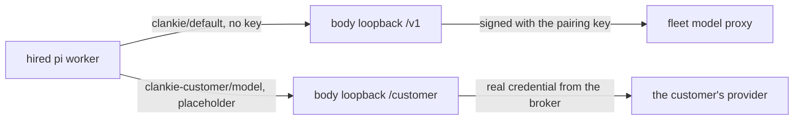

# ADR 0197: Hosted workers reach the owner's model through the body

Status: accepted (2026-09-26; James chose option c), corrected 2026-10-02 for VUH-1520. Tracks
[VUH-1373](https://linear.app/vuhlp/issue/VUH-1373). Builds on the included
model forwarder (VUH-1371) and the customer-model rule of `96cb9f9b`.

## Context

A hosted body's captain runs on one of two paths: included usage through the
fleet's model proxy, or the customer's own supported provider credential.
Anthropic uses API keys only. Hosted ChatGPT subscription use is gated pending
OpenAI approval. The captain gets that
credential from the body's broker. A pi worker the captain hires is a separate
process with its own configuration, so on the customer path it had no way to
reach the customer's model. Three options were weighed:

- (a) The customer logs pi in separately. This puts a second copy of the
  credential on the body and is a second setup step.
- (b) Pi reads the key from the broker through a `models.json` `apiKey`
  command. This opens a new path for secrets to leave the broker, and pi would
  refresh OAuth tokens on its own, so a subscription token would be rotated
  under Clankie.
- (c) The body attaches the credential on a loopback. **Chosen.**

## Decision

Every hired pi worker follows the captain's path, decided at each hire from
the body's model config:

- **Included usage:** pi's `models.json` declares `clankie`, the forwarder with
  no key, and the worker starts on `clankie/default`.
- **The customer's credential:** pi's `models.json` declares `clankie-customer`
  with the customer model's own API and limits. Its base URL is the same
  loopback server's `/customer` prefix, and its key is the non-secret `local`
  placeholder. Claude subscription markers and unsigned ChatGPT account tokens
  are no longer generated. The runtime rejects legacy Claude subscription
  credentials and hosted ChatGPT selections before token refresh or forwarding.

  The worker starts on `clankie-customer/<model>`.

- **The loopback:** for each call it reads the selection and asks Clankie's Pi
  runtime for the credential. It swaps the placeholder for the real credential
  in that API's auth header and forwards to the selected provider's base URL,
  and only there. It refuses:
  - paths that leave the base;
  - anything but POST;
  - browser requests (any `Origin` header);
  - calls when no customer model is selected;
  - Claude subscription tokens, including tokens entered as API keys;
  - ChatGPT subscription requests while hosted approval is pending.

  The refusal names a provider API key or included usage as alternatives.
  [OpenAI's usage policy](https://developers.openai.com/cookbook/articles/sign-in-with-chatgpt)
  requires access approval for paid or remotely hosted offerings. The owner
  must submit the request and record any approval; the gate has no inferred
  approval or automatic date-based bypass.

  It relays the answer as it streams and logs only statuses.

- **One refresher per token:** OAuth refresh runs in the broker's `modify()`.
  Its lock is now shared by every store over the same broker: the captain, the
  model-keys service and the loopback. A token refreshed or replaced
  mid-run is used on the worker's next call, with no restart.

## Consequences

- Pi never holds the customer's secret. It is not in `models.json`, the
  worker's environment, its argv or its session files.
- The loopback's only authentication is its `127.0.0.1` binding, the same as
  the included forwarder. On a single-owner body that is the same trust
  boundary as the broker file, which any process running as the body's user
  can already read.
- A model whose compat pi derives from its provider id or URL loses that
  inference under `clankie-customer`, for example xAI's completions quirks.
  The model's declared `compat` is copied across.
- Local/self-hosted ChatGPT remains available. Clankie's Claude subscription
  login is removed in all deployments; `/auth anthropic` is API-key-only.
- Native unmodified Claude Code and Codex seats retain their own authentication.
  See [Anthropic's native-client conditions](https://code.claude.com/docs/en/legal-and-compliance).
- Other self-hosted Pi configuration remains owner-managed.
