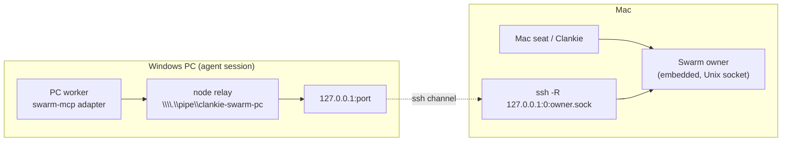
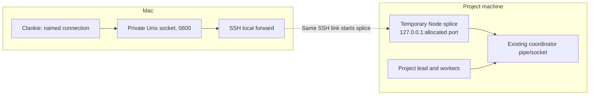

# ADR 0198: One coordinator reaches every fleet

Status: superseded by [ADR 0213](0213-clankie-retires-swarm.md).

## Context

ADR 0184 lets one Clankie drive Herdr on another machine over ssh. It does not
let agents on that machine coordinate with the rest of the fleet. Today the
Windows PC runs its own lead with a PC-local coordinator. When that lead's process
died on 2026-09-26, its watchers died with it and a peer message dead-lettered
after five unacknowledged leases. A Mac worker outside that swarm had to be
watched by hand.

The Swarm owner listens on a Unix socket, or a named pipe on Windows. Its client
dials a path, never a network address, and multi-machine storage is outside its
contract. OpenSSH forwards TCP ports and Unix sockets, but not Windows named
pipes.

## Decision

**The Mac's embedded coordinator is the one coordinator. A fleet reaches it
through a relay that exists only while the owner's ssh link to that machine is
up.**

- A peer on a fleet is enrolled from the Mac into a named conversation's scope,
  by the operator (`clankie swarm fleet-peer FLEET NAME --conversation ID --out FILE`).
  It is its own actor, keyed by fleet and name. Its capability is written once
  to a private file for that peer and never printed.
- The first enrollment pins the fleet's relay to that conversation's coordinator
  in settings. The service restores the relay at start and reconnects with
  backoff. One fleet relays one coordinator, and the service never exposes an
  external coordinator this way.
- **Transport.** The relay is one ssh connection per fleet, apart from the
  multiplexed Herdr connection:
  - `ssh -R 127.0.0.1:0:<owner socket>` binds a loopback-only port on the remote
    host that forwards to the owner's socket;
  - a stdlib Node program started by that same connection (`node -e`, nothing
    installed) serves the endpoint the stock client can dial and splices each
    client to that port. On Windows that endpoint is
    `\\.\pipe\clankie-swarm-<fleet>`; elsewhere a user-only Unix socket.
  - The program exits when its stdin closes, so the endpoint disappears with the
    link.
- **Exposure.** On the remote host: that loopback port and that endpoint. The
  coordinator authenticates every session by capability, and the relay holds
  none. On this host: nothing new; the forward targets the existing socket.
- **Health.** A lost link is a state (`relayState: unreachable`), like an
  unreachable fleet.

## Oversight of an independent project coordinator

Criterion 4 was rescoped on 2026-09-27: the PC project lead keeps its existing
coordinator, workers and dispatch. Clankie joins that coordinator as one extra
peer through a named connection with a Clankie-only capability. The embedded
coordinator remains the authority for Clankie's own fleets; independent project
coordinators are not federated or migrated into it.

The reverse transport lives alongside the fleet relay. `swarm connect` accepts
an optional registered SSH fleet (`ssh`) and the coordinator's remote `endpoint`.
One dedicated SSH master starts a stdlib Node splice, which binds an ephemeral
port on remote `127.0.0.1` and connects to the existing pipe/socket. After it
reports its port, `ssh -O forward -L` installs a local Unix-socket forward on that
same master. The local socket is 0600 inside a process-private 0700 directory;
the master socket is private too. Nothing is installed on the remote machine.

The remote loopback listener is reachable by other processes on that host.
Swarm still authenticates every operation; no capability travels in SSH argv,
relay stdin, settings, or logs. The splice exits when SSH stdin closes. The
service retries a lost link with backoff, refreshes local clients after recovery,
and removes its sockets on disconnect/shutdown. Reconnecting never enrolls a
session, restarts the remote owner, re-enrolls workers, or replays an assignment.
The connection pins the remote endpoint and fleet alongside actor/scope and
conversation. Manual local socket forwards retain their operator-owned lifecycle.

[Read-only Windows transport proof and prepared enrollment](../testing/2026-09-27-remote-fleet/connect/README.md).

## Windows execution sessions

The first PC proof uses its existing `default` Herdr server in Windows
session 0. Herdr panes are agent seats; they do not need access to the
interactive desktop. Capture, virtual pad and GPU work run in session 1
through the existing `C:\desk` job bridge. No second Herdr server is started
in session 1, and fleet registration never replaces the existing server.
This is the lead's 2026-09-27 decision on VUH-1381, amending criterion 1.

Verify these paths separately: list/read/prompt/wait against an explicitly
reserved agent pane, and one harmless bridge job that reports its own
process session ID. A successful SSH call or an Active console in
`query session` alone does not prove the bridge job ran in that session.
A plain shell pane cannot satisfy `agent prompt`, `agent wait`, or an agent
completion watch; prepare a recognized disposable agent before that proof.

The former coordinator lead handoff runbook was an optional procedure,
not part of the rescoped oversight proof or authorization to retire the PC lead.

## Alternatives

- **The coordinator on each machine, federated.** Several owners means several
  dispatch authorities, which is the failure being fixed. Federation is outside
  Swarm's contract.
- **Patch the client to dial TCP.** Every peer's adapter would need the patch,
  and a TCP listener is broader than a pipe that exists only while the link does.
- **A second Clankie on the PC.** Several Clankies with separate memories;
  already rejected by ADR 0184.
- **Expose the owner through the gateway.** This would put coordination on the
  public doorway for a machine the owner already reaches over ssh.

## Consequences

- The coordinator is only as available to a fleet as the owner's ssh link. A
  leased message whose peer loses the link expires and is redelivered on its
  next fetch. While the link is down the peer fetches nothing, so nothing new
  is leased to it.
- The peer's adapter must speak the owner's coordination protocol version.
  Startup compatibility checks refuse a mismatch; they do not fall back.
- Handing a lead from one machine to another is an ordinary Swarm handoff:
  - the old lead retires from dispatch;
  - the new lead's conversation owns the scope;
  - watchers are Clankie's persisted `herdr_watch` records, which survive a
    restart, rather than a process on the lead's machine.
- Posix fleets use the same relay with a Unix socket. Live proof is recorded on
  VUH-1381; until it lands, both paths are unit-tested only.
