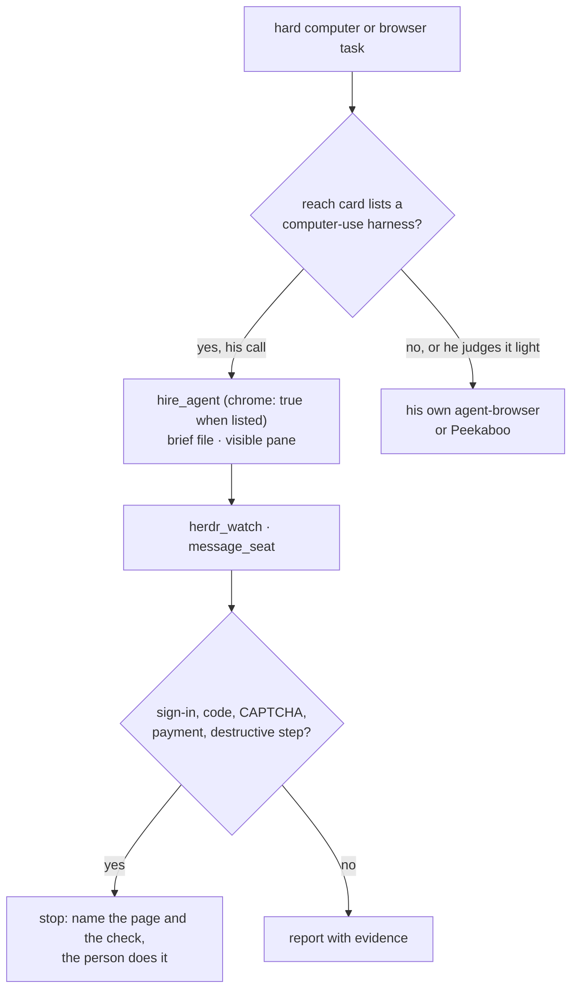

# ADR 0199: Hard computer work goes to a computer-use harness

Status: proposed (2026-09-27), from James's direction the same day. Relates to
[ADR 0082](0082-clankie-holds-the-browser.md) (his own browser), which it
narrows rather than replaces, and to
[ADR 0127](0127-his-accounts-are-his.md) (human checks stop for the person),
whose rule it extends to the owner's sessions. Builds on
[ADR 0187](0187-clankie-hires-his-own-seats.md) (`hire_agent`).

## Context

Clankie has two ways into a computer of his own: the service's `agent-browser`
(ADR 0082), a persistent profile that holds his own accounts (ADR 0127), and
Peekaboo through his shell for native Mac apps
([desktop control](../desktop-control.md)). Both are his hands, driven turn by
turn from his own model context.

The harnesses he already leads have become far better at this. Codex computer
use drove James's own Chrome and Mac apps on 2026-09-27. Claude Code drives the
owner's Chrome through the Claude in Chrome extension, and Codex has its own
Chrome and in-app browser plugins. These run inside the owner's real apps and
signed-in sessions, with a model and loop built for the job, which a
conversational turn in Clankie's shared browser does not have.

Many setups won't have them. A hosted customer on included usage has no Codex
or Claude plan, and a hosted body has no desktop at all.

## Decision

**Where a computer-use harness is available, it is his main way into hard
computer and browser work.** He hires it as a seat with `hire_agent`, hands it
a brief, and watches it. His own browser stays his for quick lookups and for
anything under his own accounts.

Nothing routes by task. He is told what exists and decides. The capability card
(the `reach` section of `clankie prompt`) lists the harnesses on this machine
that can take the work, what each can drive, and how to hire it; the shipped
`computer-use-delegation` skill carries the pattern. A task router would
guess worse than he does and would need a rule per kind of task.

**Detection reads each harness's own answer**, never just a binary on PATH:

| Harness | Signed in                           | Mac apps                                                 | Owner's Chrome                                                                                                        |
| ------- | ----------------------------------- | -------------------------------------------------------- | --------------------------------------------------------------------------------------------------------------------- |
| codex   | `codex login status` says logged in | `codex features list` has `computer_use`, plugin not off | `browser_use_external`, `chrome@openai-bundled` not off, Codex's Chrome native host registered                        |
| claude  | `claude auth status` has `loggedIn` | none (Claude Code has no native desktop use)             | `~/.claude.json` records the extension and Claude's Chrome native host is registered; `--chrome` unless on by default |

An installed harness that is signed out or has the capability off is still
listed with what the owner does about it, so he can say why he can't use it.
The service caches the answer for five minutes. `clankie browser harnesses` and
`GET /v1/browser/harnesses` re-probe on every read. A harness that needs a flag
for its Chrome integration gets it from `hire_agent`'s `chrome: true`: claude's
`--chrome`. Codex follows its own settings, and a harness with no Chrome
integration fails the hire as `harness_unavailable`.

**Authority.** A computer-use harness drives the owner's real apps and
accounts, not Clankie's. It appears only where a hire can already happen: the
operator lane or a Discord turn holding the machine grant
([ADR 0095](0095-discord-system-actors.md), ADR 0187). A social room never sees
the card and cannot hire. The brief carries ADR 0127's rule into the owner's
sessions: sign-ins, 2FA codes, CAPTCHAs, payments, and anything that changes or
deletes an account stop the seat. The seat names the page and the check, and
the person does that step. Page content the seat reads is untrusted, as it is
for his own browser.

**One driver at a time, and not while the person is using the machine.** Two
agents moving one mouse, or one agent typing into the window the person is in,
break both. He hires one computer-use seat for a desktop task, checks with the
person before it takes the screen when they may be at it, and prefers a
Chrome-only harness, which drives tabs without the pointer, when that covers
the task.

**Cost is the person's.** Each run spends that harness's plan: for example,
James's weekly Codex limit. The card says so, and the owner can take harnesses
off the card with `browser.harnessDelegation` (`clankie browser delegate off`,
`/browser delegate off`) without uninstalling anything. Routing preferences
such as "save my Codex limit" belong in `fleet.notes`, which he already reads
as preference.

**Fallback.** With no harness, delegation off, or a task he judges light, his
own browser and Peekaboo remain. A hosted body wires no detection at all, since
there is no owner desktop to drive. Probes read macOS paths, so other platforms
get no card either. The route answers `detected: false` there.

## Alternatives considered

- **A per-task router** that sends anything browser-shaped to a harness.
  Rejected: it contradicts maximum agency, and "hard" is his judgment, not a
  keyword.
- **Always delegate when a harness exists.** Rejected: a quick lookup in his
  own browser answers in the room, and delegating it spends the owner's plan
  for nothing.
- **Put a harness's computer-use tools in his own tool bank** (for example
  Codex's computer-use MCP). Rejected: it makes his model the driver again,
  which is the weaker loop, and it would reach social rooms through the shared
  tool bank.
- **Detect by binary on PATH.** Rejected: a signed-out or disabled harness
  would be advertised and fail on hire.
- **Force-enable Codex computer use with `--enable` on hire.** Rejected: an
  owner who turned it off meant it. Claude's `--chrome` is different because
  its per-session opt-in is the designed path when the default is off.

## Consequences

- On a machine like James's, his card names Codex (Mac apps and Chrome) and
  Claude (Chrome, with `chrome: true`), and hard computer work leaves his
  context for a seat he watches.
- A remote Herdr fleet ([ADR 0184](0184-clankie-leads-more-than-one-fleet.md))
  is not probed. The card describes this machine only, and a hire elsewhere
  with `chrome: true` gets the flag without a detection behind it.
- A session's card is fixed when the session is built. A login or plugin change
  shows on the next session, or at once through `clankie browser harnesses`.
- The OpenAI browser and Chrome plugins count only as Codex surfaces. A
  standalone browser product with no CLI Clankie can hire is out of scope until
  one exists.
- `SpawnOperatorSeat` gains an optional `chrome` field. The private neighbour
  repos read the protocol and can ignore it.
