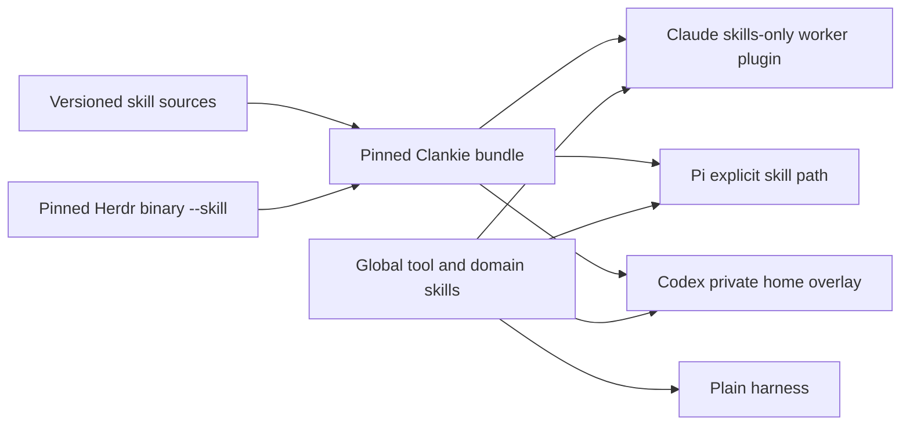

# 0200 — Clankie bundles its opinionated skills

Status: accepted; local harness launch support implemented. Global cutover remains
gated on deployment and coverage of the owner's worker routes.

Date: 2026-09-27

## Decision

Bundle proven process, leadership, review and delivery guidance with Clankie.
Keep independent tool/domain knowledge and personal workflows in the owner's
selection. Also bundle references for tools Clankie ships. Plain harnesses must
be usable without inheriting Clankie's working methods, so their relative
effectiveness can be measured.

Reusable skills retain one authoring source in Volpestyle/skills. Clankie vendors
an immutable MIT-licensed snapshot at a full Git revision. Its existing leadership
archive has the same source; Swarm owns the separate coordination protocol skill.
Product-specific skills remain authored in this repository. Personal account and
team defaults are removed upstream before export. Checkout-only Clankie development
workflows are not shipped.

Herdr is a shipped tool, not a global-only exception: fresh installs and hosted
bodies ship its pinned executable and cannot depend on James's global skills.
Generate its bundled skill directly from `libexec/herdr --skill` during release
assembly, after installing the checksum-verified `scripts/release/herdr.json` pin.
Generate the checkout skill from that same pin, and fail `pnpm check` if its bytes
drift. The release writes and checks the product root and both Claude plugin
copies; the hosted image repeats the version/content check as the runtime user.
No manually authored Herdr snapshot belongs in the opinionated-skills vendor tree.
James's global `herdr` remains available for plain-harness tool use and should
mirror the resolved `herdr --skill` too.

Each local hire gets native discovery: a skills-only Claude plugin, Pi's explicit
skill path, or a private Codex home overlay. Worker identity, permissions and
existing model choices are preserved. This avoids installing process guidance
into the user's global harness configuration. See [the current bundle and limits](../bundled-skills.md).

## Consequences

Dotfiles owns the reversible `global_process_skills` group toggle and a
`--skills-only` installer path. The latter changes managed process-skill symlinks
without rendering drifted settings, hooks or model configuration. Keep global
links until the actual installed hire path is proven; source tests alone do not
activate a running service. Remote fleets and Swarm adapters need their own
bundle propagation and canaries before claiming universal worker coverage.

The overlay preserves already trusted hook hashes, not blanket hook trust.
Existing untrusted or changed hooks still require the harness's normal review.
The snapshot must be refreshed deliberately when its source changes.

## A/B protocol

Run the same bounded task from the same repository revision, with the same model,
effort, permissions, tools and acceptance tests. Use fresh sessions; one launches
as a plain harness with process skills absent, the other through Clankie with the
bundle listed. Work outside Clankie's checkout so project-local skill discovery
does not contaminate the plain condition. Record the actual skill catalog and
bundle revision. Alternate order across several tasks.

Compare acceptance-test outcomes, regressions found by blind review, wall time,
tokens/cost, human interventions and unnecessary work. Distinguish the whole
Clankie experience from a skill-only ablation; for the latter keep the harness,
identity and all other context equal. Report failures and incomplete runs too.
