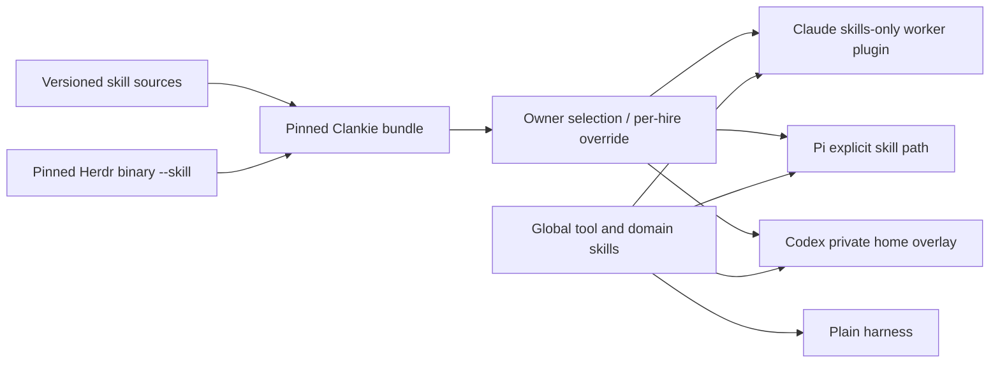

# 0200 — Clankie bundles its opinionated skills

Status: accepted; local harness launch support implemented. Global cutover remains
gated on deployment and coverage of the owner's worker routes.

Date: 2026-09-27

Amended: 2026-09-28 — optional by owner choice, on by default.

## Decision

Bundle proven process, leadership, review and delivery guidance with Clankie.
Keep independent tool/domain knowledge and personal workflows in the owner's
selection. Also bundle references for tools Clankie ships. Plain harnesses must
be usable without inheriting Clankie's working methods, so their relative
effectiveness can be measured.

Reusable skills retain one authoring source in Volpestyle/skills. Clankie vendors
an immutable MIT-licensed snapshot at a full Git revision. Leadership guidance is exported
from that same pinned revision; Swarm owns the separate coordination protocol skill.
Product-specific skills remain authored in this repository. Personal account and
team defaults are removed upstream before export. Checkout-only Clankie development
workflows are not shipped.

Herdr is a shipped tool, not a global-only exception: fresh installs and hosted
bodies ship its pinned executable and cannot depend on James's global skills.
Generate its bundled skill directly from `libexec/herdr --skill` during release
assembly, after installing the checksum-verified `scripts/release/herdr.json` pin.
Generate the checkout skill from that same pin, and fail `pnpm check` if its bytes
drift. The release writes and checks the product root and both Claude plugin
copies; the hosted image repeats the version/content check as the runtime user.
No manually authored Herdr snapshot belongs in the opinionated-skills vendor tree.
James's global `herdr` remains available for plain-harness tool use and should
mirror the resolved `herdr --skill` too.

Each local hire gets native discovery: a skills-only Claude plugin, Pi's explicit
skill path, or a private Codex home overlay. Worker identity, permissions and
existing model choices are preserved. This avoids installing process guidance
into the user's global harness configuration. See [the current bundle and limits](../bundled-skills.md).

The owner controls `skills.opinionated` (boolean, default true) and
`skills.exclude` (names, default empty) through `clankie skills` and `/skills`.
Repo-authored and product/tool skills always remain available. Vendored process
skills, including `lead`, `swarm-lead` and `herdr-lead`, are optional. The captain
references those skills only when available and retains its own ownership,
dispatch and verification instructions, backed by `swarm-mcp` and `herdr`.

All native loaders use the same manifest-based classification, even after release
assembly dereferences the links. The Claude seat makes a fresh plugin projection
at launch with only included skills; this handles individual exclusions without
combinatorial build variants. It retains identity, hooks and MCP, disables the
older marketplace copy for that session and uses the native `clankie@inline`
identity for its development channel. The plugin build still generates one
output style from the captain instructions.

Local `hire_agent` accepts `skills: "bundled" | "plain"`, defaulting to the saved
setting and retaining exclusions. Its result records the selected mode, source,
actual supplied names and whether the route applied it. Explicit overrides on
unsupported/remote routes fail visibly. This controls Clankie's contribution;
independent global/project discovery in Claude and Codex must be accounted for.

Prune whole skills, never fork upstream prose: remove `linear-write` (personal
voice), `update-review-ethos` (team policy), `mr-link` (overlapping GitLab flow),
`linear-agent-session` (ceremony), `repo-evolution-review` (niche) and
`work-tracking` (policy consolidated into product `work-items`). Keep `reflect`
and the core leadership, review, Linear and delivery guidance. The captain uses
reflection as a light skills/docs improvement reminder; the heavier upstream
ledger/proposal workflow needs an upstream edit, not a vendored fork.

## Consequences

Dotfiles owns the reversible `global_process_skills` group toggle and a
`--skills-only` installer path. The latter changes managed process-skill symlinks
without rendering drifted settings, hooks or model configuration. Keep global
links until the actual installed hire path is proven; source tests alone do not
activate a running service. Remote fleets and Swarm adapters need their own
bundle propagation and canaries before claiming universal worker coverage.

The overlay preserves already trusted hook hashes, not blanket hook trust.
Existing untrusted or changed hooks still require the harness's normal review.
The snapshot must be refreshed deliberately when its source changes.

## A/B protocol

Run the same bounded task from the same repository revision, with the same model,
effort, permissions, tools and acceptance tests. Use fresh sessions; one launches
through `hire_agent` with `skills: "plain"`, the other with `skills: "bundled"`.
Keep product/tool skills identical and record the result's skill condition. Work outside Clankie's checkout so project-local skill discovery
does not contaminate the plain condition. Record the actual skill catalog and
bundle revision. Alternate order across several tasks.

Compare acceptance-test outcomes, regressions found by blind review, wall time,
tokens/cost, human interventions and unnecessary work. Distinguish the whole
Clankie experience from a skill-only ablation; for the latter keep the harness,
identity and all other context equal. Report failures and incomplete runs too.
