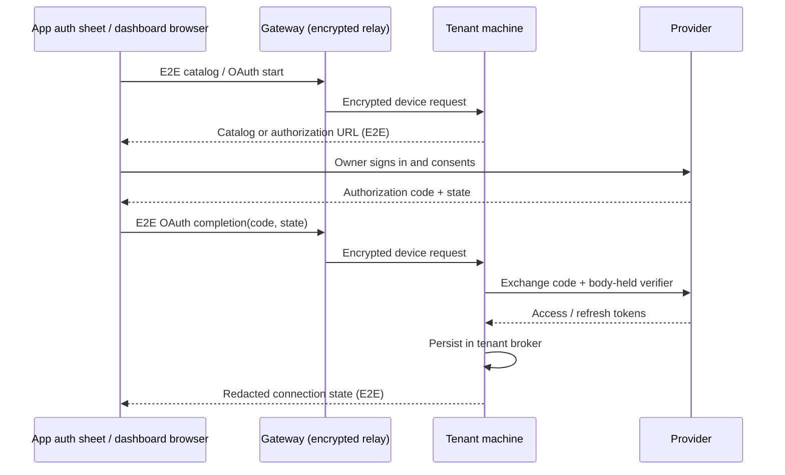

# ADR 0201: Essentials start with read-only Google connections

Status: proposed (2026-09-28). The catalog is a delivery sequence, not a claim
that these connections ship. Extends [ADR 0181](0181-clankie-is-independent-of-his-connections.md)
and [ADR 0196](0196-account-connections-keep-tokens-on-the-body.md).

## Decision

Offer three deliberately small capabilities: Gmail, Calendar and Drive, in that
order. Group them under Google in Connections, with separate consent and status.
Start with reading; no send, booking, file editing or broad write permission is
part of this first slice. Existing DIY connections remain unchanged. A connector
enters the customer catalog only after an authenticated test-account read,
expiry/refresh, disconnect and tenant isolation are proven.

| Capability | Why it earns a place                                                   | First scope (Google prefix `https://www.googleapis.com/auth/`)                                                     | Official HTTP MCP endpoint                  |
| ---------- | ---------------------------------------------------------------------- | ------------------------------------------------------------------------------------------------------------------ | ------------------------------------------- |
| Gmail      | Inbox triage and a daily briefing are frequent personal-assistant jobs | `gmail.readonly`                                                                                                   | `https://gmailmcp.googleapis.com/mcp/v1`    |
| Calendar   | Makes the briefing useful for the owner's day and trip constraints     | `calendar.calendarlist.readonly`, `calendar.events.readonly`; add free/busy only when required                     | `https://calendarmcp.googleapis.com/mcp/v1` |
| Drive      | Find the owner's receipts, itineraries and reference documents         | `drive.readonly` for broad search, explicitly disclosed; evaluate selected-file `drive.file` before broader access | `https://drivemcp.googleapis.com/mcp/v1`    |

Google publishes and documents all three remote servers, currently in Developer
Preview, requiring preview membership and a Cloud project with the corresponding
APIs and MCP services enabled. Authentication is OAuth 2.0 with a registered
client and consent screen. The tenant runs the MCP **client**, using outbound
HTTPS; these are Google-hosted servers, not a server binary installed per tenant.
No consumer-Gmail eligibility is assumed from Workspace preview documentation.
Read-only scopes must be proven against each selected tool before release.
[Google setup and scope documentation](https://developers.google.com/workspace/guides/configure-mcp-servers).

`gmail.readonly` is restricted, and `gmail.compose` includes sending, not merely
drafting. Google documents restricted-scope verification and a security assessment
when restricted data is stored or transmitted on servers. The hosted product
must resolve those requirements before offering Gmail publicly.
[Gmail scope requirements](https://developers.google.com/workspace/gmail/api/auth/scopes).

## What did not make the first catalog

**Notion:** useful for existing Notion users, but less universal than mail,
calendar and files. Its maintained remote MCP uses OAuth authorization code with
PKCE, dynamic client registration and refresh at `https://mcp.notion.com/mcp`.
A tenant can operate its client; the maintained server remains at Notion.
Discover scopes from provider metadata and verify effective workspace/content
access during consent; the documentation does not establish a narrow read-only
scope that this ADR can promise. Do not equate a local tool allowlist with narrow
provider permission. [Client contract](https://developers.notion.com/guides/mcp/build-mcp-client),
[permissions](https://developers.notion.com/guides/mcp/overview).
The official self-hostable package is no longer actively maintained, so it fails
the “proven, maintained bundle” criterion.
[Maintenance status](https://developers.notion.com/guides/mcp/hosting-open-source-mcp).

**Canva:** a maintained official creative MCP exists, but does not advance the
four first playbooks enough to justify another permission surface. OAuth supports
a registered client or CIMD; its access page currently says self-service is not
yet available and directs clients to a waitlist. Each person authorizes their own
Canva account. The tenant can run a client, not the Canva-hosted service.
The access documentation does not enumerate an MCP-specific least-privilege scope
set; validate the live grant rather than borrowing the REST API scope list.
An allowlisted app and verified consent are prerequisites, not completed work.
[Access and permissions](https://www.canva.dev/docs/apps/mcp/access/),
[official MCP](https://www.canva.dev/docs/apps/mcp/).

No form-filling skill yet: general browser tooling can fill forms, but research
success does not prove correct submission, signed-in access or receipt handling
across arbitrary sites. No third-party skill text is redistributed.

## Body-owned authority and customer flow

**One catalog, served by the tenant's machine, rendered in three surfaces.**
This surface/ownership decision is accepted by James and the lead (2026-09-28);
the proposed provider rollout and its proof gates remain as stated above.
Provider definitions, capabilities and connection states have one machine-owned
source. Each client renders that response, without a separate provider list or
client-side inference that a stored credential means a healthy connection.

| Surface                                    | Experience                                                                                                                          | Code ownership and existing integration points                                                                                                                                                      |
| ------------------------------------------ | ----------------------------------------------------------------------------------------------------------------------------------- | --------------------------------------------------------------------------------------------------------------------------------------------------------------------------------------------------- |
| App: Settings → Connections                | Primary for hosted users. Tap **Connect** to open provider sign-in in a system auth sheet, then show the machine's resulting state. | Private `clankie-app`: `packages/command-center/src/settings/ConnectionsSettings.tsx`, wired by `apps/mobile/App.tsx`; device transport in `packages/device-session/apple/GatewayEncryption.swift`. |
| Web account dashboard at `api.clankie.bot` | The same catalog and states; a convenient place for browser OAuth redirects.                                                        | Private `clankie-ops`: `apps/fleet/web/app.js` and `index.html`; pairing bootstrap in `apps/fleet/web/pairing.js`.                                                                                  |
| TUI `/connect`                             | The same catalog in the existing DIY interaction style.                                                                             | Public `clankie`: `apps/tui/src/connect-commands.ts`; headless commands in `apps/tui/src/command/accounts.ts`.                                                                                      |

Machine code stays public in `clankie`: `apps/clankie/src/accounts.ts`,
`apps/clankie/src/account-routes.ts`, `apps/clankie/src/mcp-host.ts`,
`packages/credential-broker` and the `packages/protocol/src/accounts.ts` contract.
Extend these account interfaces with the single catalog; the current APIs do
not yet establish that all three surfaces share it. Hosting-only gateway,
account and dashboard code stays in `clankie-ops`, under
[ADR 0183](0183-the-harness-is-public-the-hosted-service-is-private.md).

Reuse ADR 0196's flow through the existing E2E device channel to the selected
tenant. The machine owns state and the PKCE verifier. After provider consent,
the client forwards the authorization code and state through that same encrypted
channel via the gateway. **OAuth completion executes on the tenant's machine:**
it validates the flow, exchanges the code directly with the provider and stores
access/refresh tokens in its own broker. Only redacted status returns to clients.

One tap starts consent; it does not bypass the provider's screen. The account
service and dashboard show status and never receive or store a provider token.
The dashboard browser can carry the one-time authorization code, but cannot
exchange it or send it to a fleet/account completion endpoint. Its redirect
handler forwards completion through the authorized paired-device channel.
Account login and a pairing offer do not substitute for that device authority.
Keep callback codes out of server access logs, analytics and referrers. If the
channel is unavailable, report it without falling back to account-service token
exchange. Provider MCP receives the bearer directly from the tenant machine.

States distinguish unconfigured, awaiting consent, connected, expired, revoked
and temporarily unavailable. Show connected account, granted access and last
successful check. Do not label a timeout revoked or promise to distinguish
expiry from revocation when the provider only returns `invalid_grant`: show
reconnect required with the known reason.

Scope escalation is a new owner consent. Mail, calendar descriptions, documents,
MCP tool descriptions and browser content are untrusted inputs. They cannot
authorize tools, new recipients, payments or broader access. Keep personal
connectors in the private operator lane; workers require explicit account-bound
grants checked on every call. Tool discovery is not authorization.

Disconnect immediately disables local calls and grants, serializes with refresh,
and revokes at the provider. If provider revocation fails, display “disconnected
locally; provider revocation pending” and retain only broker-held material needed
for a bounded retry. Never claim revocation from local deletion alone. Google
supports token revocation; revoking one Google grant may affect other scopes in
the same grant, so reconcile sibling capability states.
[Google token lifecycle](https://developers.google.com/identity/protocols/oauth2/web-server#tokenrevoke).

## Four original playbooks

The ordinary shipped skill root contains [inbox triage](../../.agents/skills/inbox-triage/SKILL.md),
[daily digest](../../.agents/skills/daily-digest/SKILL.md),
[trip planning](../../.agents/skills/trip-planning/SKILL.md) and
[comparison shopping](../../.agents/skills/comparison-shopping/SKILL.md).
They use existing email/browser tools and discover connected MCP schemas. They
make no scheduling, booking or Google-connection claim. Inbox and digest become
Google consumers only after that connection is actually available. These are
source-reviewed playbooks pending live outcome evaluation, not proven product
capabilities. The bundle worker owns the shared distribution mechanism; these
skills add only their own directories and plugin links.

## First slice and release gate

**Choose the app for the first end-to-end surface.** Its paired-device transport
already reaches the machine through the gateway with E2E encryption. Adding the
account call and auth-sheet callback reuses that authority. The dashboard is
convenient for redirects but currently retrieves pairing offers; it needs a
complete device client before it can perform this flow. A local TUI callback
alone would not prove the remote tenant path. This is an implementation choice
based on current code, not a claim that app Google auth already exists.

Build the machine API first, then wire only app Settings → Connections for the
rehearsal. The dashboard and TUI will consume the same catalog; all three UIs
are not a prerequisite for the first proof. On an isolated development tenant,
complete app consent through the gateway, verify app status and that tenant's
broker entry, and perform the read-only MCP call there. Verify that no provider
token appears in gateway/account-service handling or client responses. Check
the app auth-sheet flow on both iPhone and iPad.

The [development probe and evidence](../testing/2026-09-28-hosted-essentials/README.md)
use the real credential broker and MCP host with a private Gmail configuration.
They do not enable a production connector or prove remote E2E OAuth completion.
Missing consent stops the live proof.
The current provider refresher and verified worker-account schema are
Linear-specific; Google OAuth begin/complete/refresh/revoke, verified identity,
owner API/CLI/TUI states and portal controls remain implementation work.

Acceptance requires an authorized test mailbox with known fixture content:
successful read-only MCP result, a correct triage/digest, no content leakage to
social lanes or another tenant, refresh/disconnect races, revoked-token refusal,
and an honest portal state. A fixture transport test or successful `tools/list`
alone cannot close this gate. Preview access, app registration and test-account
consent must precede that rehearsal; production remains untouched.
