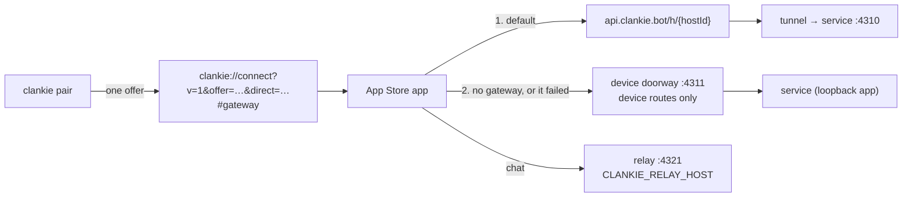

# 0204 — A self-hosted Mac pairs the App Store app directly

Status: accepted (VUH-1463, 2026-09-30)

Date: 2026-09-30

## Context

The App Store build bakes one control plane, `https://api.clankie.bot`, and
refused any pairing link without the gateway's encrypted fragment. A
self-hosted Mac could therefore pair the phone only by turning on remote
access, which requires a Clankie account. Direct pairing existed only in source
builds (`CLANKIE_HOST`). ADR 0151 made the gateway the doorway; VUH-1452 then
let a gateway-paired device learn explicit direct endpoints (`directRoute`,
`clankie gateway direct`) and fall back to them.

Two constraints shape the answer:

- **App Store ATS.** `NSAllowsLocalNetworking` permits plain HTTP to `.local`,
  single-label names and IP literals. Anything else needs HTTPS, and the store
  build carries no `NSAllowsArbitraryLoads` and no exception domains.
  `ts.net` is on the Public Suffix List, so no store-safe exception covers a
  tailnet name over HTTP.
- **The service binds loopback only.** A phone on the LAN cannot reach
  `127.0.0.1:4310`, and exposing the whole service would widen what any LAN
  peer can call.

## Decision

**The route follows where Clankie's body lives, not whether the user pays.**
A self-hosted Mac pairs directly, with no account. Remote access through the
gateway is optional for self-hosters; whether it is free is still open. Managed
users, including BYOK and bring-your-own-subscription, always go through the
gateway because their body runs in our cloud.

1. **One link carries every route.** `clankie pair` mints one single-use
   offer. When the Mac has a direct route (`relay.controlPlaneUrl` and
   `relay.url`, from `clankie gateway direct`), the link gains
   `&direct=<control origin>`. When remote access is on, the gateway's
   encrypted fragment stays last, as before. The wire reports `gateway: true`
   and `direct`, and `clankie pair` prints which routes the QR carries. It
   warns when the App Store app cannot reach a direct origin.
2. **The gateway stays the default.** The app redeems through the gateway
   first. It uses the direct origin only when the gateway cannot answer
   (network failure or 5xx), or when the link carries no gateway. A pairing
   that completes directly is a direct session with no gateway credential. It
   stores the host's `directRoute` and uses its relay, never the gateway relay
   the host also publishes. App Review, which reaches the Mac only through the
   gateway, sees no change.
3. **`clankie pair` keeps working when the doorway cannot carry an offer.** If
   the doorway is signed out or unreachable and a direct route exists, the
   service mints a direct-only offer instead of refusing with
   `public_gateway_unavailable`. Review offers (ADR 0154) never carry a private
   address and still refuse, because App Review cannot use one.
4. **Transport is decided by one shared rule.** `directOriginTransport` in
   `@clankie/protocol` (node-free) classifies an origin:
   - `https`: any name.
   - `local`: plain HTTP to `.local`, a single-label name, or a private,
     link-local or loopback IP literal.
   - `blocked`: everything else, including tailnet names and Tailscale's
     `100.64/10` IPs over HTTP.

   The server uses it to warn; the app uses it to explain an ATS refusal
   ("Clankie needs a secure address") instead of calling the Mac unreachable.
   Tailscale users serve HTTPS with `tailscale serve --https`.

5. **An opt-in device doorway, not a wider bind.** `CLANKIE_DEVICE_HOST` (and
   `CLANKIE_DEVICE_PORT`, default 4311) opens a second listener. It serves only
   the device routes the public gateway already carries to the Mac:
   `/v1/pairing/*`, `/v1/devices/*`, `/v1/model-keys*` and `/v1/accounts*`.
   Everything else, including operator, webhook, gateway-envelope and hosted
   routes and `/health`, answers 404. A LAN peer can call nothing the internet
   cannot already call through the gateway. The relay keeps its own
   `CLANKIE_RELAY_HOST`.
6. **The store build declares its local network use.** `app.json` sets
   `NSLocalNetworkUsageDescription` to Clankie's own sentence, which
   expo-dev-launcher leaves in Release. `ios-appstore.sh` fails an archive that
   allows arbitrary loads, lacks `NSAllowsLocalNetworking`, or lacks that
   string.

LAN: `CLANKIE_DEVICE_HOST=0.0.0.0 CLANKIE_RELAY_HOST=0.0.0.0 clankie restart
captain` (which restarts the relay too), then `clankie gateway direct --control-plane-url
http://<mac>.local:4311 --relay-url http://<mac>.local:4321`. Tailscale:
`tailscale serve --https=<port>` in front of both, with the HTTPS origins as the
direct route.

## Consequences

- A self-hoster pairs the App Store app over the LAN or tailnet with no
  account. The offer secret stays the single-use capability. Device bearer
  authorization, expiry, revocation and grant checks are unchanged.
- The Mac cannot know which of its addresses the phone can reach, so a direct
  route is still configured explicitly, never inferred (as in VUH-1452). With
  none configured and remote access off, the QR pairs only a source build, and
  `clankie pair` says so.
- The doorway binds are environment settings. The launcher passes the caller's
  environment to services, but nothing persists them yet. Durable settings
  belong to the remote-access redesign (VUH-1464).
- A directly paired device has no gateway credential. It gets no gateway push
  (ADR 0159), sends no gateway diagnostics, and cannot fall back to the
  gateway when it leaves the LAN. The reverse of VUH-1452's fallback is future
  work.
- A scanned direct link is trusted the way a gateway link already is: the
  person scanning chooses the host. The access review names the host before
  any grant.
