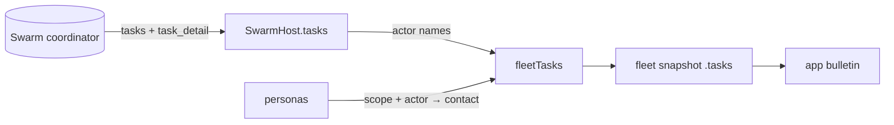

# ADR 0205: The fleet carries its open Swarm tasks

Status: superseded by [ADR 0213](0213-clankie-retires-swarm.md).

## Context

The fleet snapshot says who is seated, what each seat last said it was doing
(its stance), who spawned whom and who prompted whom recently. None of those
say what an agent was _assigned_, who assigned it, or whether that work is
stuck. A spawn edge is not an assignment, and a prompt is not ownership.

Swarm already records all of it. Every task has a creator (the lead that
assigned it), a current owner, a state, a contract with an objective and a
worktree, and a progress deadline. The facts exist; no surface can see them.

## Decision

The snapshot carries `tasks`: every unfinished Swarm task (`open`, `blocked`,
`running`, `cancel_requested`) on every coordinator Clankie is connected to,
read fresh on each fleet read. Each carries its title, state, lead, owner,
objective, worktree, blocker reason, and `stale` when a running owner's lease
lapsed or its progress deadline passed. Finished work is not carried. Its
result stays with the coordinator, and a board that listed history would stop
answering "what is happening now".

**Nothing is remembered.** The host caches a task's detail by its version only
to avoid re-reading an unchanged contract. The board itself is re-derived on
every read, so it cannot outlive its coordinator (the rule app ADR 0022 took
from the garden). A change to the board advances the fleet cursor, like a
roster change, so a long poll wakes for it.

**A task names actors, never seats.** Lead and owner are named the way the
board says them. Clankie's own conversation actors are `Clankie`, a Herdr
runtime worker is `codex worker` (or its harness), and any other actor is its
Swarm label. `personaId` is present only when that actor is a messageable Swarm
contact. No coordinator fact says which Herdr pane a task's owner occupies
(`dispatch_intents.external_id` is internal to swarm-mcp), so no surface may
place a task on a seated figure by guessing. The directory the contract names
is carried because a commons district is keyed by directory. That places a
task in a district, not on a person.

A coordinator that cannot answer takes only its own tasks off the board. The
list is bounded at 128, like the edge array.

## Consequences

- The app can show every piece of delegated work, grouped by lead, with its
  owner, state and blocker, from one snapshot.
- Placing a task on a figure needs a real pane fact from Swarm. That is a
  swarm-mcp change and a coordinated runtime upgrade (see `vendor/README.md`),
  deferred until the board proves its worth.
- Work tracked only in Linear or in a lead's head is not on the board; the
  district boards (app ADR 0037) still show tracker items.
