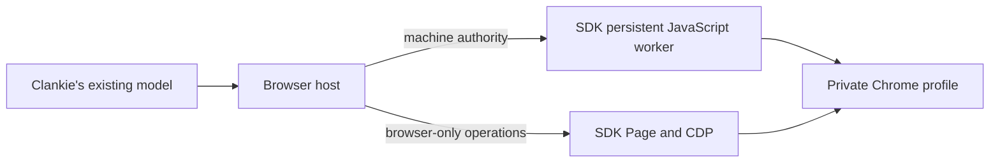

# ADR 0206: Browser Use Pi supplies the browser workspace

Status: accepted (2026-10-01), requested by James. Updates the implementation
in [ADR 0082](0082-clankie-holds-the-browser.md).

## Decision

Replace the agent-browser MCP process with the pinned `@browser_use/pi` SDK.
Clankie's existing model calls its persistent `execute()` workspace directly.
The SDK owns Chrome launch, private-profile locking, the killable JavaScript
worker, browser primitives, and worker recovery. No second model runs and no
provider key is required for browser execution.

Release builds preserve the SDK package and its dependency graph alongside the
service bundle, because the SDK forks a worker relative to its own module.

The SDK's JavaScript is Node code, not just page code. The catalog therefore
marks that tool `requiresShell`. Pi and MCP hide it from social turns, the
browser host checks host-stamped machine authority, and the standalone HTTP
route requires the operator credential. Social browser operations use the
SDK's page/CDP APIs in the browser realm. A request argument cannot grant
machine authority.

Keep the existing browser API envelope and hash-bound screenshot artifacts.
Use `browser_use_*` tool names, with `clankie browser tools` and
`clankie browser call TOOL JSON` for operator access. The protocol addition is
optional, so existing catalog consumers can still parse ordinary tools.

The private profile path stays the same. Chrome starts headless on the first
call and closes after 60 idle seconds. Headed takeover and explicit close
use the SDK lifecycle. JavaScript variables reset on mode changes, idle close
or worker termination; logins and workspace files persist.

## Recording and recovery

The SDK's automatic recorder wraps `run()`, which would introduce a second
agent loop. Direct execution instead samples the current tab using public
SDK screenshots every 750 ms and encodes WebM with the existing FFmpeg
dependency. Recording is opt-in and cannot prevent browser actions. The first
sample follows the initial action: navigating while the initial blank-tab
screenshot is pending can leave that capture waiting until its CDP timeout.

Do not automatically repeat a failed JavaScript cell: browser effects may
have happened before a timeout. The SDK resets its worker; Clankie inspects
the browser before continuing. A profile lock after a crash requires checking
its owner before recovery, rather than launching a competing browser.

## Verification

Host, Pi/MCP discovery, and HTTP/CLI tests cover machine authority, including
forged arguments. A real local Chrome exercise covers long pages, variables
across cells, accessibility, form input, clicks, screenshot artifacts,
worker timeout recovery, headed/headless transitions, local storage across
session restarts, and decodable WebM output.
