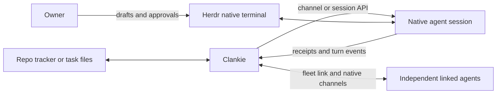

# 0207. Work records and native agent delivery

Status: accepted (James, 2026-10-01). Amends
[ADR 0180](0180-swarm-is-the-coordination-layer.md),
[ADR 0187](0187-clankie-hires-his-own-seats.md), and
[ADR 0203](0203-clankie-keeps-what-better-models-cannot-absorb.md). Amended by
[ADR 0213](0213-clankie-retires-swarm.md): `hire_agent` is the only way Clankie
starts a worker, and the embedded Swarm has been removed.

## Context

Clankie can dispatch his own workers without requiring a second task board or
independent peer coordination. The repo's tracker or files already describe the
work. Herdr provides the native interactive agents the owner can watch and use.
Typing automated messages into those terminals competes with the owner's draft
and can land in a question or approval prompt. A paste-aware terminal command
does not remove that race.

## Decision

Keep three responsibilities separate:

- Work, ownership, acceptance, decisions, and results stay in the repo's existing
  tracker or files, as defined by [ADR 0191](0191-work-is-tracked-where-the-repo-tracks-it.md).
  Clankie does not mirror those records into a second task lifecycle for local hires.
- Herdr contains the real interactive harnesses. The owner can observe them and
  type into them directly.
- Clankie delivers briefs and messages through a supported harness channel or
  session API. The connection must identify the same session displayed in Herdr.

Normal agent messages never fall back to terminal typing. Missing consent,
unsupported control, or a disconnected channel produces an explicit delivery
outcome. Existing mailbox and session receipts distinguish confirmed delivery
from an uncertain attempt. An uncertain attempt must be reconciled before a retry;
it is not permission to type the message or launch another worker. Approvals and
questions remain owner decisions. Explicit owner terminal control remains available.

Independent linked agents reach Clankie through `message_clankie` and the
per-fleet link. Remote hires use their native harness channels or session APIs.
Coordinator state remains on disk for inspection; it is no longer a connection.

## Consequences

Unsupported harnesses can remain useful as owner-operated terminals without
claiming to support automated messaging. A headless RPC interface alone does not
prove control of an existing interactive session. New harness support must verify
that boundary before advertising it.

Delivery acknowledgment is not task completion. A channel may deliver at its next
turn boundary; a session API may steer an active turn. Results must describe the
actual mechanism. An unavailable connection is not a promise of automatic retry,
and a saved session ID alone does not prove restart reattachment. Reuse existing
mailboxes and session state; add recovery machinery only for demonstrated gaps.

## MCP reconnect and native call receipts (VUH-1638)

Overlapping operator MCP calls share an HTTP client. Resetting that client after
one logical error can close another call that already reached native dispatch,
losing its result while its effect continues. A reconnect must therefore drain
the old client generation without closing its pending calls. Only an explicit
`unknown_session` rejection before tool admission permits one retry in a new
session. Network failure or a missing result never permits mutation replay.

The bridge assigns `deliveryId` for `message_seat` and `hireId` for `hire_agent`
before protected dispatch and carries them in MCP `_meta["clankie/seat-call"]`.
The service persists the exact scoped receipt before the native effect, binding
the request by fingerprint without storing its request text. Lost
results return typed uncertainty with the original ID, rather than hiding it in
a transport exception or launching a replacement. Reconnect does not change that
pending action's identity or replay it.

These IDs identify the operator dispatch; native delivery receipts retain their
own identities. A settled call receipt preserves the original tool result,
including any native uncertainty, rather than asserting task completion.

`reconcile_seat_call({deliveryId})` or `reconcile_seat_call({hireId})` reads the
original receipt in its owning operator conversation. It sends no message,
starts no hire and grants no new authority. This operator receipt scope is
separate from worker inbound and fleet peer-message ledgers. The journal keeps
the latest 1,000 settled result bodies; older IDs remain non-replayable and report
an expired result, while uncertain originals remain retained. ID, scope and
fingerprint tombstones survive result-body expiry and service restart. Reconciliation
reports what the original receipt proves, preserving the distinction between
native delivery, uncertainty and completed work.
