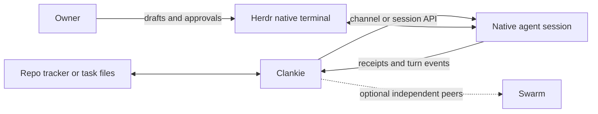

# 0207. Work records and native agent delivery

Status: accepted (James, 2026-10-01). Amends
[ADR 0180](0180-swarm-is-the-coordination-layer.md),
[ADR 0187](0187-clankie-hires-his-own-seats.md), and
[ADR 0203](0203-clankie-keeps-what-better-models-cannot-absorb.md). Amended by
[ADR 0213](0213-clankie-retires-swarm.md): `hire_agent` is the only way Clankie
starts a worker, and Swarm is being retired.

## Context

Clankie can dispatch his own workers without requiring a second task board or
independent peer coordination. The repo's tracker or files already describe the
work. Herdr provides the native interactive agents the owner can watch and use.
Typing automated messages into those terminals competes with the owner's draft
and can land in a question or approval prompt. A paste-aware terminal command
does not remove that race.

## Decision

Keep three responsibilities separate:

- Work, ownership, acceptance, decisions, and results stay in the repo's existing
  tracker or files, as defined by [ADR 0191](0191-work-is-tracked-where-the-repo-tracks-it.md).
  Clankie does not mirror those records into a second task lifecycle for local hires.
- Herdr contains the real interactive harnesses. The owner can observe them and
  type into them directly.
- Clankie delivers briefs and messages through a supported harness channel or
  session API. The connection must identify the same session displayed in Herdr.

Normal agent messages never fall back to terminal typing. Missing consent,
unsupported control, or a disconnected channel produces an explicit delivery
outcome. Existing mailbox and session receipts distinguish confirmed delivery
from an uncertain attempt. An uncertain attempt must be reconciled before a retry;
it is not permission to type the message or launch another worker. Approvals and
questions remain owner decisions. Explicit owner terminal control remains available.

Swarm remains an optional connection for independent peers that need durable
mailboxes, task claims, and recovery across sessions or machines. It is not a
prerequisite for local hiring, harness messages, or work tracking. The owner can
disable Swarm at the next service start without deleting its saved state or
changing the running fleet. The setting defaults on, including fresh installs;
disabling it is explicit.

## Consequences

Unsupported harnesses can remain useful as owner-operated terminals without
claiming to support automated messaging. A headless RPC interface alone does not
prove control of an existing interactive session. New harness support must verify
that boundary before advertising it.

Delivery acknowledgment is not task completion. A channel may deliver at its next
turn boundary; a session API may steer an active turn. Results must describe the
actual mechanism. An unavailable connection is not a promise of automatic retry,
and a saved session ID alone does not prove restart reattachment. Reuse existing
mailboxes and session state; add recovery machinery only for demonstrated gaps.
