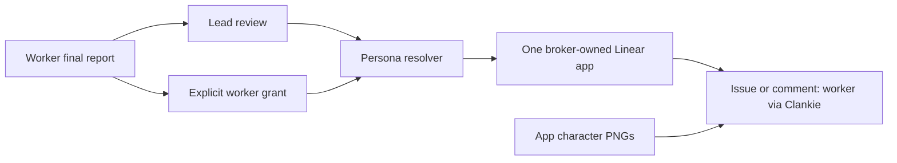

# ADR 0207: Workers publish through one Clankie app

Status: accepted (2026-10-02), authorized by James. Extends
[ADR 0181](0181-clankie-is-independent-of-his-connections.md) and
[ADR 0203](0203-clankie-keeps-what-better-models-cannot-absorb.md).
Setup and implementation boundaries live in [worker posts](../linear-worker-posts.md).

## Context

The fleet already has durable personas and colored characters. James wants
those same characters to appear on their Linear results, across arbitrary
harnesses in Herdr panes, and wants leads to consume compact worker handoffs.
Email aliases do not select an API author. Linear's app actor supports
`createAsUser` and `displayIconUrl` on issue and comment creation.

## Decision

Keep one connected tracker identity: a workspace-owned Clankie OAuth app.
Resolve each post's display name and portrait from an existing fleet persona.
Do not provision a Linear member or email alias for each worker. A displayed
worker is not independently assignable or mentionable in Linear.

Provider credentials stay in the broker. The operator can publish a worker's
result; a worker can publish directly through an explicit restricted grant.
Grants pin the persona and retain their existing account and task fences.
Receipts carry worker provenance independently of the decorative author fields.

Workers return outcome, evidence links, decisions and gaps in their native
final message. Completion wakes pass a bounded excerpt to the lead, which
starts from that report and opens the transcript only as needed. This uses
native harness capabilities and the existing issue/thread records; it adds no
summarization agent, report database or new coordination framework.

## Consequences

- The app and Linear use the same characters without buying per-worker seats.
- Actual authentication, notification filtering and ordinary updates share
  the app identity. Per-worker appearance applies to issue/comment creation.
- Public portrait URLs must be deployed before live use.
- Existing native workers can hand results to the lead. Automatic tracker
  grant installation and inherited connector isolation remain separate work.
- Credential changes invalidate prior grants; display names do not grant access.
