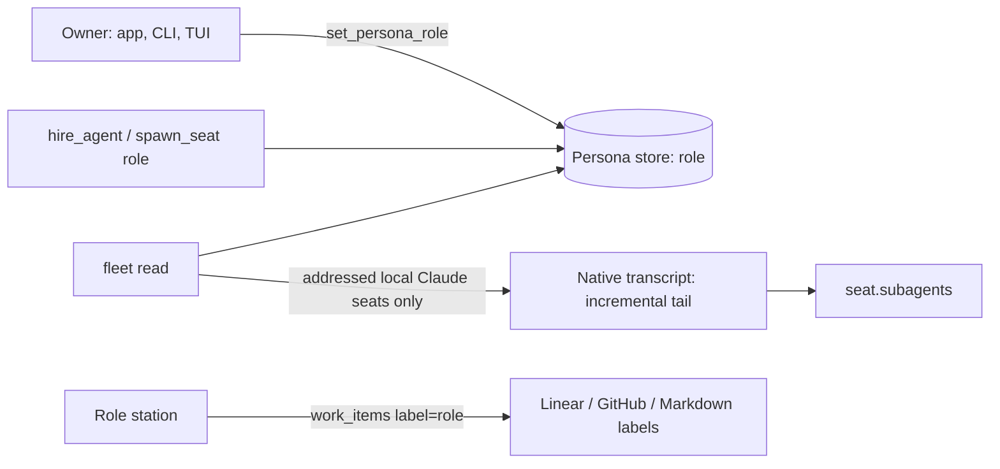

# ADR 0208: Agents carry a role; the world reads it

Status: accepted (James, 2026-10-02). Applies
[ADR 0203](0203-clankie-keeps-what-better-models-cannot-absorb.md) and stays
inside [ADR 0188](0188-native-agent-chats-read-their-own-history.md).

## Context

The app's second version shows the swarm as a pixel world where agents work at
role stations. It needs three facts the host did not carry: what each agent is
for, whether it is fanning out into native subagents inside its own TUI, and
which work items belong at each station. The persona already had an
`appearance.accessory` with role-like names, but that field is cosmetic and
chosen for variety by a hash; a station cannot be keyed on it.

Under ADR 0203 this passes on both counts. The world is part of Clankie's
character, and neither Claude Code nor Codex gives the owner one view of a
mixed fleet's roles, fan-out and backlogs. Better models would not absorb it:
the facts belong to the owner's arrangement, not to any one harness.

## Decision

**A persona carries an optional semantic `role`:** `planner`, `designer`,
`builder`, `tester`, `reviewer` or `researcher`. Absent means unassigned. It
persists in the persona store with the character, survives seat moves, and is
independent of `appearance.accessory`. The owner sets it with the
`set_persona_role` operator op (steer grant), `clankie agents role`, or `/agents
role` in the TUI; Clankie or the owner can set it at hire time with the
optional `role` on `hire_agent` and `spawn_seat`. Nothing infers a role.

**A fleet seat may carry `subagents`:** a running count and up to eight recent
labels. It is derived from the harness's own transcript through
`@clankie/agent-transcript`. For Claude Code, an `Agent`/`Task` call with no
result is running; a background call answers at once with `async_launched` and
finishes when its `<task-notification>` lands in the parent journal; a
foreground call is treated as ended once the main thread speaks again in a new
message. The read is incremental, so a fleet read costs the append. A cold read
covers at most the last 2 MiB.

To respect ADR 0188, discovery alone never reads a transcript. The host reads
only seats it already has an address for: one it hired or whose chat the owner
opened. It reads only local seats. It stores nothing and imports no entries,
and the derived summary contains labels, not content. Absent means unknown,
not zero. Codex is left absent: its collaboration tools record a spawn but not
when the spawned agent finishes. Remote fleets are left absent because each
read would cost an SSH round trip per seat.

**A work item may carry `labels`** from its backend: Linear labels, GitHub
labels (minus the `status: …` labels the GitHub backend writes), or Markdown
`labels:` front matter. Listing accepts one `label` filter, matched
case-insensitively against any label. A station shows the items labelled with
its role. Labels are read-only through this contract. An owner labels work in
the tracker itself.

## Alternatives

- Reuse `appearance.accessory`: it is cosmetic, hash-assigned and has a
  different vocabulary. Overloading it would turn every avatar edit into a
  reassignment.
- Push subagent state from Claude Code hooks: this would need new hook events,
  a service route and per-seat state, and it would cover only plugin-launched
  workers. The transcript already records the facts.
- Read subagents for every roster seat: this violates ADR 0188 for panes that
  are not working for Clankie.
- A separate role-to-backlog mapping: labels already exist in every tracker,
  and the role name is the label.

## Consequences

- The app places agents by `persona.role` and reads a station's backlog with
  `work_items { label: role }`.
- An unaddressed, remote or Codex seat shows no subagents. The world treats
  that as unknown.
- A subagent started before the 2 MiB cold-read window is not counted.
