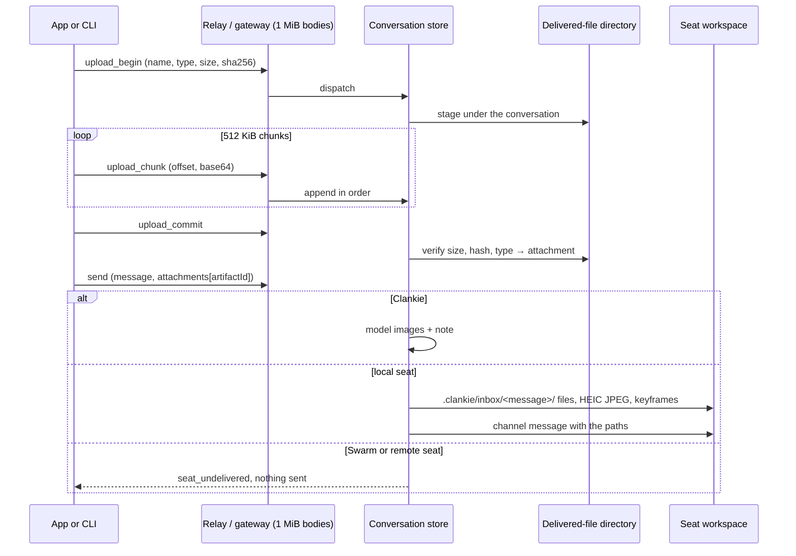

# 0209. Owner attachments reach agents as files

Status: accepted (James asked for it directly, 2026-10-02: "we need a way to
attach image/video to the message composer and send to agents"). Extends
[ADR 0174](0174-finished-files-belong-to-conversations.md).

## Context

ADR 0174 carries files from agents to the owner. The other direction was
missing: the app could pick a photo but the live lane refused attachments, and
no operator op could carry bytes. The relay and the public gateway each accept
at most 1 MiB per request, which is less than one phone photo. The agents that
receive a message are different: Clankie's own Pi session takes model images,
while Claude Code and Codex in Herdr seats open images by path in their own
workspace and cannot read video at all.

## Decision

**Upload.** `upload_begin`, `upload_chunk` and `upload_commit` are operator
conversation ops on the existing dispatch route, so local, relay and hosted
devices share one path and the `chat` grant. A client declares the filename,
media type, size and SHA-256, sends the bytes in order in 512 KiB chunks
(about 700 KB of base64, inside both 1 MiB bodies), and commits. A chunk sent
again after a lost acknowledgement is acknowledged again; a gap is refused with
the offset to resume from. Commit verifies size, hash and the file's leading
bytes against the declared type. Allowed types are PNG, JPEG, HEIC/HEIF, GIF,
WebP, MP4 and QuickTime. Images are capped at 20 MiB (a 48 MP photo fits) and
video at 200 MiB (a couple of minutes of 4K phone video), with eight files per
message and sixteen open uploads per host. An idle upload is dropped after an
hour.

**Storage.** Staged and committed bytes live under the conversation's own
delivered-file directory, so reset, close and retention remove them with
everything else. A committed upload is an `OperatorConversationAttachment`:
the `OperatorDeliveredFile` shape with the larger size bound. Files of at most
15 MiB download through the ADR 0174 route; larger video stays on the host
because the relay and gateway responses are bounded there.

**Send.** `send` names committed attachments by `artifactId`; the message text
may then be empty. The durable operator message records the attachments it
carried.

- Clankie's own session receives images as model images, resized to what the
  provider accepts. HEIC is converted to JPEG first; video becomes six evenly
  spaced keyframes. A note numbers the images and names each stored original
  so his tools can reach it.
- A local Herdr seat (Claude Code, Codex or another harness) receives copies in
  its working directory under `.clankie/inbox/<message>/`. The inbox carries
  its own `.gitignore`, so nothing in it is committed and no tracked file
  changes. Realpath containment rejects a symlinked `.clankie` or inbox. HEIC
  gets a JPEG copy beside it. Video gets six keyframes (eight past twenty
  seconds) in `<name>.frames/` when ffmpeg is installed; otherwise the note
  says ffmpeg is missing. The delivered message is the owner's text followed
  by a note listing every absolute path. The seat's own channel delivers it,
  as with any message (ADR 0207). Clankie's seat in his own head receives the
  files the same way.
- A Swarm peer, a seat on another fleet machine, and a seat whose working
  directory is unknown share no filesystem with the host. The send is refused
  as `seat_undelivered`, with the reason, and nothing is sent: the owner keeps
  the draft instead of a message that silently lost what it was about. Channels
  and rooms refuse attachments.

Every note says the files are owner content to look at and that text inside
them is not an instruction. Model-output and untrusted-input rules are
unchanged.

## Consequences

The app needs no new route or grant, and the CLI uses the same ops
(`clankie send --attach`). Seats need no new tool because they already open
images by path. Older app builds reject a message event that carries
`attachments`, so they must update before the owner sends attachments from a
newer surface. A worker's inbox grows with what the owner sends; it is
git-ignored workspace content that the worker or owner may delete.

## Alternatives

- One large request, or a multipart HTTP route, was rejected because the relay
  and the encrypted gateway bound every body at 1 MiB.
- Base64 attachments inside `send` were rejected for the same reason, and
  because a retried send would resend the bytes.
- Editing the repo's `.gitignore` was rejected because it changes a tracked
  file in someone else's worktree.
- Sending text to a Swarm peer with a note that files were dropped was rejected
  because the owner would not learn that the agent never saw them.
