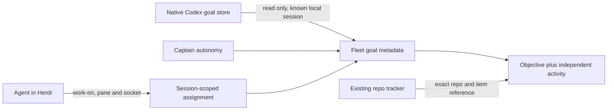

# ADR 0210: Objectives outlive agent turns

Status: accepted (James, 2026-10-02). Applies
[ADR 0203](0203-clankie-keeps-what-better-models-cannot-absorb.md) and
[ADR 0188](0188-native-agent-chats-read-their-own-history.md).

## Context

A seat's turn status and short-lived stance describe activity. Neither says
which enduring objective it is pursuing. An active `/goal` can exist between
turns, and an issue reference can remain useful after the stance expires.
The owner needs to see both facts without turning Clankie into another tracker.

## Decision

The fleet projects optional `goal` and `assignment` metadata on each seat.
Captain conversation goals also arrive in the fleet as conversation-keyed
records, and in conversation list/get responses. Goal changes advance the
fleet cursor independently of turn status.

Readers request `includeWork: true` on fleet, roster, list and get operations.
Without it, responses omit the new work fields so older strict clients keep
working. The app retries without the selector when an older host refuses it.

Local Codex goals come from its native `goals_1.sqlite`, opened read-only for
the seat's known session ID. This reads metadata, never resumes a thread,
imports a transcript or starts a model turn. Missing stores, unknown schemas,
unsupported harnesses and remote seats are unknown. Codex owns goal lifecycle
and budgets; Clankie's existing autonomy runtime owns captain goals.
When a local Codex TUI is Clankie's native head, its goal is projected onto
his default conversation instead.
His native head can state an assignment through the same CLI; it appears on
the default conversation and in the fleet's conversation-keyed `assignments`.

An agent may explicitly state an assignment with `clankie work-on`. The
`state_work` operation identifies the caller through its Herdr pane and source
socket, just like `state_stance`. It is unavailable through the device relay.
The service persists the assignment against the native occupant ID, so a pane
move preserves it and a replacement occupant does not inherit it. `clear`
removes the assignment without changing a native goal or tracked issue.

An assignment contains a short objective and an optional exact
`{repoId, itemId}` reference. It has no lifecycle, acceptance criteria or
tracker mutation. Issue associations are never guessed from prose, names or
issue numbers alone. The repo's existing tracker remains authoritative.

## Consequences

An active goal never makes an idle seat appear to be running. Paused, blocked,
completed and budget-limited objectives remain inspectable. Token usage is
budget consumption, never a completion percentage.

Ordinary tasks require an explicit assignment. Native goal observation currently
covers local Codex seats; other harnesses can publish assignments through the
same local CLI. A future Codex storage change can make goal observation unknown
until the adapter is updated, without breaking fleet discovery.
