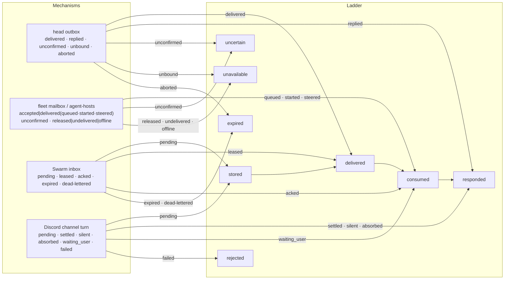

# ADR 0211: A delivery says how far it got

Status: proposed (2026-10-02), for James to accept;
[VUH-1521](https://linear.app/vuhlp/issue/VUH-1521) tracks it. Applies
[ADR 0207](0207-work-records-and-native-agent-delivery.md) and
[ADR 0203](0203-clankie-keeps-what-better-models-cannot-absorb.md). Prompted by
the external architecture spec's receipt ladder (review of 2026-10-02).

## Context

Clankie delivers to agents and rooms over several mechanisms, and each one
reports its result in its own words:

| Path                                 | Reported outcomes                                                                   |
| ------------------------------------ | ----------------------------------------------------------------------------------- |
| Head seat outbox (ADR 0152)          | `delivered`, `replied`, `unconfirmed`, `unbound`, `aborted`                         |
| Fleet seat mailbox (ADR 0161)        | `delivered` (`queued`/`started`/`steered`), `unconfirmed`, `undelivered`, `offline` |
| Harness seat control (`agent-hosts`) | `accepted` (`queued`/`started`/`steered`), `released`, `offline`, `unconfirmed`     |
| Swarm leased inbox (ADR 0180)        | pending, leased, acknowledged, expired with a reason, dead-lettered                 |
| Discord channel turn (ADR 0177)      | `pending`, `settled`, `silent`, `absorbed`, `waiting_user`, `failed`                |

The same word means different things. The head outbox says `delivered` once
its bridge takes the event and comes back to poll again; the fleet mailbox
says `delivered` only after the harness itself queued, started or steered a
turn; `agent-hosts` calls that same fact `accepted`. "No channel" is
`unbound`, `released`, `undelivered` or `offline` depending on the path. A
lead, the app and a model reading a tool result cannot tell how far a message
actually got without knowing which mechanism carried it, which is exactly the
ambiguity ADR 0207 forbids claiming past.

## Decision

Every delivery result that leaves its mechanism, whether in a tool result, an
API response, the fleet or the app, reports one stage from a shared ladder.
The mechanism's own detail rides alongside; it does not replace the stage.

| Stage       | Means                                                                                       | Does not mean                    |
| ----------- | ------------------------------------------------------------------------------------------- | -------------------------------- |
| `stored`    | Clankie durably accepted it for delivery                                                    | Anyone is reachable              |
| `delivered` | It reached the recipient's channel, bridge or inbox                                         | The harness or model has seen it |
| `consumed`  | The harness acknowledged it: queued, started or steered a turn, or acked a leased envelope  | The work is done                 |
| `responded` | A correlated reply or turn outcome exists (including a chosen silence or an absorbing turn) | An external effect succeeded     |

And the stops short of the ladder:

| Outcome       | Means                                                           | Allows                              |
| ------------- | --------------------------------------------------------------- | ----------------------------------- |
| `unavailable` | No supported channel reached the recipient; nothing was sent    | Report it; never type into the pane |
| `uncertain`   | Sent, but no acknowledgment arrived before the deadline         | Reconcile before any retry          |
| `expired`     | A deadline, release or dead-letter ended it without consumption | A fresh, explicit send              |
| `rejected`    | Policy or validation refused it                                 | Nothing automatic                   |

The current outcomes map without changing any mechanism:

`waiting_user` is `consumed` because the turn ran and stopped on an owner
decision; the question it raises is its own message. A Discord `failed` turn
maps to `rejected` only for a refusal; an interrupted or stalled turn maps to
`expired`. The mapping lives once in `@clankie/protocol`, beside the existing
types, so each mechanism keeps its precise internal vocabulary.

## Options weighed

- **One durable conversation service behind every path** (the external
  spec's proposal). Rejected for now: ADR 0207 deliberately routes local hires
  through native harness channels, and the observed failures were in
  reporting and fallback, not in a missing broker. A shared vocabulary removes
  the ambiguity without a new service; a broker can follow if a measured
  delivery gap needs one.
- **Rename every mechanism's outcomes to the ladder.** Rejected: the internal
  words carry real detail (`steered` versus `queued`, `silent` versus
  `absorbed`) that the ladder would erase.
- **Leave it to each tool's description.** Rejected: that is the status quo,
  and a model or the app still has to know which mechanism ran.

## Consequences

- A tool result or app badge can say "reached the pane, not yet consumed"
  truthfully, on any path.
- `uncertain` is the one stage that blocks an automatic retry everywhere,
  which is how ADR 0207's rule becomes checkable in tests.
- `consumed` is never presented as task progress or completion; work state
  stays with the repo tracker (ADR 0191).
- Adding a new delivery mechanism requires its ladder mapping before it is
  advertised.
