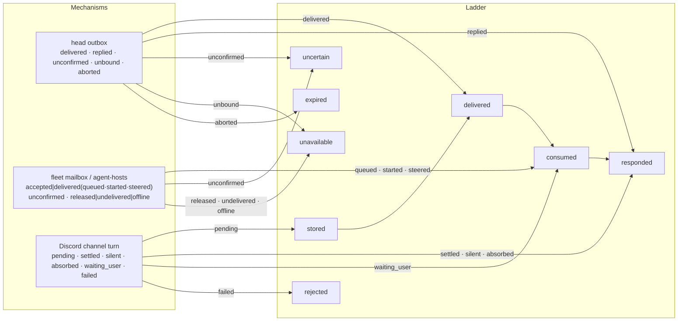

# ADR 0211: A delivery says how far it got

Status: accepted by James (2026-10-03), with the amendments below;
[VUH-1521](https://linear.app/vuhlp/issue/VUH-1521) tracks it. Applies
[ADR 0207](0207-work-records-and-native-agent-delivery.md) and
[ADR 0203](0203-clankie-keeps-what-better-models-cannot-absorb.md). Prompted by
the external architecture spec's receipt ladder (review of 2026-10-02).

James accepted the ladder with three amendments: remove the retired Swarm
mapping ([ADR 0213](0213-clankie-retires-swarm.md)); reconcile an `uncertain`
delivery before any retry; and treat a native queue acknowledgment as
`consumed`, without claiming the model has seen the message. Native mechanism
detail (`queued`, `started`, `steered`) remains alongside the stage.

## Context

Clankie delivers to agents and rooms over several mechanisms, and each one
reports its result in its own words:

| Path                                 | Reported outcomes                                                                   |
| ------------------------------------ | ----------------------------------------------------------------------------------- |
| Head seat outbox (ADR 0152)          | `delivered`, `replied`, `unconfirmed`, `unbound`, `aborted`                         |
| Fleet seat mailbox (ADR 0161)        | `delivered` (`queued`/`started`/`steered`), `unconfirmed`, `undelivered`, `offline` |
| Harness seat control (`agent-hosts`) | `accepted` (`queued`/`started`/`steered`), `released`, `offline`, `unconfirmed`     |
| Discord channel turn (ADR 0177)      | `pending`, `settled`, `silent`, `absorbed`, `waiting_user`, `failed`                |

The same word means different things. The head outbox says `delivered` once
its bridge takes the event and comes back to poll again; the fleet mailbox
says `delivered` only after the harness itself queued, started or steered a
turn; `agent-hosts` calls that same fact `accepted`. "No channel" is
`unbound`, `released`, `undelivered` or `offline` depending on the path. A
lead, the app and a model reading a tool result cannot tell how far a message
actually got without knowing which mechanism carried it, which is exactly the
ambiguity ADR 0207 forbids claiming past.

## Decision

Every delivery result that leaves its mechanism, whether in a tool result, an
API response, the fleet or the app, reports one stage from a shared ladder.
The mechanism's own detail rides alongside; it does not replace the stage.

| Stage       | Means                                                                                       | Does not mean                             |
| ----------- | ------------------------------------------------------------------------------------------- | ----------------------------------------- |
| `stored`    | Clankie durably accepted it for delivery                                                    | Anyone is reachable                       |
| `delivered` | It reached the recipient's channel, bridge or inbox                                         | The harness or model has seen it          |
| `consumed`  | The harness acknowledged it: queued, started or steered a turn                              | The model has seen it or the work is done |
| `responded` | A correlated reply or turn outcome exists (including a chosen silence or an absorbing turn) | An external effect succeeded              |

And the stops short of the ladder:

| Outcome       | Means                                                           | Allows                              |
| ------------- | --------------------------------------------------------------- | ----------------------------------- |
| `unavailable` | No supported channel reached the recipient; nothing was sent    | Report it; never type into the pane |
| `uncertain`   | Sent, but no acknowledgment arrived before the deadline         | Reconcile before any retry          |
| `expired`     | A deadline, release or dead-letter ended it without consumption | A fresh, explicit send              |
| `rejected`    | Policy or validation refused it                                 | Nothing automatic                   |

The current outcomes map without changing any mechanism:

`waiting_user` is `consumed` because the turn ran and stopped on an owner
decision; the question it raises is its own message. A Discord `failed` turn
maps to `rejected` only for a refusal; an interrupted or stalled turn maps to
`expired`. The mapping lives once in `@clankie/protocol`, beside the existing
types, so each mechanism keeps its precise internal vocabulary.

A native queue acknowledgment is `consumed` even when an active turn or goal
keeps the message pending. Report the `queued` detail and that delay; it does
not establish that the model has read the message. An `uncertain` result must
be reconciled before any retry, including an explicit retry, so a missing
receipt never creates a duplicate turn.

## Options weighed

- **One durable conversation service behind every path** (the external
  spec's proposal). Rejected for now: ADR 0207 deliberately routes local hires
  through native harness channels, and the observed failures were in
  reporting and fallback, not in a missing broker. A shared vocabulary removes
  the ambiguity without a new service; a broker can follow if a measured
  delivery gap needs one.
- **Rename every mechanism's outcomes to the ladder.** Rejected: the internal
  words carry real detail (`steered` versus `queued`, `silent` versus
  `absorbed`) that the ladder would erase.
- **Leave it to each tool's description.** Rejected: that is the status quo,
  and a model or the app still has to know which mechanism ran.

## Consequences

- A tool result or app badge can say "reached the pane, not yet consumed"
  truthfully, on any path.
- `uncertain` blocks every retry until reconciled,
  which is how ADR 0207's rule becomes checkable in tests.
- `consumed` is never presented as task progress or completion; work state
  stays with the repo tracker (ADR 0191).
- Adding a new delivery mechanism requires its ladder mapping before it is
  advertised.

## Implementation boundaries

Protocol results retain mechanism-specific outcomes and add `deliveryStage`.
Conversation acceptance is `stored`; a native seat acceptance is `consumed`;
turn stream events retain the final receipt stage independently of the local
run's completion phase. Plain mailbox acknowledgments remain `delivered`.
The existing queue state and detail remain available for operator display.

Head and fleet mailboxes persist unresolved event IDs and expose authenticated
exact-ID acknowledgment endpoints. A fresh poll after restart cannot reconcile
an old event. Native fleet sends and hires persist unresolved original session,
pane and message evidence before dispatch. They never send a replacement while
uncertain; a new complete matching operator transcript entry can reconcile the
original session. If that evidence is unavailable, delivery remains blocked.
An unbound channel does not authorize a fallback after an uncertain dispatch.

OpenCode additionally fences native claims across launcher replacement. Native
history must match the complete original synthetic event in the original
session to reconcile a lost receipt. Bridge persistence and native consumption
remain separate receipts. Pending launch journals do not become automatic
restart replay queues. No new broker, harness transcript format, or Swarm path
is introduced. Deterministic verification does not claim a live model trial.

### Inbound fleet acceptance and restart

Both `clankie mcp --seat` and the installed `--fleet` worker bridge use the
same durable pending claim. Before a POST, an authenticated read resolves the
pane's current native session binding. The bridge exclusively persists an ID,
binding and original payload fingerprint under `~/.clankie/inbound-receipts/`.
The stable socket/pane scope survives bridge replacement and port refresh.
Concurrent bridges cannot claim two originals, and an old response can clear
only its own exact ID. An abandoned mutation lock or corrupt claim blocks
writes; neither age nor process replacement proves an original was unsent.

The service checks the asserted binding against a fresh native inspection
through the existing authenticated pane route. This assertion grants no
membership or authority. A pane-scoped pending fence is persisted before
acceptance; a different ID, binding or payload cannot replace it. The full
original text, wrapped untrusted agent output, receipt and run ID are retained
in the conversation's atomic metadata write **before** event publication and
dispatch. That write is the `stored` boundary, not evidence of a started turn.
On restart, metadata accepted before event publication produces the missing
accepted event and a `service_restarted` failure. It never replays model work.

`GET .../messages/:id?binding=...&fingerprint=...` reconciles only that original
persisted acceptance without sending work. Unknown, revoked, corrupt or
mismatched evidence remains `uncertain`. A late original acceptance can resolve
the fence. A different follow-up presented during reconciliation stays unsent,
even when the original resolves. Accepted payload receipts are retained with
the conversation metadata independently of event-history trimming. Explicit
conversation reset/removal may remove that proof; retained attempted-ID
tombstones prevent dispatching the same ID again. A genuinely new, undispatched
request can report an exact `unavailable` refusal; a denied lookup of an earlier
unknown outcome cannot clear its pending claim.

Legacy reads and optional `deliveryStage` decoding remain compatible. Inbound
POSTs without an exact delivery ID and binding are rejected before dispatch:
allowing an old bridge to generate uncorrelated replacement writes would defeat
the fence. A legacy success response without the original exact receipt cannot
resolve a new bridge's pending claim. The linked bridge still refreshes its
link after a refused connection; safe reads may follow the refreshed port, but
an uncertain POST is never blindly repeated. No local bearer was introduced.
