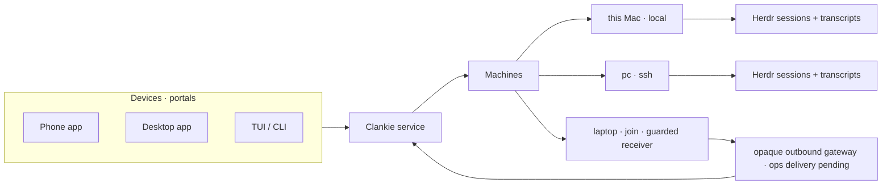

# 0212. Machines run agents; devices reach Clankie

Status: partially implemented (2026-10-08). Local/SSH discovery and live
connections are implemented. The public outbound `join` contract and guarded
receiver are implemented; gateway deployment, native worker/screen adapters
and real Mac/Windows captures remain pending (VUH-1800). `join` is decided by
[ADR 0244](0244-machines-join-clankie-at-an-access-level.md), which also adds
per-machine access levels. Amends the onboarding and writer sections of
[ADR 0184](0184-clankie-leads-more-than-one-fleet.md) and the agent-host list of
[ADR 0189](0189-agent-sessions-read-from-their-transcripts.md). The connection
contract of [ADR 0181](0181-clankie-is-independent-of-his-connections.md), the
binding rules of [ADR 0157](0157-herdr-is-an-owned-runtime.md) and
[ADR 0172](0172-herdr-sessions-follow-official-releases.md), and pairing in
[ADR 0204](0204-a-self-hosted-mac-pairs-the-app-directly.md) are unchanged.

## Context

Adding a place where agents run has five entry points, each with its own word:

| Today                                       | Effect                                          | Surfaces                                 |
| ------------------------------------------- | ----------------------------------------------- | ---------------------------------------- |
| `herdr use` / `create` / `disable`          | Default fleet binding; restart                  | CLI, TUI `/herdr`                        |
| `runtime connect ID --session` / `--socket` | Another local Herdr session                     | CLI, TUI, app (free-text names)          |
| `herdr add NAME --ssh HOST --session S`     | Remote fleet; session must run; restart         | CLI only                                 |
| `agents hosts add NAME --ssh HOST`          | Transcript host in a separate `agentHosts` list | CLI, TUI `/connections → Agent sessions` |
| `pair` / `devices` / `gateway direct`       | Phone and desktop portals                       | CLI, TUI `/pair`                         |

The same PC is registered twice — once as a fleet, once as a transcript host —
with no link between the records. Every form asks for a typed session name;
ADR 0184's ssh-config discovery and the app's fleet dropdown were not built.
The app's `connect_runtime` operation accepts only a local session name, and
its inventory carries no machine. Remote fleets are read once at service start
(`apps/clankie/src/index.ts`) and handed to the captain as a fixed list, so
adding one needs `clankie restart captain`. Fleet, runtime, connection,
session, host, device and machine all appear in user-facing text.

## Decision

**Two user-facing nouns.** A **machine** is where agents run: this Mac, an ssh
host, and later a machine that dials in. A **device** is a portal the owner
talks to Clankie through — the paired phone and desktop app. Herdr sessions
and transcript access are things a machine has. Fleet, runtime connection and
agent host remain internal and wire terms; existing commands remain as aliases.

**One machine record.** A machine names its transport (`local`, `ssh` with host
alias and shell; `join` reserved for the follow-up below). Its Herdr sessions
are the runtime connections that name it, and its transcripts are read over the
same transport. Adding an ssh machine registers transcript reading immediately
and offers its running Herdr sessions; the existing `agentHosts.connections`
and ssh `execution.connections` entries migrate into machines without changing
connection ids, so seat ids like `pc/w2:p1J`, grants and stored bindings keep
their meaning. `local` always exists.

**Discovery first.** `GET /v1/machines` returns configured machines with state
and agent counts, plus candidates: local `herdr session list`, and hosts from
the owner's ssh configuration that answer `herdr session list` within a bounded
probe (`BatchMode`, no prompts, cached briefly). Picking a candidate uses the
existing writers. A typed name stays as the fallback. Discovery never starts a
Herdr server or installs anything remotely.

**The same flow on every surface.**

- CLI: `clankie machines`, `machines discover`, `machines add NAME --ssh HOST`,
  `machines remove NAME`, and `machines sessions NAME` to connect a discovered
  session. `herdr add/remove/fleets`, `runtime connect` and `agents hosts`
  remain as aliases. `machines` and `herdr status` print a readable summary
  by default and take `--json` for agents, like `devices`; `--help` names
  these commands instead of the retired runtime vocabulary.
- TUI: `/machines` replaces the Runtimes and Agent sessions sections of
  `/connections`: machines → sessions → connect, with discovered candidates
  listed first. `/herdr` keeps the default-fleet choice.
- App: Settings → Machines (status, agent count, add sheet over discovery);
  Settings → Devices stays separate. The protocol's connections operation
  gains `discover`, `add_machine` and a `machine` on runtime rows, under the
  existing `steer` grant. The header fleet dropdown from ADR 0184 follows.

**Named connections apply live.** Adding, removing, connecting or
disconnecting a named or ssh connection takes effect without a captain
restart: the captain reads the fleet list through `runtimes.fleets()` per use
instead of a startup snapshot. Changing the default binding still applies on
restart, as ADR 0172 decides. Removing a machine never stops its workers or
redirects existing work.

**The console is the conversation; `clankie herdr` is the workspace.** `clankie`
opens the operator console in the current terminal, in every runtime mode.
Agents are visible inside it, the way Claude Code shows its subagents: a
compact live strip lists each agent's name, state and current step, and one
key expands an agent to its transcript or a live terminal tail (the stream of
[ADR 0138](0138-terminal-truth-rides-the-operator-relay.md)) and lets the owner
message it. `clankie herdr` with no arguments attaches the full Herdr
workspace, as `clankie-herdr` already does; its status moves to
`clankie herdr status`. The console never runs inside a Herdr it starts, so an
owner who already uses Herdr never gets one Herdr inside another.

**Onboarding never asks about Herdr.** A new install takes Clankie's own
workspace (the bundled runtime, ADR 0157's default), and `/setup` keeps its one
required question ([ADR 0190](0190-setup-asks-one-question-then-clankie-takes-over.md)).
Only when `doctor` finds Herdr installed with running sessions does the setup
checklist offer a row: keep his own workspace (recommended) or lead the
owner's session, saying that leading it lets him see and message every pane
in it. The first hire is where workers are introduced: the agent appears in
the console strip, and he can mention `clankie herdr` in his own words. User
text says "his workspace" or "your Herdr session", never bundled, external or
runtime.

**Outbound: `clankie join`.** A machine with no ssh route runs `clankie join`,
generates a 256-bit approval code locally, and dials out through the gateway like the Mac does — the third
transport. The owner approves the code, access level and advertised directories. The public
receiver and registry are implemented; ops-side routing and real gateway proof
remain pending. Bootstrap advertises only the code hash; approval uses the
existing trusted owner surface. Following [ADR 0173](0173-the-gateway-cannot-read-device-traffic.md),
the approved lease is encrypted for the code holder. The broker-owned machine
capability authenticates encrypted channel/leave requests; the service consumes
a fresh identity-bound challenge before any effect and encrypts replies under
an independent per-request key. The receiver independently intersects current
policy with its original approved ceiling and directories; widening that
consent requires fresh owner approval. The gateway can observe metadata and deny
delivery, but cannot read or forge commands, results or capabilities.

## Consequences

- One add flow per machine instead of two registrations; one list to read.
- The protocol change lands here first; `~/dev/clankie-app` consumes it as a
  sibling and records its Settings change in its own ADR.
- Discovery probes ssh hosts the owner configured; an unreachable host is a
  candidate state, not an error, and a slow host cannot block the listing.
- Old command names stay supported for scripts; docs and skills move to
  machine and device wording.
