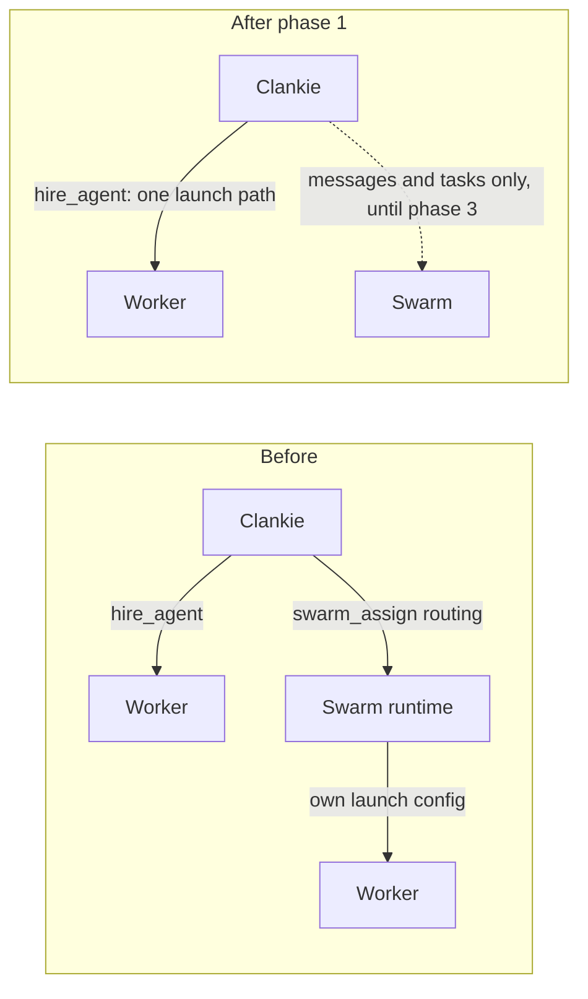
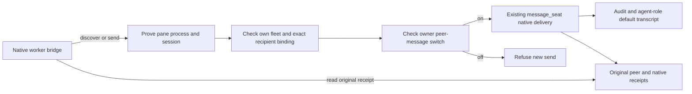

# ADR 0213: Clankie retires Swarm

Status: accepted (James, 2026-10-02). All three phases implemented.
Supersedes ADRs [0180](0180-swarm-is-the-coordination-layer.md),
[0182](0182-swarm-peers-are-messageable-personas.md),
[0194](0194-interactive-swarm-workers-receive-leased-channel-events.md),
[0198](0198-one-coordinator-reaches-every-fleet.md) and
[0205](0205-the-fleet-carries-its-open-swarm-tasks.md). Amends
[ADR 0203](0203-clankie-keeps-what-better-models-cannot-absorb.md) and
[ADR 0207](0207-work-records-and-native-agent-delivery.md).

## Context

ADR 0203 kept Swarm as Clankie's way to reach agents across vendors and machines.
Since then Clankie became that hub himself. He hires Claude Code, Codex and pi
workers through `hire_agent`, reaches them through their native channels (the
Claude plugin channel, the Codex app-server), and relays between them. Swarm
duplicates that with a second coordinator that has its own inboxes, leases,
fencing and dead letters. It is also the second way to start a worker:
`swarm_assign` with `routing` made the Swarm runtime launch a harness with
configuration it built itself. That launch path:

- loaded the owner's own Linear connector, bypassing the connected account
  ([worker tracker identity](../worker-tracker-identity.md));
- carried headless stream workers that ADR 0203 rejects, until ADR 0194's
  interactive mode;
- produced the retained dispatches and dead letters in VUH-1516 and VUH-1517.

ADR 0203's incident list also records one Swarm disconnect failing every seat
tool. Use on this Mac is light: the busier coordinator holds 24 dispatches in
total, the last on 2026-09-30, and 9 messages since 2026-09-28. The cut audit
found no Swarm tool calls from Clankie or his seat after 2026-09-27.

Two things only Swarm does today:

- **Agents on another machine:** the ssh relay to the Mac coordinator (ADR 0198).
  Remote hires have no native channel, so without Swarm they would be reached by
  typing, which ADR 0207 rules out.
- **Agents Clankie did not start:** independent peers messaging him (ADR 0182).

## Decision

Clankie stops using Swarm, in three phases.

1. **No Swarm launches (done).** Clankie writes its Herdr dispatch routes
   disabled; they stay registered only so existing receipts can be reconciled and
   stopped. `swarm_assign` with `routing` is refused before reaching the
   coordinator, and its `harness` and `runtime` parameters are removed. Every
   worker Clankie starts goes through `hire_agent`. Messages, tasks and peers
   among agents that are already running are unchanged.
2. **Native reach to remote agents.** Remote hires get the same delivery as local
   ones, through the ssh link Clankie already holds to each fleet (ADR 0184): the
   Codex app-server and the Claude plugin channel on the remote machine. Agents
   Clankie did not start reach him through his MCP server and the seat mailbox.
3. **Remove the embedded Swarm.** Delete `packages/swarm`, the vendored runtime,
   the `swarm_*` tools, the fleet relay, the fleet's Swarm task view and the
   matching protocol fields the private app consumes. Retained coordinator state
   stays on disk for inspection.

James's own agent fleet may keep using Swarm on its own; this decision covers
Clankie.

## Implementation and disposition

VUH-1527 supplied native remote hires, the per-fleet link, `message_clankie`
and fleet grants. VUH-1528 removes the embedded runtime, coordinator relays,
Swarm tools and controls, task/contact protocol fields and task-bound grants.
The private app removes those consumers in step. Manual grants and fleet grants
remain. Existing settings discard retired coordinator and dispatch fields;
saved task-bound grants confer no access. Saved personas and conversations
remain offline, and coordinator state under `~/.clankie/swarm` remains on disk.

James cancelled VUH-1517 on 2026-10-03, disposing of the retained Mac dispatch
work. The worker plugin kept its MCP server key `swarm` for compatibility with
hire permissions and installed PC configuration until 2026-10-03, when it became
`clankie` (hire permissions followed in VUH-1784); only its native hire/link
channel remains. James's independent Swarm fleet and installs are unaffected.

## Consequences

- One launch path means tracker isolation, model and effort selection, roles and
  attachments apply to every worker Clankie starts.
- A lead hires parallel workers through native channels and assigns work in
  the repo's tracker (ADR 0191).
- Remote workers use the fleet link and their native harness channels or
  session APIs. Independent linked agents can initiate messages to Clankie.
- Fenced task claims between agents go away in phase 3. Work ownership already
  lives in the tracker.

Operator receipt recovery distinguishes a mapped abandonment from
`abandoned-unknown`. The latter requires an existing authenticated fresh Codex
launch journal and a complete current host census, retains unknown allocation
fate and permanently fences the original. Choosing it explicitly permits
separately new work through fresh-intent admission; it cannot prove no launch or
grant ownership of an observed pane. Every new UUID, brief, owner, project and
target check still applies. See [receipt recovery](../cli.md)
for the operator commands.

## Local fleet authority (VUH-1548)

The VUH-1527 fleet grant also covers `default`, Clankie's connected local Herdr
session, including owner-started agents. It stays scoped to the selected tools
and account and standing until owner revocation. The original short-lived-worker
goal uses short-lived bearer grants for individual workers; this fleet path
instead rechecks membership and grants on every request/tool call, with a
15-minute idle MCP session lease. It does not silently turn a fleet grant into a
renewable individual bearer.

On macOS the separate local loopback listener derives the client PID from its
actual TCP tuple using `lsof`, then checks bounded `ps` ancestry against the live
Herdr pane shell. It checks the configured binding, open socket and tuple again
before admitting a request. Private hired Codex app-server PIDs are associated
with their allocated pane by the service at spawn, including pending startup;
release, failure and exit revoke that mapping. Process/pane IDs claimed by a
caller confer nothing. Unsupported platforms and shared-daemon Codex processes
fail closed. This protects against forged local HTTP/env claims, not malicious
code already controlling the same OS account, Herdr or the service files.

Fresh managed Windows Codex roots receive their assigned worker name through the native metadata API before the first brief. This prevents Codex's automatic title helper from creating a second thread on the private server; strict single-thread sender proof remains. Resumes and existing names are preserved, and an unconfirmed native name stops startup before input. The dedicated server's controller owns startup catalog evidence; its lifecycle hook does not replace it with an embedded-session warning.

Only that listener may place a request identity into the in-memory WeakMap read
by the application. A temporary per-request proof stays inside the service and
binds MCP sessions to one pane; no credential is delivered to the worker. The
local discovery JSON holds only socket and loopback URL. The SSH fleet path
continues to use its owner-readable session link token; neither path exports the
operator bearer or connected provider credentials. The local listener forwards
only worker MCP and exact-pane mailbox/hook/message routes. Tool execution
continues through the credential broker and the existing live fleet-grant checks.

## Direct peer messages (VUH-1608)

The native delivery path now covers worker-to-worker messages inside one fleet.
Workers should not need Clankie to relay each question, blocker or useful result.
This extends native seat messaging; it introduces no coordinator, task ownership
system or restored Swarm transport.

The Claude worker plugin's `seat-channel.mjs` and `clankie mcp --fleet` share
`runSeatChannel`. Their worker catalog exposes `list_fleet_seats({})` and
`message_peer({seat, text})` when the service proves a native sender and the
owner's `fleet.peerMessages` setting is `on` (the default). Discovery returns the
sender's own fleet and exact recipient seat/binding records. The caller passes
the returned `seatId` as `seat`; the bridge obtains the current sender and
recipient bindings for the server to check.

The service owns the boundary, on both local and remote paths:

- The sender must have a proven native pane process and matching native session.
  A claimed pane ID, environment variable, plugin installation or legacy fleet
  bearer alone is insufficient. The broader connected-tool admission in
  [ADR 0217](0217-fleet-membership-gets-connected-tools.md) does not grant this
  stronger seat identity.
- Recipients belong to the sender's own fleet and must retain the exact current
  binding from discovery. A later pane occupant cannot inherit the old address.
- Sending reuses `message_seat` native harness channel/session delivery, receipts
  and refusal states. It never writes terminal keys. An uncertain native handoff
  stays associated with its original native receipt and is never resent.
- Message framing identifies the proven worker as agent output, never an owner
  instruction or new authority. The service records an audit with sender,
  recipient and native receipt provenance, plus an agent-role message in Clankie's
  default transcript. Native channel events carry `source: peer`. It does not change worker-to-Clankie
  inbound routing, wake Clankie or invent an operator turn.

Worker HTTP discovery is `GET /v1/fleet/seats/{paneId}/peers`; send is
`POST /v1/fleet/seats/{paneId}/peer-messages`; reconciliation is
`GET /v1/fleet/seats/{paneId}/peer-messages/{id}`. The admitted identity, not
request fields, establishes the sender and scope of each receipt read. An
uncertain bridge request keeps its original ID across bridge replacement and
reconciles by reading; missing acknowledgment never authorizes another POST.

When an uncertain original's recipient is no longer bound, reconciliation
settles it to `recipient_gone` with outcome `unconfirmed`: the native handoff's
outcome remains unknown, the original is never resent, and it no longer blocks
the sender from a fresh message. This terminal state survives restart and cannot
be promoted by a concurrent late native observation. The bridge clears the exact
original claim only for this stage/outcome pair; a different follow-up in that
same call remains unsent.

The receipt journal retains full bodies for the latest 100 settled messages and
all uncertain originals. Older settled records become compact receipts containing
the original identity, scope and result. Those receipts remain queryable and
prevent replay of old IDs; body pruning never deletes uncertainty or authorizes
another dispatch. Pruning commits only after the journal is persisted successfully.

The owner controls this separately from connected tools through
`clankie fleet set --peer-messages off|on` and the `/fleet` editor. `off` hides
both peer tools and refuses new sends server-side, including stale calls. Receipt
reads and reconciliation remain allowed while off. A message already dispatched
to the native receiver cannot be recalled. Workers do not gain permission to
change the switch, broaden fleet scope or promote another agent's text into an
owner instruction.

Deterministic server and bridge tests cover authority, fleet isolation, stale
bindings, the switch and uncertain receipt reconciliation. The live PC check with
two KH2 panes follows landing and re-pin; those tests are not evidence that the
installed native PC path worked.
