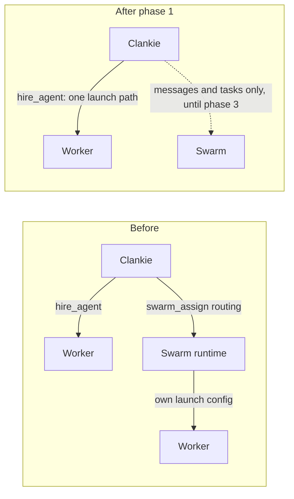

# ADR 0213: Clankie retires Swarm

Status: accepted (James, 2026-10-02). Phase 1 implemented; phases 2 and 3 are
tracked in Linear. Amends [ADR 0180](0180-swarm-is-the-coordination-layer.md),
[ADR 0203](0203-clankie-keeps-what-better-models-cannot-absorb.md) (Swarm leaves the
keep-and-invest list) and [ADR 0207](0207-work-records-and-native-agent-delivery.md).
Phase 3 will supersede [ADR 0182](0182-swarm-peers-are-messageable-personas.md),
[ADR 0194](0194-interactive-swarm-workers-receive-leased-channel-events.md),
[ADR 0198](0198-one-coordinator-reaches-every-fleet.md) and
[ADR 0205](0205-the-fleet-carries-its-open-swarm-tasks.md).

## Context

ADR 0203 kept Swarm as Clankie's way to reach agents across vendors and machines.
Since then Clankie became that hub himself. He hires Claude Code, Codex and pi
workers through `hire_agent`, reaches them through their native channels (the
Claude plugin channel, the Codex app-server), and relays between them. Swarm
duplicates that with a second coordinator that has its own inboxes, leases,
fencing and dead letters. It is also the second way to start a worker:
`swarm_assign` with `routing` made the Swarm runtime launch a harness with
configuration it built itself. That launch path:

- loaded the owner's own Linear connector, bypassing the connected account
  ([worker tracker identity](../worker-tracker-identity.md));
- carried headless stream workers that ADR 0203 rejects, until ADR 0194's
  interactive mode;
- produced the retained dispatches and dead letters in VUH-1516 and VUH-1517.

ADR 0203's incident list also records one Swarm disconnect failing every seat
tool. Use on this Mac is light: the busier coordinator holds 24 dispatches in
total, the last on 2026-09-30, and 9 messages since 2026-09-28. The cut audit
found no Swarm tool calls from Clankie or his seat after 2026-09-27.

Two things only Swarm does today:

- **Agents on another machine:** the ssh relay to the Mac coordinator (ADR 0198).
  Remote hires have no native channel, so without Swarm they would be reached by
  typing, which ADR 0207 rules out.
- **Agents Clankie did not start:** independent peers messaging him (ADR 0182).

## Decision

Clankie stops using Swarm, in three phases.

1. **No Swarm launches (done).** Clankie writes its Herdr dispatch routes
   disabled; they stay registered only so existing receipts can be reconciled and
   stopped. `swarm_assign` with `routing` is refused before reaching the
   coordinator, and its `harness` and `runtime` parameters are removed. Every
   worker Clankie starts goes through `hire_agent`. Messages, tasks and peers
   among agents that are already running are unchanged.
2. **Native reach to remote agents.** Remote hires get the same delivery as local
   ones, through the ssh link Clankie already holds to each fleet (ADR 0184): the
   Codex app-server and the Claude plugin channel on the remote machine. Agents
   Clankie did not start reach him through his MCP server and the seat mailbox.
3. **Remove the embedded Swarm.** Delete `packages/swarm`, the vendored runtime,
   the `swarm_*` tools, the fleet relay, the fleet's Swarm task view and the
   matching protocol fields the private app consumes. Retained coordinator state
   stays on disk for inspection.

James's own agent fleet may keep using Swarm on its own; this decision covers
Clankie.

## Consequences

- One launch path means tracker isolation, model and effort selection, roles and
  attachments apply to every worker Clankie starts.
- A lead that wants parallel workers hires them and assigns work in the repo's
  tracker (ADR 0191). An agent that asks Swarm to dispatch gets a refusal that
  names `hire_agent`.
- Until phase 2, remote fleets keep Swarm messaging through the relay.
  Starting a remote worker still uses the terminal lane it used before.
- Fenced task claims between agents go away in phase 3. Work ownership already
  lives in the tracker.
