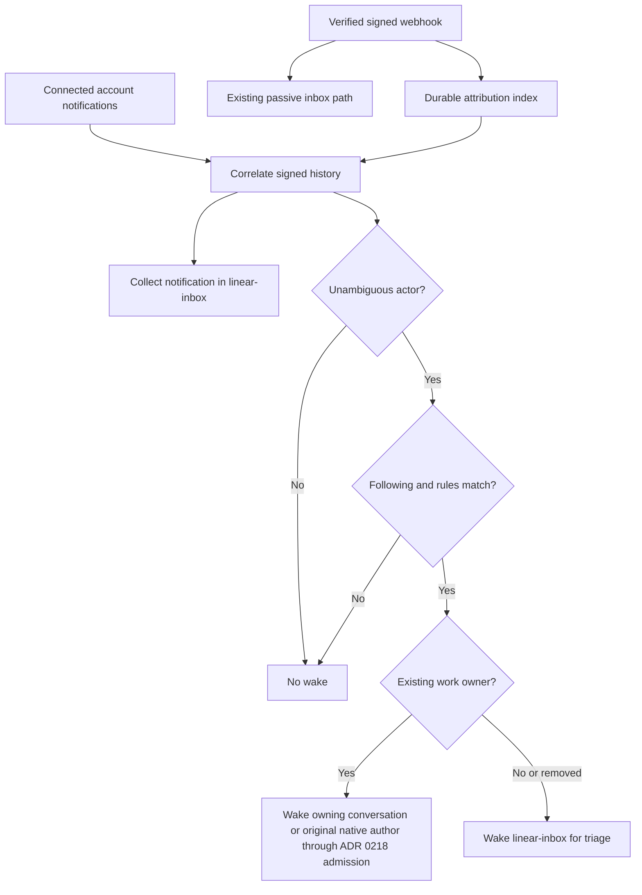

# ADR 0214: Linear wakes require attribution and rules

Status: accepted (James / Clankie lead, 2026-10-02, [VUH-1549](https://linear.app/vuhlp/issue/VUH-1549)).
Destination amended by [ADR 0218](0218-native-seats-drive-their-attached-conversation.md) (2026-10-04): eligible owned events wake their leading conversation; unowned/removed owners wake `linear-inbox`. Attribution and rules below remain unchanged.
Amends [ADR 0189 (Linear echoes)](0189-his-own-linear-activity-does-not-wake-him.md).

## Context

The connected Clankie app's Linear MCP notification response has no actor field.
Testing an absent actor against the connected account admitted every notification,
including bursts of self-authored subscriptions. Notification subtitles and display
names cannot establish whether James or a worker acted. The signed webhook carries
actor identity and type ([Linear's envelope](https://linear.app/developers/webhooks)).

## Decision

Attribute notifications before deciding to wake. Correlate the workspace, resource,
comment when available, action timestamp and relevant revision kind against signed
webhook history. Retain a bounded structured attribution index because inbox prompts
are truncated for model context. Record exact self echoes in that index before the
existing receipt suppression; inbox collection and acknowledgment remain unchanged.
Different or missing actors among candidates mean unknown, never a best guess.

Settings beside the follow switch select owner humans, any human, the connected
account/app and workers, or named IDs, and filter notification types. Defaults select
only explicitly configured owner IDs and exclude `issueSubscribed`. There is no
portable default owner ID; installation setup must name the owner. Signed user type
is required for human selectors, and own-account or worker evidence takes precedence.
No name, email or subtitle establishes ownership. Unknown attribution never wakes.

The CLI, authenticated API and Follow Linear menu share the schema. Changes apply
on the next notification decision without restarting. Changing rules never promotes
old passive notifications or revises an already accepted wake. Follow off remains
the control for suppressing queued turns. Collection stays independent of both filters.
No OAuth token crosses from its MCP audience to GraphQL.

## Consequences

Missing hooks, ambiguous simultaneous changes, or history outside the index's bounds
can miss a desired wake. Those notifications remain readable. This is preferable to
waking on an unattributed app echo. The index retains seven days / 2,000 records;
correlation allows five seconds before or one second after the notification time.
Notifications processed before their hook remain quiet; no periodic reconciliation or
retroactive wake queue is added. Owner and coordination preferences are settings,
not instructions repeated in Clankie's prompt.
