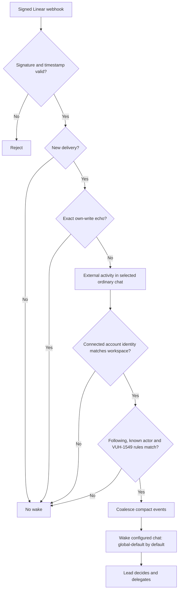
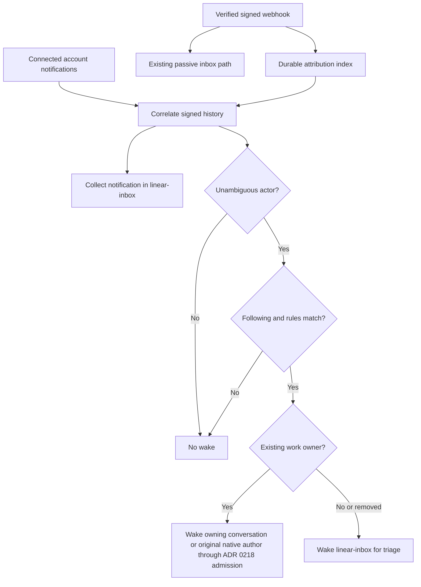

# ADR 0214: Linear wakes require attribution and rules

Status: accepted (James / Clankie lead, 2026-10-02, [VUH-1549](https://linear.app/vuhlp/issue/VUH-1549)).
Amended by James in [VUH-1678](https://linear.app/vuhlp/issue/VUH-1678),
2026-10-04: signed rule-passing webhooks wake one ordinary configured chat,
`global-default` by default. This supersedes
[ADR 0218's Linear work-routing extension](0218-native-seats-drive-their-attached-conversation.md#extension--linear-work-ownership-2026-10-04)
and the separate inbox protocol. Amends
[ADR 0189 (Linear echoes)](0189-his-own-linear-activity-does-not-wake-him.md).

## Amendment — one ordinary chat receives signed Linear activity, 2026-10-04

Verified webhook activity is the input to the existing VUH-1549 actor/type rule
engine. A qualifying event wakes one configured ordinary global conversation;
`linearWebhook.wakeConversationId` defaults to `global-default`. The lead
conversation chooses any delegation. An owner who prefers a Linear place can
select an ordinary owner-openable chat. Issue ownership, parent-update authors,
and native worker recipients do not select a wake destination. A selected chat's
existing native operator seat can receive the wake through its normal channel.

The compact event carries the issue ID and title where available, what changed,
who acted, and the Linear link. A Comment hook can contain only the issue UUID.
Retained signed Issue context or a native connected `get_issue` lookup bounded
to one second can supply its display identifier/title. Fetched display context never changes the
signed actor/resource/change authority. If the title remains unavailable, the
event says `Title unavailable` and retains its signed UUID/link; it is not dropped.
Bursts coalesce into one wake. Nonmatching signed
activity remains visible in the normal chat without starting a turn. The special
Linear inbox conversation, read/ack/handoff protocol, and notification checkpoint
are retired. Upgrade drops retained unread inbox items once with a log entry;
old inbox state never schedules a fresh turn.

Rules and the target are non-secret settings that Clankie can change himself
through `linear_wake`, the `clankie linear wake` / `linear target` CLI, and their
authenticated API. The Follow Linear menu exposes both. Defaults select only
signed comments and mentions from James (`ownerUserEmails: ["volpestyle@gmail.com"]`)
with actor selector `owner`; additional owner IDs remain configurable. This
changes the earlier default of an empty owner list and all nonexcluded types.
Signed user ID/email evidence identifies the human. Display names and notification
subtitles do not. Own-write suppression takes precedence over the selectors;
Clankie's connected account and attributed workers remain quiet. Production
wakes require the connected account identity in the signed event's workspace;
lookup failure or workspace mismatch retains passive chat history with a
metadata decision of `identity_unavailable` or `account_workspace_mismatch`.
Local webhook readiness alone is not proof of account lookup or delivery health.

Raw-body signature verification, signed timestamp tolerance, delivery dedupe and
restart replay safety remain. The attribution journal and exact write receipts
retain their provenance and own-write suppression responsibilities; actor-less
recipient notification polling is no longer the wake path. Rule or target edits
never promote passive history. Following remains opt-in and requires the stored
webhook URL and broker-held secret. Incoming events remain untrusted context,
never new authority.

## Historical decision — 2026-10-02

The following records the original notification-correlation design. The amendment
above replaces its destination, polling path, inbox protocol and default rules;
the signed attribution and trust boundaries remain.

## Context

The connected Clankie app's Linear MCP notification response has no actor field.
Testing an absent actor against the connected account admitted every notification,
including bursts of self-authored subscriptions. Notification subtitles and display
names cannot establish whether James or a worker acted. The signed webhook carries
actor identity and type ([Linear's envelope](https://linear.app/developers/webhooks)).

## Decision

Attribute notifications before deciding to wake. Correlate the workspace, resource,
comment when available, action timestamp and relevant revision kind against signed
webhook history. Retain a bounded structured attribution index because inbox prompts
are truncated for model context. Record exact self echoes in that index before the
existing receipt suppression; inbox collection and acknowledgment remain unchanged.
Different or missing actors among candidates mean unknown, never a best guess.

Settings beside the follow switch select owner humans, any human, the connected
account/app and workers, or named IDs, and filter notification types. Defaults select
only explicitly configured owner IDs and exclude `issueSubscribed`. There is no
portable default owner ID; installation setup must name the owner. Signed user type
is required for human selectors, and own-account or worker evidence takes precedence.
No name, email or subtitle establishes ownership. Unknown attribution never wakes.

The CLI, authenticated API and Follow Linear menu share the schema. Changes apply
on the next notification decision without restarting. Changing rules never promotes
old passive notifications or revises an already accepted wake. Follow off remains
the control for suppressing queued turns. Collection stays independent of both filters.
No OAuth token crosses from its MCP audience to GraphQL.

## Consequences

Missing hooks, ambiguous simultaneous changes, or history outside the index's bounds
can miss a desired wake. Those notifications remain readable. This is preferable to
waking on an unattributed app echo. The index retains seven days / 2,000 records;
correlation allows five seconds before or one second after the notification time.
Notifications processed before their hook remain quiet; no periodic reconciliation or
retroactive wake queue is added. Owner and coordination preferences are settings,
not instructions repeated in Clankie's prompt.
