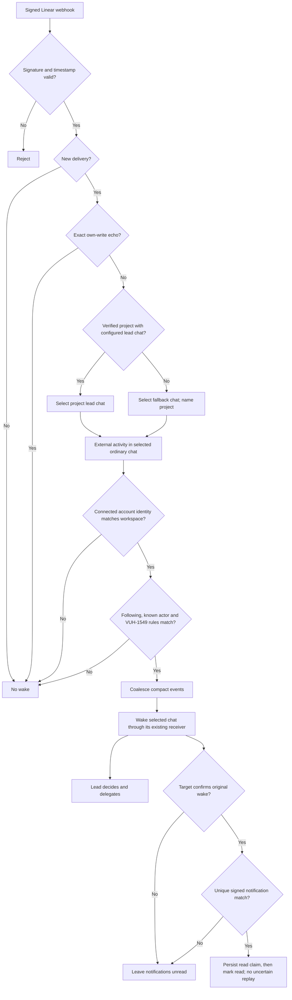
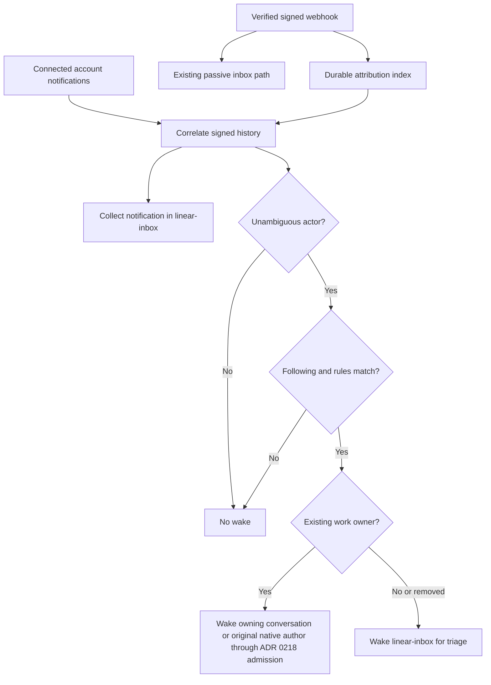

# ADR 0214: Linear wakes require attribution and rules

Status: accepted (James / Clankie lead, 2026-10-02, [VUH-1549](https://linear.app/vuhlp/issue/VUH-1549)).
Amended by James in [VUH-1678](https://linear.app/vuhlp/issue/VUH-1678),
2026-10-04: signed rule-passing webhooks wake one ordinary configured chat,
`global-default` by default. This supersedes
[ADR 0218's Linear work-routing extension](0218-native-seats-drive-their-attached-conversation.md#extension--linear-work-ownership-2026-10-04)
and the separate inbox protocol. Amends
[ADR 0189 (Linear echoes)](0189-his-own-linear-activity-does-not-wake-him.md).
Amended by James in [VUH-1743](https://linear.app/vuhlp/issue/VUH-1743),
2026-10-06: project activity goes to its configured lead chat, otherwise
`global-default` with the project named; provider notifications are marked read
only after that target chat confirms receipt of the original wake.

## Amendment — one ordinary chat receives signed Linear activity, 2026-10-04

Verified webhook activity is the input to the existing VUH-1549 actor/type rule
engine. Each qualifying event wakes one ordinary global conversation. Explicit
`linearWebhook.projectChats` entries map verified Linear project UUIDs to existing
lead chats. Unconfigured projects and removed lead chats go to `global-default`
with the project named. Nonproject activity uses `linearWebhook.wakeConversationId`,
default `global-default`. The lead chooses any delegation. Assignees, parent-update
authors and native workers do not select destinations. Signed project fields or
bounded connected reads of the exact signed issue/update parent supply project
context; URL slugs cannot establish project identity. The external journal and
delivery history record the project and selected destination. A chat's attached
native operator receives the wake through its existing channel.

The compact event carries the issue ID and title where available, what changed,
who acted, and the Linear link. A Comment hook can contain only the issue UUID.
Retained signed Issue context or a native connected `get_issue` lookup bounded
to one second can supply its display identifier/title. Fetched display context never changes the
signed actor/resource/change authority. If the title remains unavailable, the
event says `Title unavailable` and retains its signed UUID/link; it is not dropped.
Bursts coalesce into one wake. Nonmatching signed
activity remains visible in the normal chat without starting a turn. The special
Linear inbox conversation, inbox handoff protocol, and old notification checkpoint
are retired. Upgrade drops retained unread inbox items once with a log entry;
old inbox state never schedules a fresh turn.

The 2026-10-06 read-status amendment gives each offered batch a host-issued
original wake ID and an exact native fingerprint/recipient receipt prepared
before delivery. The target chat confirms its original through
`linear_wake({ action: "received", wakeId })`. The tool derives the chat from live
conversation authority and verifies the current native recipient and exact
outbox original. Another chat or changed occupant cannot confirm it; a transport
ACK alone leaves notifications unread. Pi conversations use their own admitted
turn receipt. Only events actually included in the batch are eligible.

After confirmation, a bounded reader correlates inbox notifications with signed
event identities. Unique full or eight-character comment anchors permit delayed
inbox creation. Resource-only assignment/reaction matches retain conservative
action-time checks; unknown or ambiguous matches stay unread. Read claims persist
before dispatch. Lost/error responses remain uncertain and settle by read-only
inbox observation, without repeating the mutation. The reader uses the shared
background request budget, scans at most 20 pages and retries delayed notifications
for ten minutes. Durable references resume that bounded window after restart.
It never generates wakes or replays native delivery.

Rules and the target are non-secret settings that Clankie can change himself
through `linear_wake`, the `clankie linear wake` / `linear target` / `linear routes`
CLI, and their authenticated API. Follow Linear exposes rules, the default chat
and project lead chats. `linear deliveries` records destinations and consumption
receipts. Defaults select signed comments, mentions, assignment/delegation to
the connected app and reactions on its comments with actor selector `owner`.
New installs start with empty owner ID/email lists; existing configured identities
remain. Signed owner identity must be configured before the selector can match. This
changes the earlier default of an empty owner list and all nonexcluded types.
Signed user ID/email evidence identifies the human. Display names and notification
subtitles do not. Own-write suppression takes precedence over the selectors;
Clankie's connected account and attributed workers remain quiet. Production
wakes require the connected account identity in the signed event's workspace;
lookup failure or workspace mismatch retains passive chat history with a
metadata decision of `identity_unavailable` or `account_workspace_mismatch`.
Local webhook readiness alone is not proof of account lookup or delivery health.

Raw-body signature verification, signed timestamp tolerance, delivery dedupe and
restart replay safety remain. The attribution journal and exact write receipts
retain their provenance and own-write suppression responsibilities; actor-less
recipient notification polling is no longer the wake path. Rule or target edits
never promote passive history. Following remains opt-in and requires the stored
webhook URL and broker-held secret. Incoming events remain untrusted context,
never new authority.

## Historical decision — 2026-10-02

The following records the original notification-correlation design. The amendment
above replaces its destination, polling path, inbox protocol and default rules;
the signed attribution and trust boundaries remain.

## Context

The connected Clankie app's Linear MCP notification response has no actor field.
Testing an absent actor against the connected account admitted every notification,
including bursts of self-authored subscriptions. Notification subtitles and display
names cannot establish whether James or a worker acted. The signed webhook carries
actor identity and type ([Linear's envelope](https://linear.app/developers/webhooks)).

## Decision

Attribute notifications before deciding to wake. Correlate the workspace, resource,
comment when available, action timestamp and relevant revision kind against signed
webhook history. Retain a bounded structured attribution index because inbox prompts
are truncated for model context. Record exact self echoes in that index before the
existing receipt suppression; inbox collection and acknowledgment remain unchanged.
Different or missing actors among candidates mean unknown, never a best guess.

Settings beside the follow switch select owner humans, any human, the connected
account/app and workers, or named IDs, and filter notification types. Defaults select
only explicitly configured owner IDs and exclude `issueSubscribed`. There is no
portable default owner ID; installation setup must name the owner. Signed user type
is required for human selectors, and own-account or worker evidence takes precedence.
No name, email or subtitle establishes ownership. Unknown attribution never wakes.

The CLI, authenticated API and Follow Linear menu share the schema. Changes apply
on the next notification decision without restarting. Changing rules never promotes
old passive notifications or revises an already accepted wake. Follow off remains
the control for suppressing queued turns. Collection stays independent of both filters.
No OAuth token crosses from its MCP audience to GraphQL.

## Consequences

Missing hooks, ambiguous simultaneous changes, or history outside the index's bounds
can miss a desired wake. Those notifications remain readable. This is preferable to
waking on an unattributed app echo. The index retains seven days / 2,000 records;
correlation allows five seconds before or one second after the notification time.
Notifications processed before their hook remain quiet; no periodic reconciliation or
retroactive wake queue is added. Owner and coordination preferences are settings,
not instructions repeated in Clankie's prompt.
