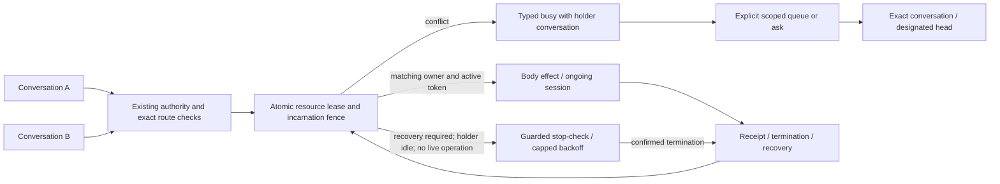

# ADR 0215: Conversations lease one body

Status: accepted for engineering (2026-10-03; root review) ([VUH-1472](https://linear.app/vuhlp/issue/VUH-1472)).
Extends [ADR 0124](0124-one-self-has-many-local-threads.md). Preserves
[room inspection boundaries](0176-every-room-is-an-inspectable-conversation.md),
[room-owned harvests](0186-a-discord-room-harvests-its-own-workers.md),
[delivery receipts](0211-a-delivery-says-how-far-it-got.md), and
[Swarm retirement](0213-clankie-retires-swarm.md).

## Context

Parallel conversations belong to one Clankie, but his browser, Discord mouth,
voice membership, and play seat are shared mutable resources. Serializing a
single browser call does not prevent a second conversation from navigating away
between the first conversation's observations and actions. A turn ending does
not end a voice stay or a running game. Conversation inspection does not confer
permission to speak, reset, fork, or use another room's context.

## Decision

The service owns one lease registry. Its resource keys are `discord_mouth`,
`voice`, `browser`, and `play`; each has at most one owning conversation.
Acquisition uses a host-resolved stable conversation ID, never a model-supplied
room name, arbitrary pane ID, or retired Swarm actor. Different resources may
belong to different conversations. Observation of public status/catalogs does
not acquire the whole body. Reading another conversation's active browser page
is not public status and still requires the browser lease and existing access.

A lease adds no authority. Existing actor, room, machine, route, and tool grants
are checked independently at admission and again immediately before effects.
The captured conversation and lease token must still match at that boundary,
including after asynchronous discovery or queued browser work. A queued call
must never read a mutable turn context belonging to a later turn.

Acquisition, renewal, operation reservation, and release are serialized atomic
state transitions. An opaque unpredictable incarnation token fences release and
heartbeat as well as effects: an old owner cannot affect a later lease, even
when the same conversation reacquires it. The service persists claims before
admitting effects. Persistence errors fail closed. Only the single service owns
this store; its service lifetime lock prevents a second process from operating
it. It is not a distributed scheduling system.

A deadline ends permission to begin effects; it does not prove that earlier
external work stopped. Active operations remain blocking until their exact
completion is observed. Expired ongoing voice/play/browser sessions enter
`recovery_required`, retaining their owner and token. Heartbeat cannot resurrect
an expired claim. A service restart invalidates all old tokens and leaves
persisted occupied resources blocked until their body state is reconciled or
explicitly stopped through an authorized recovery action. Never infer safe
handoff from elapsed time, missing heartbeats, or a process replacement.

Discord text leases cover one admitted outbound operation through its receipt.
Uncertain sends keep the resource blocked until reconciled; lease handling never
retries delivery. Voice covers the complete joined stay, including speech and
stream changes. Play covers start through confirmed terminal session state.
Browser covers a browsing burst through confirmed close, including the REPL,
selected page and recording. Only the owner can renew or request ordinary stop;
owner-authorized recovery is explicit and records the original claimant. An
independent transport-owned voice stay needs its own exact conversation binding.

The [VUH-1752](https://linear.app/vuhlp/issue/VUH-1752) recovery amendment
(2026-10-06) permits the service to retry the same verified stop-check at boot
and on 5–60 second backoff. Automatic admission requires `recovery_required`,
usable metadata for a service-owned holder, an ended turn/driver, and no live
body operation. Missing/unreadable holders and native-owned turns require explicit
owner recovery: display activity is not native completion proof. These conditions remain
fenced to the exact lease incarnation across awaited checks. Only confirmed
termination releases it; a refused or unavailable proof retains the claim.
This cleanup does not replay a Discord send or grant another conversation
authority. Explicit owner recovery remains available; computer sessions use
their separate adapter contract.

A conflict returns typed `busy` with resource, owning conversation, state, and
allowed explicit `queue`/`ask` actions. It includes no other room's transcript,
actor identity, prompt, or private display name. Queueing is an explicit bounded
request scoped to requester, resource, current holder token and deadline. It
never automatically runs an effect or transfers a lease. Availability wakes the
requesting conversation to reconsider with fresh authority. Asking sends only a
requester-authored bounded request to the holding conversation, or an explicitly
designated head when the original is unavailable; no global/default-room
fallback and no context copying. Existing delivery receipts describe progress.

Watches continue to wake the conversation that armed them, with current grants
rechecked. Workers retain the hiring conversation as their owner; completion or
escalation targets that owner or its explicitly designated head. Neither fact
requires a body lease for mere computation. Shared memory keeps host-stamped
source conversation provenance and existing visibility restrictions. Sharing a
memory never imports another room's transcript or elevates its instructions.

API and CLI expose lease status and explicit acquire/renew/release/queue/ask
operations with exact conversation identity. Inspection permission alone permits
only inspection. The app displays one Clankie with conversation threads beneath
him and resource-held badges; a parallel seat is not another Clankie contact.

## Consequences and verification

Two seats may think concurrently while conflicts over one resource are visible
and recoverable. Holding voice does not monopolize browser or play. A stuck or
uncertain operation reduces availability until reconciled, rather than silently
letting a second conversation take over. General scheduling, transcript merging,
new worker launch paths, and new authority are outside this decision.

Deterministic verification covers simultaneous acquisition, stale-token ABA,
expiry during an operation, async identity changes, restart recovery, denied
authority, scoped queue/ask and preserved watch/memory provenance. A real two-seat
lease conflict, Discord/voice/play lifetime, and private app presentation remain
separate acceptance evidence; deterministic tests do not claim a live model run.

## Conversation provenance implementation

New memory writes and worker ownership capture a stable host-admitted source
before asynchronous work. Episode POST requires an authenticator-provided exact
source; a lane bearer alone is refused. Legacy memory retains visibility but
cannot invent an owner for conversation-level corrections. Explicit operator
management remains separate.

Hire intents are persisted before discovery/launch, then bound to the exact
pane, seat and native session proof. Uncertain starts keep their original owner.
Completion watches preserve that owner across restart and movement, and refresh
its route grants before a wake and final reply. Legacy raw room-key watches and
saved workers without exact persisted proof fail closed. No default room,
current worker persona or implicit head replaces a missing owner. Operator API
hires and saved-session resumes require an explicit runnable conversation ID;
private consumers must supply their selected thread.

## Body lifecycle implementation

Audio and Go Live may share a voice lease only for the same physical account,
gateway session, guild and channel. Each keeps its own source authority,
generation and operation pin. One termination never frees the other pin.
Publish release requires exact gateway stream deletion and media disconnect;
normal voice release requires the actual gateway leave. Restart recovery
captures all unfinished stays and their registered account subject. Its
nonce-bound internal body guard rechecks original owner/operator authority and
the private current claim at the final remote stop boundary. Fresh exact remote
leave/deletion receipts can reconcile an abandoned generation; empty replacement
process maps cannot. Every automatic OP4 rejoin and OP18 publish retry refreshes
the original lease guard so an old generation cannot recreate cleared effects.

Pending queue/ask requests persist host-stamped requester and holder routes.
The service pump tries the exact owner first. Only a definite pre-acceptance
refusal may route the explicit request to that owner’s designated head.
Social wakes use a separate non-shell session even after a later machine grant.
A changed holder incarnation, missing route, expired request or revoked grant
cannot redirect delivery. Uncertain wake acceptance is not replayed.

## Explicit head designation

An operator may persist an optional head with `POST /v1/conversation-heads`.
The owner must be an existing runnable conversation or canonical host-created
room. The head must be an existing writable global/workspace captain thread;
self references and cycles are rejected. The default is no designation.
This metadata grants no room send, reset, fork, or captain access.

Worker results, escalations, and explicit resource asks try their owning
conversation first. Only a definite refusal before acceptance may use the
explicit head. Accepted or uncertain dispatch is never replayed. Original
source grants, registered account/presence and opt-in remain valid, and the
mapping and head writability are checked again after asynchronous authorization
at dispatch. Only the explicit notification crosses this route, never room
history or inherited source authority. Removing a designation fences pending
fallback. Queue availability still wakes its original requester only.
