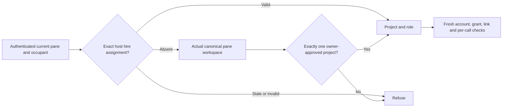

# ADR 0216: Projects own agent roles and tool policy

Status: accepted for engineering (2026-10-03; VUH-1535 root source review).
Deterministic foundation evidence covers schema, migration and compatibility; live
project hiring and grant enforcement remain the subsequent issue boundaries below.

Supersedes the identity-role storage decision in [ADR 0208](0208-agents-carry-a-role-the-world-reads-it.md).
Preserves the repository tracker contract in [ADR 0191](0191-work-is-tracked-where-the-repo-tracks-it.md).
Implements the foundation of [VUH-1535](https://linear.app/vuhlp/issue/VUH-1535)
within [Projects](https://linear.app/vuhlp/issue/VUH-1534); per-agent tool enforcement
and fleet-grant retirement belong to [VUH-1558](https://linear.app/vuhlp/issue/VUH-1558).

## Decision

Owner settings contain projects, approved workspaces, role definitions, character
role associations, hiring rules, worker limits and tool-policy references. A repo
may describe its tracker in `.clankie/tracking.json`; it cannot grant authority to
itself. A project's tracker reference names one of its approved workspaces and
that fixed relative path. It does not copy tracker credentials or turn tracker
labels into authorization. Label-to-role mappings live in owner settings.

Each project can override the existing host `fleet.size` and `fleet.models`
defaults. A role can select a harness, model, effort, concurrency cap and naming
rule. Roles retain the existing built-ins and validated custom names; comparison
is case-insensitive while custom display spelling is preserved. Worker caps and
role concurrency caps are independent limits, with zero meaning no new hires.
Unset values inherit host policy. VUH-1536 enforces configured role harness,
model and effort at the native launch, overriding conflicting hire inputs. The
hiring conversation's verified native assignment or canonical effective workspace
pins its project; otherwise the canonical destination workspace selects it. An
optional requested project must match that context. Overlapping approvals and
cross-project source/destination choices refuse rather than choose a cap bucket.
Remote paths cannot be proven by the local filesystem and require a verified
source project; unproven native process identity grants no project tools.

The controller journals cap allocations before asynchronous startup, atomically
across admission calls. Starting and uncertain hires count alongside live hires;
settling a turn or marking a persona done never releases capacity. Close the pane to release its slot: a successful
complete native inventory can confirm that allocated pane is gone. An exited
harness in an open pane keeps its allocation until the pane closes. Missing or
failed inventory retains capacity. Retry uses the original launch choice and
receipt even when current settings change; it cannot allocate a replacement.
A settings/project change is checked again immediately before native effects.
An exact live session can be reused at capacity, but cannot change its recorded
role settings or start a replacement if it disappears during resumption.

This journal is controller-owned, separate from semantic role settings. A project
assignment requires the actual native session plus a freshly observed harness
process PID/start time, shell PID/start time and Herdr socket/session binding.
Missing or stale proof refuses membership without workspace fallback. The same
journal serves cap accounting and the host assignment lookup; it never creates
or copies grants.

A persona remains identity: name, appearance, avatar revision and stable binding.
A project role association says what that character does _in that project_. The
same character may have different roles in different projects. These associations
are not evidence of a live hire, workspace occupancy or tool eligibility.

## Membership and authority

The host first resolves the current agent occupant from its authenticated pane
and existing link. A durable explicit project/role assignment recorded by the
host when hiring that exact occupant wins over workspace inference. A stale,
missing-project or invalid-role assignment refuses membership; it never falls
back to a more permissive workspace match. A persona ID, model-selected project,
imported settings object, session, or machine alone cannot establish membership.

For agents not started with a host assignment, the host obtains the _actual_
current pane working directory and canonicalizes it on that machine. It compares
that evidence with owner-approved canonical roots on that same machine. Descendants
match on path-segment boundaries. Linked Git worktrees need their own approval;
sharing a repository or Git common directory confers nothing. All matching
projects are considered: two matches, even nested ones, are ambiguous and deny.
There is no longest-prefix or first-project preference. Unknown/relative/uncanonical
paths deny. Windows aliases and case uncertainty require fresh host canonicalization;
our conservative selector never guesses a case-insensitive alias. The pure selector
is policy calculation, not a capability or proof that its input came from a pane.

Existing session-wide fleet grants are **not** copied into project grants or
workspace approvals. VUH-1558 must explicitly retire/reissue them through the
owner, retaining verified account, server, tool/argument bounds, revocation and
exact pane/link checks. Removing a grant, changing workspace or replacing the
occupant must invalidate eligibility within its required refresh bound and before
new effects. A project association never promotes a social conversation to machine
authority. No bridge or grant execution changes are claimed by this foundation.

## Lossless rollout

Legacy persona roles migrate to the reserved `default` project with no workspace
approvals and no grants. The migration preserves every persona's validated role,
including custom spelling, and leaves identity, avatar files and occupant bindings
intact. An unrelated existing default project, changed legacy source or incompatible
migration receipt stops migration with the original identity file retained.

The service serializes migration before persona operations. It writes owner settings
through SettingsStore, syncs file and directory, and verifies the saved project
section before removing roles from the identity file. A durable source receipt
makes restart after settings commit but before identity cleanup idempotent. It does
not overwrite a later owner assignment with the old identity role. Settings failure
or uncertain verification leaves the source for reconciliation; no completed
migration is reported. Corrupt identity or pending state fails closed.

Native hire adoption already has a synchronous final authority boundary. Preserve
it. When adopting an observed native identity, write a bounded durable role intent
in the **owner settings directory**, scoped to that identity store, then persist the
identity. Flush that intent through serialized SettingsStore before claiming the
role change completed. The journal has an exclusive process writer; live/reused
PIDs are never stolen, and dead-process recovery rechecks the original lock. A
pending role with no persisted identity remains unresolved. Applied operation IDs
prevent crash replay from overwriting a subsequent owner edit. The journal is only
a semantic association write, never a native-hire receipt or membership proof.
A failed flush retains evidence; it must not cause the native hire to be retried.
The canonical native result remains `spawned` with its exact started seat. Optional
`roleAssignment` reports `pending` with the durable operation ID, or `unsaved` if
recording the intent itself failed. Neither claims a completed role change. Fully
persisted success is unchanged; role failure never becomes a generic hire failure.

The legacy setter now updates the default-project association. Existing app
`persona.role` remains a temporary **host-derived read projection** of that explicit
default context, not an identity field on disk. New consumers pass a selected
project to read the role; absent context does not choose an arbitrary association.
A character assigned only in another project therefore has no default wire role.
Project assignment requests require the current project-section SHA revision;
controllers must validate the selected project/persona and owner authority under
the existing SettingsStore final guard. No caller-supplied path becomes approved
merely by schema parsing.

## Delivery boundaries

This change provides node-free project contracts, owner settings validation,
migration, legacy compatibility and a membership selector with deterministic tests.
The new assignment request is a contract, not a newly exposed endpoint. Project
API/CLI/TUI editors, app selected-project views, onboarding and project-grant
enforcement retain their separate issue boundaries. VUH-1536 adds deterministic
per-hire project recording and cap execution; live acceptance remains unrun.
Neither live owner settings nor real grants/hires are changed by this engineering
verification. Existing fleet grants remain unchanged until VUH-1558 explicitly
retires or replaces them; this release does not claim they are project-scoped.

### VUH-1558 project-tool cutover

Fleet grants now remain readable/revocable but confer no tools. Reissue is an
explicit owner action; no owner grant or settings migration is performed by the
implementation. `project add` provides only the narrow local workspace
registration prerequisite and requires broker-consistent owner authentication.
General project editing/onboarding remains separate.

The local service resolves actual native process and session identity before
consulting the host hire ledger or canonical approved workspace. Settings and
assignment changes are fenced again after OS reads. Each tool call rechecks the
durable grant immediately before dispatch, and the MCP host retains its account
and server-configuration checks. A service-owned private Codex server additionally
needs its captured PID lifetime and immutably bound native thread plus an actual
matching hire; it never gets a workspace fallback. Full details and explicit
owner cutover commands are in [worker access](../worker-access.md).

Native Codex/Claude/OpenCode and registered private Codex paths have deterministic
coverage. Installed Pi rewrites its command title, so generic Node cannot prove
the installed script: trusted Pi launch provenance remains engineering within
VUH-1558. Remote process proof remains VUH-1563. Live owner cutover is unrun.
