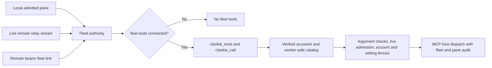

# ADR 0217: Fleet membership gets connected tools

Status: accepted (2026-10-04 owner decision). Supersedes the fleet **tool-access**
gate in [ADR 0216](0216-projects-own-agent-roles-and-tool-policy.md), including its
membership/authority and project-tool cutover sections. Project roles, caps,
hiring, approved workspaces and tracker binding remain in force. Native mailbox
and hire identity proof remain separate. Implementation and setup are in
[worker access](../worker-access.md).

## Decision

An admitted Clankie fleet member gets every connected MCP tool whose account
verifies, through a two-tool bridge. Local socket admission in the pinned Herdr
session, a live service-owned remote relay stream, or an authenticated remote
fleet bearer is sufficient. Tool access does not require per-process project,
workspace, native-session or hire proof. A bearer proves the fleet, not a pane.

James chose “it just works” after the trust tradeoff was stated: anything running
in a linked session can write through Clankie's connected account, including a
stray program in a pane or anyone holding a valid remote fleet token. This is an
accepted boundary, not an unimplemented project restriction. Tasks still limit
which outward actions a worker is authorized to perform.

The local macOS implementation observes the unique loopback socket owner and
microsecond process births through a bounded native `libproc` census. Fresh
observations bracket the current linked pane checks; an admitted connection's
identity pin can refuse replacement but never supplies cached admission. Socket
sharing, exit, reused PIDs, unknown ownership and changed bindings refuse access.
This replaces slow `lsof` socket scans without changing the accepted fleet
boundary. The release includes the helper; source startup builds it before
serving requests. Project and private-seat checks retain their separate authority.
The owner requires full same-user kernel observation; non-owner ancestors use
cross-user `sysctl` PID, parent and birth records, including a terminal's root
`login` process. Descriptor churn restarts a complete census, with up to 32
attempts and 1–8 ms jitter inside the unchanged 200 ms per-attempt and 600 ms
total budgets. Unknown owners and owner/ancestor changes still fail closed;
no partial census or earlier admission is reused. Bounded retries may still
refuse under sustained churn; an explicit current-request admission
403 precedes dispatch, while earlier uncertain receipts remain subject to
reconciliation.

The body keeps one native helper alive on private stdin/stdout pipes. A bounded
serialized request carries a monotonic ID; each job resets all proof state and
performs the same complete fresh observations. There is no admission cache or
helper listener. Each active proof has a 1 s transport timeout; queue wait does
not consume it. Cancelling a queued job removes only that job. Cancelling an
active job drains its reply and discards it before releasing that observation,
so one caller cannot kill other callers' proofs. Queue depth remains capped at
128; queued callers can abort, but waiting under a burst can exceed 1 s.
A malformed reply, active
timeout or child exit refuses pending observations; a later request may start
a fresh helper. Herdr reads use
its existing JSONL socket API directly, avoiding a CLI process per read. Shutdown
closes only the body's own helper. This removes hot-path process launches while
preserving shared-descriptor, occupant, registry and binding revocation checks.
Refusals log fixed reason/stage/errno vocabulary without PIDs, paths or argv.

Foreground project identity uses the same native helper for same-user executable,
exact first launcher arguments and microsecond process births. It reads the shell
and native process together at both checkpoints, then binds their lifetimes to
the socket's kernel ancestry. This replaces the repeated foreground `ps`/`lsof`
spawns without caching an admission result. The two project observations enclose
both socket censuses; socket censuses enclose the private-registry checks. Keeping
each census clear of our own short-lived proof children avoids causing process-list
churn during that census. This remains a pair of observations, not an atomic
kernel snapshot. Restored private-seat checks still
observe the current occupant on each request; roster reads and provider write
checks retain their independent revocation fences. Existing generic hire receipts
with second-resolution display timestamps do not match the new kernel lifetime
format: they fail closed until a fresh hire records the full birth. No legacy
timestamp conversion grants an old receipt authority.

Private Codex launch registrations also compare fresh native births. New launch
records retain microseconds. Existing server-owned private records keep their
previous second-resolution comparison by formatting the observed kernel birth
identically; this does not promote them to a precise birth or create a new
registration. Actual socket ownership still uses the full birth and socket pin,
and restored records still require the matching live native occupant on every
check. These private launch records are distinct from generic hire receipts.

Fleet discovery lists exactly `clankie_tools` and `clankie_call`.
`clankie_tools` searches up to 20 qualified names/descriptions or retrieves up to
10 selected input schemas. It never dumps every server's catalog. `clankie_call`
dispatches a qualified tool through the existing rule matcher, argument restrictions
and account-bound MCP host. Linear worker-publishing tools requiring an exact
`personaId` remain excluded. Existing manual grants keep direct listing and
all their expiry, argument, revocation and account restrictions.

The owner setting `fleet.tools: connected | off` defaults to `connected`; the
CLI and TUI expose it. `off` removes fleet tools and refuses stale displayed
calls while manual grants keep working. Removing a connection invalidates that
fleet's admission. Calls recheck the account, setting and live admission immediately
before effects; the host retains its final account/configuration fence.

Turning the switch off, or losing admission, refuses every call whose final
pre-dispatch checks run after the change. After its own credential and connection
awaits, the host runs the fleet fence (admission, then the switch) and then its
configuration check. A call whose last asynchronous check has already read the old
state can still reach the provider after the change; this is not a cancellation,
and there is no proven bound on how many concurrent calls can be in that position.
That is the contract: the switch stops new calls, and calls already past their
checks may finish (decided 2026-10-04 on VUH-1585, the owner delegating the choice).
A hard stop would need a final check that does not await, such as an in-memory
switch kept by a settings watcher plus synchronous admission; it can be added if a
need appears.

Standing records are synthesized in memory from the current verified catalog,
not loaded from durable grant files. Audit principals include `fleet:ID:pane:PANE`,
with `pane:unverified` for bearer links. Codex hire discovery expects the two meta
names while on, or none while off, independent of project grants. The native
worker plugin contributes `message_clankie` separately.

## Consequences

Project approvals and grants no longer constrain fleet provider access. Legacy
project/fleet grant records remain inspectable and explicitly revocable, without
being migrated or copied into standing authority. Project membership diagnostics
must distinguish eligibility for project policy from tools; unsupported native
proof does not mean a connected fleet pane has no tools.

This meets the tool-access objective previously assigned to VUH-1558 and VUH-1578.
Their other native delivery, membership, project or live verification scope remains
in their issue records. Fixtures establish deterministic bridge behavior; the
lead owns landing, re-pin and live PC native acceptance.
