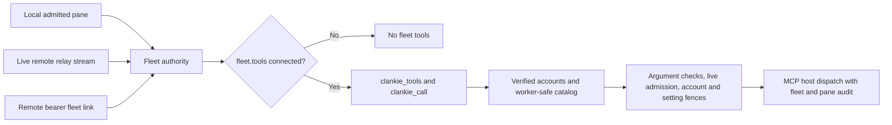

# ADR 0217: Fleet membership gets connected tools

Status: accepted (2026-10-04 owner decision). Supersedes the fleet **tool-access**
gate in [ADR 0216](0216-projects-own-agent-roles-and-tool-policy.md), including its
membership/authority and project-tool cutover sections. Project roles, caps,
hiring, approved workspaces and tracker binding remain in force. Native mailbox
and hire identity proof remain separate. Implementation and setup are in
[worker access](../worker-access.md).

## Decision

An admitted Clankie fleet member gets every connected MCP tool whose account
verifies, through a two-tool bridge. Local socket admission in the pinned Herdr
session, a live service-owned remote relay stream, or an authenticated remote
fleet bearer is sufficient. Tool access does not require per-process project,
workspace, native-session or hire proof. A bearer proves the fleet, not a pane.

James chose “it just works” after the trust tradeoff was stated: anything running
in a linked session can write through Clankie's connected account, including a
stray program in a pane or anyone holding a valid remote fleet token. This is an
accepted boundary, not an unimplemented project restriction. Tasks still limit
which outward actions a worker is authorized to perform.

The local macOS implementation observes the unique loopback socket owner and
microsecond process births through a bounded native `libproc` census. Fresh
observations bracket the current linked pane checks; an admitted connection's
identity pin can refuse replacement but never supplies cached admission. Socket
sharing, exit, reused PIDs, unknown ownership and changed bindings refuse access.
This replaces slow `lsof` socket scans without changing the accepted fleet
boundary. The release includes the helper; source startup builds it before
serving requests. Project and private-seat checks retain their separate authority.

Fleet discovery lists exactly `clankie_tools` and `clankie_call`.
`clankie_tools` searches up to 20 qualified names/descriptions or retrieves up to
10 selected input schemas. It never dumps every server's catalog. `clankie_call`
dispatches a qualified tool through the existing rule matcher, argument restrictions
and account-bound MCP host. Linear worker-publishing tools requiring an exact
`personaId` remain excluded. Existing manual grants keep direct listing and
all their expiry, argument, revocation and account restrictions.

The owner setting `fleet.tools: connected | off` defaults to `connected`; the
CLI and TUI expose it. `off` removes fleet tools and refuses stale displayed
calls while manual grants keep working. Removing a connection invalidates that
fleet's admission. Calls recheck the account, setting and live admission immediately
before effects; the host retains its final account/configuration fence.

Turning the switch off, or losing admission, refuses every call whose final
pre-dispatch checks run after the change. After its own credential and connection
awaits, the host runs the fleet fence (admission, then the switch) and then its
configuration check. A call whose last asynchronous check has already read the old
state can still reach the provider after the change; this is not a cancellation,
and there is no proven bound on how many concurrent calls can be in that position.
That is the contract: the switch stops new calls, and calls already past their
checks may finish (decided 2026-10-04 on VUH-1585, the owner delegating the choice).
A hard stop would need a final check that does not await, such as an in-memory
switch kept by a settings watcher plus synchronous admission; it can be added if a
need appears.

Standing records are synthesized in memory from the current verified catalog,
not loaded from durable grant files. Audit principals include `fleet:ID:pane:PANE`,
with `pane:unverified` for bearer links. Codex hire discovery expects the two meta
names while on, or none while off, independent of project grants. The native
worker plugin contributes `message_clankie` separately.

## Consequences

Project approvals and grants no longer constrain fleet provider access. Legacy
project/fleet grant records remain inspectable and explicitly revocable, without
being migrated or copied into standing authority. Project membership diagnostics
must distinguish eligibility for project policy from tools; unsupported native
proof does not mean a connected fleet pane has no tools.

This meets the tool-access objective previously assigned to VUH-1558 and VUH-1578.
Their other native delivery, membership, project or live verification scope remains
in their issue records. Fixtures establish deterministic bridge behavior; the
lead owns landing, re-pin and live PC native acceptance.
