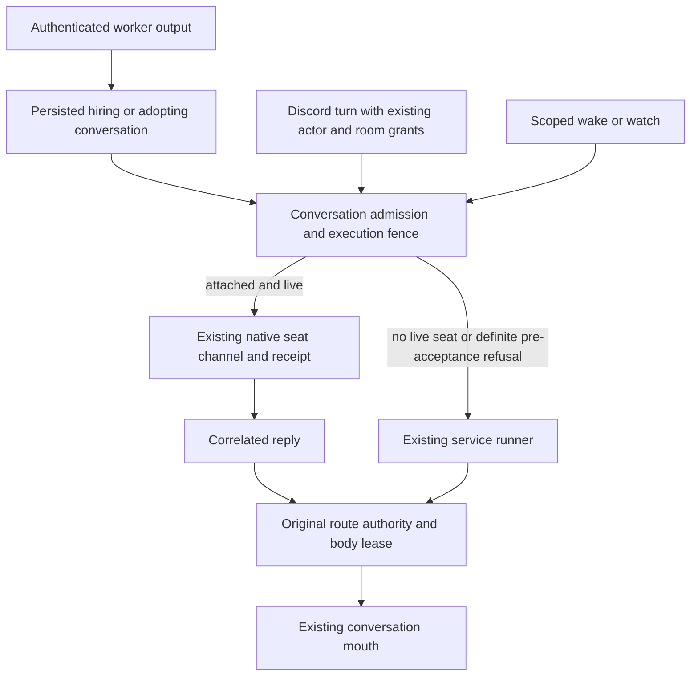

# ADR 0218: Native seats drive their attached conversation

Status: accepted for engineering (James, 2026-10-04). Extends
[room turn admission](0118-a-text-room-is-a-durable-lane.md),
[room inspection](0176-every-room-is-an-inspectable-conversation.md),
[room-owned harvests](0186-a-discord-room-harvests-its-own-workers.md), and
[conversation body leases](0215-conversations-lease-one-body.md).

## Context

Clankie's conversation is independent of the harness that executes it. Native
operator seats already select a conversation, receive channel events, and
project their own transcripts. Worker output currently enters the default
conversation even when another conversation hired the worker. Room conversations
are inspectable but cannot yet be selected by a native operator seat.

## Decision

A native operator seat may select any existing service conversation, including
the default conversation and canonical Discord text or voice rooms. A room
remains the same room conversation; selecting the default never selects all
Discord rooms. Conversation discovery exposes stable IDs and readable names.
Inspection, ordinary owner sends, reset, and attachment retain their separate
admission rules.

The service selects one execution destination for each admitted input. A live
attached native seat receives worker output, escalations, wakes, watches and
room messages through its existing conversation channel. Its reply uses the
existing reply correlation. When no seat is live, the service runner executes
the conversation. Extend the existing native source metadata, conversation
admission and seat outbox; do not create a second conversation or mailbox system.
Existing Pi goal continuations retain their service loop; this change routes the
listed external inputs and asynchronous notifications.

Execution admission and attachment handover share a conversation fence. A
service execution that has already reserved admission keeps that input;
attachment cannot start a second execution of it. A native delivery that was
taken, accepted, or became uncertain is never replayed into the service runner.
Only a definite refusal before native acceptance permits fallback, after
rechecking the current destination. Detach cannot redirect an in-flight accepted
input. Unaccepted queued input follows the current destination. Existing durable
delivery IDs, fingerprints and receipts survive retries; transport uncertainty
remains visible instead of becoming a duplicate answer.

Attachment grants no tools or room authority. Discord turns and asynchronous
room notifications refresh the original actor and route grants as today.
Native replies return through the admitted room turn's existing body mouth and
lease checks. Selecting a room grants neither cross-room replies nor the right
to invoke a generic operator runner on that room. Other rooms and conversations
retain their own execution destination and grants.
A room's cached MCP tool bank remains social and has no generic operator body
identity. The current MCP session contract has no exact per-event actor binding;
it cannot safely import a later actor's machine grants into that cached bank.

A worker's lead is the host-stamped conversation that hired it. The existing
persisted hire ownership proof binds it to the exact fleet, pane, seat and native
occupant. A successful host-admitted `message_seat` from another conversation
adopts the worker under that conversation. Workers never choose this route in
`message_clankie`. Authenticated worker messages use their existing receipts and
the existing framing that agent output is untrusted context, not an instruction
from the owner. When the recorded conversation is gone, worker messages fall
back to `global-default`; a live room with revoked authority is refused rather
than redirected. This missing-conversation fallback applies to worker messages,
and does not change scoped watch or body-lease fallback rules in ADR 0215.

## Extension — Linear work ownership, 2026-10-04

James selected issue-owned routing in
[VUH-1611](https://linear.app/vuhlp/issue/VUH-1611). A successful Linear issue or
comment write from an admitted conversation, an issue-scoped native hire, or an
explicit owner claim records that conversation in the existing `linear-work.json`.
Identifier-only comment writes can acquire canonical parent identity through an
exact signed match to the existing write receipt. Its host-stamped owner and
original write time survive restart; a delayed echo cannot undo a newer claim.
An explicit unbind retains its timestamp in the same file, so an older receipt
cannot silently reclaim released work.
Incomplete receipts establish no automatic ownership.
The organization and canonical issue UUID are the key. An admitted later claim
adopts the work, as an admitted message adopts a worker. Room ownership retains
the original Discord actor and route proof; later delivery refreshes those grants.
Model arguments and worker output cannot invent that proof.

Signed `linear-attribution.json` history supplies canonical issue identity for
actor-less notifications. Ambiguous identity stays unowned. Ownership neither
changes attribution nor bypasses the follow switch and
[ADR 0214's wake rules](0214-linear-wakes-require-attribution-and-rules.md).
Workspace hooks remain passive history. Owned notifications wake their existing
conversation through the same admission fence and native channel as other inputs.
Unowned notifications and notifications whose conversation has been removed wake
`linear-inbox`, never an implicit `global-default`. A present room with revoked
authority remains undelivered rather than gaining another conversation's tools.

The inbox reads durable work ownership, memory, work items and the fleet roster;
it does not import another conversation's transcript. An explicit inbox handoff
uses the retained event's current issue owner and preserves its original wake
eligibility. A stable derived handoff ID and a new journal cursor admit it once,
even when the owner has already processed newer provider events. Completed
admissions stay marked in the inbox metadata, so deleting an owner does not
replay its completed notifications. Passive or filtered history cannot become a
wake merely because ownership changes. Existing per-conversation cursors and
interrupted-run recovery retain the accepted destination across restart.

This extension supersedes the inert-binding amendments in ADR 0168 and the fixed
`global-default` destination in ADR 0214. The inbox remains the shared durable
event journal; no parallel notification mailbox or ownership service is added.

### Replies to status updates and native authors

A reply to a project or initiative status update belongs to the authoring seat or
conversation. Successful `save_status_update` writes retain the canonical update
UUID and the host's original author proof in the existing write receipt. Signed
comment history matches that exact parent and carries the receipt into
`linear-attribution.json`. Notification URL aliases are resolved only against
those signed full IDs; names, short prefixes alone, and provider-supplied routing
fields cannot establish an author. Missing or conflicting proof leaves the event
in the inbox. Existing attribution and follow rules still decide whether it wakes.

A native author can live on a local or remote fleet without owning a local
conversation. Its proof retains the fleet-qualified pane, seat, native occupant
and admission binding. Capture uses the existing authenticated process observation,
never a pane named by the model or a fleet bearer alone. Later delivery refreshes
that exact recipient and any original room grants, then uses the existing native
delivery fence and fleet link. A replacement occupant cannot inherit the reply.
Uncertain delivery retains its original ID and is reconciled rather than replayed.
The shared inbox journal stores the admission and outcome; it does not introduce
a second mailbox or copy an author's conversation transcript.
The host commits the admission proof before appending an eligible event. A crash
cannot leave a native event recoverable as an ordinary inbox model turn. Pending
native admissions remain retained independently of the inbox's read/wake cursor.
Explicit stable native delivery receipts keep confirmed outcomes for seven days
in the existing delivery fence, covering a crash between native acceptance and
the journal's completion marker.
Stable Linear receipt keys and peer-message IDs share the same per-seat delivery
reservation. After asynchronous recipient and attachment checks, reservation
rechecks unresolved deliveries without yielding. A second key cannot bypass an
in-flight or uncertain receipt, or reconcile another key's identical content.
The existing peer delivery options carry both the native author guard and stable
receipt key; their final adapter and fleet dispatch checks remain authoritative.
An unresolved native admission older than that receipt window fails loudly and
remains unread for reconciliation; expired proof never permits automatic replay.

The live acceptance case is James's 2026-10-04 19:09Z approval on KH2 Multiplayer
status update `d9b90f52-0b0e-463d-a1e9-9457d250592c`, comment `0707b479`:
“I APPROVE all!!”. Its author was the native Claude lead at `kh2/w3:pK` on the PC
fleet. After landing, reconcile any existing manual relay before checking this
exact reply. Older writes for which the host retained no author receipt cannot
acquire guessed ownership from the current roster.

## Consequences and verification

Conversation identity and worker ownership survive harness changes. The native
seat can lead the workers it hired without an unrelated default conversation
harvesting their reports. A room remains independently inspectable and retains
its current transport and authority boundaries.

Focused regressions cover hire, adoption, missing-owner fallback and remote
identity; live attachment, detachment and execution reservation races; taken or
uncertain delivery without replay; room reply authority and independent room
routing; and discovery and native launch selection. A live post-landing worker
report to the hiring Claude conversation remains separate evidence from these
deterministic checks.

## Stalled service preparation and execution (VUH-1613)

A service reservation cannot hold attachment and later turns indefinitely.
A five-minute inactivity watchdog covers cold preparation from the reservation
through Pi execution. Host-observed preparation progress and Pi events renew it.
The watchdog is suspended while one or more Pi tools execute; each tool retains
its own timeout and cancellation behavior. A full five-minute idle window resumes
after the last tool ends. Before execution starts, or with no active tool and no
preparation or streamed progress, inactivity still times out after five minutes.
Healthy work has no total duration cap. Queued runs do not consume this timeout
while waiting. Question authority and hook checks before driver selection, and
native attachment preparation before dispatch, are bounded too.

On a stall, a stored run fails with `conversation_turn_stalled`. The service log
identifies the conversation, run ID and stalled phase. The host aborts and evicts
that exact cached startup/session and releases its admission, allowing the attached
seat to receive later queued inputs. Late completion cannot prompt or publish.
The failed input keeps its original acceptance and receipt; it is never replayed
into another destination. Earlier effects may have an unknown outcome, so check
the original evidence before submitting a new request.

Native delivery retains its existing acknowledgment and reply deadlines, including
the ten-minute escalation reply wait. The service inactivity watchdog does not
impose a five-minute native reply cutoff or permit replay of taken, accepted or
uncertain native delivery.
