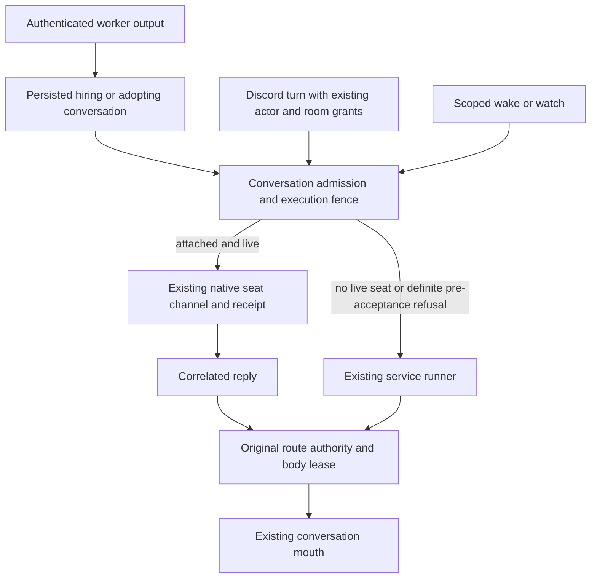

# ADR 0218: Native seats drive their attached conversation

Status: accepted for engineering (James, 2026-10-04). Extends
[room turn admission](0118-a-text-room-is-a-durable-lane.md),
[room inspection](0176-every-room-is-an-inspectable-conversation.md),
[room-owned harvests](0186-a-discord-room-harvests-its-own-workers.md), and
[conversation body leases](0215-conversations-lease-one-body.md).

## Context

Clankie's conversation is independent of the harness that executes it. Native
operator seats already select a conversation, receive channel events, and
project their own transcripts. Worker output currently enters the default
conversation even when another conversation hired the worker. Room conversations
are inspectable but cannot yet be selected by a native operator seat.

## Decision

A native operator seat may select any existing service conversation, including
the default conversation and canonical Discord text or voice rooms. A room
remains the same room conversation; selecting the default never selects all
Discord rooms. Conversation discovery exposes stable IDs and readable names.
Inspection, ordinary owner sends, reset, and attachment retain their separate
admission rules.

The service selects one execution destination for each admitted input. A live
attached native seat receives worker output, escalations, wakes, watches and
room messages through its existing conversation channel. Its reply uses the
existing reply correlation. When no seat is live, the service runner executes
the conversation. Extend the existing native source metadata, conversation
admission and seat outbox; do not create a second conversation or mailbox system.
Existing Pi goal continuations retain their service loop; this change routes the
listed external inputs and asynchronous notifications.

Execution admission and attachment handover share a conversation fence. A
service execution that has already reserved admission keeps that input;
attachment cannot start a second execution of it. A native delivery that was
taken, accepted, or became uncertain is never replayed into the service runner.
Only a definite refusal before native acceptance permits fallback, after
rechecking the current destination. Detach cannot redirect an in-flight accepted
input. Unaccepted queued input follows the current destination. Existing durable
delivery IDs, fingerprints and receipts survive retries; transport uncertainty
remains visible instead of becoming a duplicate answer.

Attachment grants no tools or room authority. Discord turns and asynchronous
room notifications refresh the original actor and route grants as today.
Native replies return through the admitted room turn's existing body mouth and
lease checks. Selecting a room grants neither cross-room replies nor the right
to invoke a generic operator runner on that room. Other rooms and conversations
retain their own execution destination and grants.
A room's cached MCP tool bank remains social and has no generic operator body
identity. The current MCP session contract has no exact per-event actor binding;
it cannot safely import a later actor's machine grants into that cached bank.

A worker's lead is the host-stamped conversation that hired it. The existing
persisted hire ownership proof binds it to the exact fleet, pane, seat and native
occupant. A successful host-admitted `message_seat` from another conversation
adopts the worker under that conversation. Workers never choose this route in
`message_clankie`. Authenticated worker messages use their existing receipts and
the existing framing that agent output is untrusted context, not an instruction
from the owner. When the recorded conversation is gone, worker messages fall
back to `global-default`; a live room with revoked authority is refused rather
than redirected. This missing-conversation fallback applies to worker messages,
and does not change scoped watch or body-lease fallback rules in ADR 0215.

## Consequences and verification

Conversation identity and worker ownership survive harness changes. The native
seat can lead the workers it hired without an unrelated default conversation
harvesting their reports. A room remains independently inspectable and retains
its current transport and authority boundaries.

Focused regressions cover hire, adoption, missing-owner fallback and remote
identity; live attachment, detachment and execution reservation races; taken or
uncertain delivery without replay; room reply authority and independent room
routing; and discovery and native launch selection. A live post-landing worker
report to the hiring Claude conversation remains separate evidence from these
deterministic checks.
