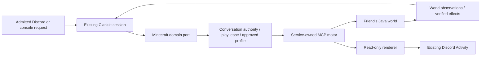
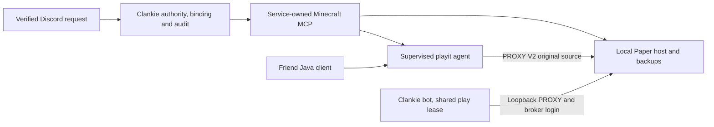
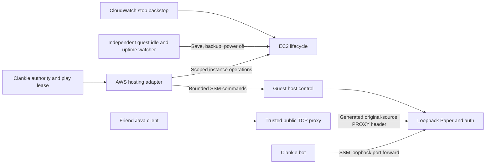

# ADR 0219: Minecraft is an MCP-connected body

Status: Accepted for the offline body slice (2026-10-04), for [VUH-1584](https://linear.app/vuhlp/issue/VUH-1584/let-clankie-play-minecraft-with-friends).
Extends [service-owned MCP connections](0109-mcp-is-how-he-reaches-a-service.md)
and [conversation body leases](0215-conversations-lease-one-body.md). The retired
[Mineflayer runner](0044-runner-owned-mineflayer-private-paper-gameplay.md) and
[environment contract](0016-versioned-interactive-environment-contract.md) are
historical precedents. Wave 1 froze contracts and evaluated the stock server;
wave 2 implements the service-owned offline body. Online account authentication
and live Discord acceptance remain deferred.

## Context

Clankie should join a friend's Java world as himself, chat, follow people, mine,
craft, build and react, with friends seeing the play in their Discord call.
VUH-1584 replaces the old VUH-766 plan. The landing page already depicts Minecraft;
a recorded live session must establish what can be claimed and confirm or
replace that scene before the issue is complete.

[VUH-983](https://linear.app/vuhlp/issue/VUH-983) removed the old implementation in
commit `29fc7615b70e36089ebea0482b053873d816ac0c` (2026-08-15). Its motor and tests
remain recoverable in Git, but its runner, environment runtime, frozen mission
and loopback-only profile do not describe today's architecture or multiplayer
requirement. Minecraft needs its own domain contracts; it does not fit Pokémon's
GBA actions or require a second model identity.

## Decision

Clankie's existing service session remains the sole model decision-maker. It
chooses goals, words and reactions through native goals and wakes. A
service-owned MCP connection drives Mineflayer and pathfinder beneath that
session. The motor handles navigation and physics, never a separate model loop
or scripted personality.

Start from yuniko's existing MCP server at
`240c8cec337ce152cc9e058ebdef511055808406` (v2.0.4). Adapt only the demonstrated
missing behavior at that boundary; preserve upstream provenance and pin the
release inputs. The stock conformance spike below determines the final adoption
or adapter rationale for AC6.

| Candidate reviewed                                                                                                        | Evidence and consequence                                                                                                                                                                                                                                                                                                                                                                                                                                                                                                                                                                                                                                                               |
| ------------------------------------------------------------------------------------------------------------------------- | -------------------------------------------------------------------------------------------------------------------------------------------------------------------------------------------------------------------------------------------------------------------------------------------------------------------------------------------------------------------------------------------------------------------------------------------------------------------------------------------------------------------------------------------------------------------------------------------------------------------------------------------------------------------------------------- |
| [yuniko](https://github.com/yuniko-software/minecraft-mcp-server/tree/240c8cec337ce152cc9e058ebdef511055808406)           | Small existing movement, block, inventory, crafting and chat surface. Its [tool factory](https://github.com/yuniko-software/minecraft-mcp-server/blob/240c8cec337ce152cc9e058ebdef511055808406/src/tool-factory.ts) does not forward request cancellation; [navigation](https://github.com/yuniko-software/minecraft-mcp-server/blob/240c8cec337ce152cc9e058ebdef511055808406/src/tools/position-tools.ts) waits for goto and stops on timeout. [Bot creation](https://github.com/yuniko-software/minecraft-mcp-server/blob/240c8cec337ce152cc9e058ebdef511055808406/src/bot-connection.ts) supplies no Microsoft auth/cache seam. Best baseline to test, with known integration gaps. |
| [minecraft-companion](https://github.com/Buaichilajiao/minecraft-companion/tree/b3272e13faf30a81ad62a82da804fcbb29ddbc6a) | Broader surface, with a [brain bridge](https://github.com/Buaichilajiao/minecraft-companion/blob/b3272e13faf30a81ad62a82da804fcbb29ddbc6a/src/brain.ts) that calls AstrBot. Its [interrupt window](https://github.com/Buaichilajiao/minecraft-companion/blob/b3272e13faf30a81ad62a82da804fcbb29ddbc6a/src/interrupt.ts) is 1.5s while [navigation checks](https://github.com/Buaichilajiao/minecraft-companion/blob/b3272e13faf30a81ad62a82da804fcbb29ddbc6a/src/tools/helpers.ts) can be 5–10s apart. More machinery to remove; source review does not establish prompt cancellation.                                                                                                 |
| [Mindcraft](https://github.com/mindcraft-bots/mindcraft)                                                                  | Its documented setup supplies model credentials and bot model/prompt profiles. Its own agent loop would need removal or replacement to keep Clankie as the decision-maker; it is not the selected MCP baseline.                                                                                                                                                                                                                                                                                                                                                                                                                                                                        |

Selectively reuse the pruned motor's `cancelMotion`, abort/normalization patterns
and action-ID/asynchronous-settlement regression cases, retrieved with
`git show 29fc7615^:integrations/minecraft-mineflayer/src/real-motor.ts` and the
adjacent `adapter.ts`/tests. Reimplement those patterns against the small current
contracts. The old `stop()` declared disconnection after an `end` event **or a
two-second timeout**; reject that inference. Reject full revival because it
imports deleted runtime and mission bindings. Reject a wholly fresh movement
engine because Mineflayer/pathfinder and the old motor already supply useful
mechanics. A private auth cache directory is useful precedent, not proof of
broker-backed storage.

### Ownership, authority and account boundary

A model-facing server profile identifies an owner-configured destination; it
contains no endpoint override, auth material or server administration commands.
Operator API/CLI configure and authenticate profiles, and the TUI exposes those
settings. Non-secret destination/version/allowlist settings remain owner-authored;
Microsoft credentials, device-code flow and canonical auth cache belong to the
credential broker. Any runtime cache must be private and broker-backed. Offline
auth is an explicit isolated-test/private-server mode, not online account proof.

Check destinations before dialing, including DNS/SRV-resolved endpoints. LAN or
self-hosted worlds are the supported target; a public endpoint requires explicit
owner allowlisting, including a friend's publicly reachable server. Model tools
select only approved profiles. Minecraft chat, signs and world text are untrusted
observations: they do not grant machine tools, change a profile or widen Discord
admission. Play-voice narration and suggestions carry experience, not authority.

Acquire the existing `play` lease before join and retain it through **confirmed
termination of the exact bot session and connection generation**. Pokémon and
Minecraft cannot both own the seat. Persist the external identity before effects;
all later operations and callbacks must match that identity, the captured
conversation, authority and lease incarnation. Pause retains the stay and lease;
resume starts a fresh guarded action. Reconnect is a new admitted generation,
never an automatic restoration of stale work. Restart or an uncertain stop keeps
ownership blocked for explicit reconciliation or authorized recovery.

Catalog warming must not connect a player: yuniko's [startup](https://github.com/yuniko-software/minecraft-mcp-server/blob/240c8cec337ce152cc9e058ebdef511055808406/src/main.ts)
connects before MCP registration, so join must become lazy or the process's
entire lifetime must sit inside the lease. Raw/direct/deferred MCP, operator MCP,
worker and fleet routes must pass the same body guard or be denied access to
Clankie's bot. Prompt tool selection is not access control. Workers that play
need independent bot identities. This proposal does not settle
[ADR 0217](0217-fleet-membership-gets-connected-tools.md)'s open
strict-versus-new-call-only fleet dispatch decision.

### Cancellation and world evidence

Long actions return bounded action handles promptly. Status, observation and
out-of-band pause/cancel remain responsive while navigation, digging or building
runs. Thread cancellation into the motor, clear the pathfinder goal and control
states, stop active digging, and check between build steps. An aborted MCP
request or rejected promise alone does not prove that equip/craft/place stopped.
Fence late callbacks and separately record requested cancellation, actual motor
settlement and any effect whose outcome is still uncertain.

Contracts separate adapter settlement from world evidence. A completed request
may have unknown or refuted effects; cancellation may leave an already completed
effect. Only fresh server-origin observations matching exact postconditions may
verify position, block or inventory changes. Preserve provenance and freshness
instead of treating the bot's completion text or optimistic cache as proof.
Independent server/second-client observations validate acceptance, including
failed/protected digs and invalid placements. Unknown stays unknown. A timeout
cannot confirm disconnect or release `play`.

### Viewing and delivery

Prefer a real read-only renderer feeding the existing brokered Discord Activity.
Keep MCP, control and renderer ingress local; expose only the existing read-only
viewing surface. Use bounded PNG frames/backpressure and frame-derived dimensions,
add a Minecraft surface, and remove Pokémon-only Activity launch assumptions.
One producer owns `play`; close and invalidate stale live state on termination.
Renderer version support and visual fidelity must be proven for the chosen
world. A viewer dependency or one screenshot is not continuous Discord viewing.

If automated rendering cannot meet the chosen version, record the limitation and
supported route. A real human-client Discord stream may demonstrate viewing; it
must not be represented as an automated Clankie Activity. User-session Go Live
requires its separately authorized body; the official bot cannot publish it.
Friends use ordinary Java clients at the chosen reachable server/version; no
Clankie install is required. Bedrock/Geyser support is a separate decision.

## Stock conformance spike — 2026-10-04

A disposable loopback, offline-mode Paper **1.21.4 build 232** server ran with
Homebrew OpenJDK **21.0.11** and Node **26.7.0**. The pinned yuniko server used
Mineflayer **4.35.0**, pathfinder **2.4.5**, and MCP SDK **1.27.1**. Stock MCP
tools drove a loaded-chunk survival fixture; RCON independently inspected actual
entity, block and inventory state. Supplemental cancellation diagnostics added
passive bot event listeners, without changing movement or digging controls.

| Check                                                              | Observed result                                                                                                                                                                                                                                                                                                                    |
| ------------------------------------------------------------------ | ---------------------------------------------------------------------------------------------------------------------------------------------------------------------------------------------------------------------------------------------------------------------------------------------------------------------------------- |
| Join, two-way chat, goto, ordinary dig/place and inventory changes | Passed the local stock-motor fixture with independent RCON observations. This was a script-driven offline bot, not a Clankie conversation or authenticated friend session.                                                                                                                                                         |
| Follow and explicit stop/pause                                     | No such tools in the stock catalog. Finding an entity and navigating to its current coordinates does not establish continuous following.                                                                                                                                                                                           |
| Cancel navigation                                                  | Failed. After `notifications/cancelled`, RCON still observed movement and eventual arrival. In the passive diagnostic, the goal was reached about 5.8 seconds after cancellation. The SDK suppressed the cancelled request's reply while the world effect continued.                                                               |
| Cancel digging                                                     | Failed. The iron block remained for seven seconds after cancellation, then RCON observed it removed between roughly 7.0 and 7.5 seconds later; tool durability also changed. A cancelled request did not quiesce the motor.                                                                                                        |
| Verify a denied dig                                                | Failed. In Adventure mode, the tool returned `Dug dirt at (3, 64, 0)` without `isError`; immediate independent RCON `execute if block 3 64 0 minecraft:dirt` returned `Test passed`. The client's completion/cache could not establish the world effect.                                                                           |
| Headless PNG capture                                               | Not established. The same-bot viewer probe used prismarine-viewer **1.33.0** and reached Minecraft 1.21.4, but capture failed on missing native `canvas`; the `gl` install fallback lacked a Node 26/macOS arm64 prebuild and could not build. This is an environment-specific renderer gap, not proof that viewing is impossible. |

Raw MCP/RCON transcripts and commands are retained in the separate wave-1 spike
workspace. The owned server and MCP processes were stopped; no Discord post,
public endpoint, account login or Linear write was part of the spike. No full
Minecraft acceptance criterion is marked complete by these subsystem checks.

**AC6 recommendation: patch/adapt the pinned MCP baseline.** Stock yuniko
demonstrably falls short on actual cancellation and honest effect verification,
and lacks follow and the account/viewer integration needed for the feature.
The owned domain/lifecycle adapter at that boundary reuses Mineflayer and
selectively recovered motor mechanics. Full runner revival or a new movement
engine is not justified by these results.

## Owned offline implementation — 2026-10-04

`integrations/minecraft-mcp` preserves the pinned upstream's Apache-2.0 license
and provenance. Join is lazy; cancellable action handles, server-packet evidence,
bounded world events and a same-bot browser viewer sit beneath the service's
exact conversation/generation guard. The service persists ownership in the
shared play lease, denies raw MCP bypasses, and rechecks approved destinations
before dispatch. API, CLI and TUI controls configure offline profiles.

Manual Node 26.7.0 conformance against the same Paper 1.21.4 fixture measured
navigation stopping within 527.4 ms of cancellation through independent RCON
samples. Dig cancellation replied in 1.3 ms; RCON confirmed the iron remained
through the former 7.5-second late-effect window. Adventure-mode digging settled
with refuted evidence while RCON still found dirt. Follow, two-way chat and
server-verified survival dig/place passed. The compiled motor and copied runtime
packages also passed outside the checkout (513.7 ms navigation stop, 1.5 ms dig
cancel reply). Reply latency alone is not a motor-stop measurement.

The isolated real HTTP app and CLI command module joined, followed a second
scripted player, exchanged chat, dug and placed blocks, captured three inspected
320×180 PNGs, and released the lease only after confirmed leave. The real browser
viewer avoids native canvas/GL builds. These are local offline subsystem and
integration proofs; they establish neither a human friend session nor live
Discord Activity delivery.

## Consequences and remaining verification

Broker-backed Microsoft auth remains unimplemented. Focused tests cover endpoint
refusal, exact lease/restart handling, raw MCP denial and bounded capture. Manual
live acceptance still needs a human friend, admitted Discord requests, continuous
Activity viewing, and a recorded session attached to VUH-1584 with the landing-page
comparison. The isolated offline checks cannot prove authenticated online
multiplayer or Discord viewing.

Current setup lives in `docs/minecraft.md` and the shipped Minecraft skill,
with API/CLI/TUI behavior in `docs/cli.md`. Keep procedures out of the
standing identity instructions. No hosted provisioning or production records
move into this public repo. Ordinary CI stays narrow; live checks are manual
and evals are excluded.

## On-demand hosted world and hybrid auth — 2026-10-04

The Minecraft integration now owns the local Paper host and playit tunnel behind
the existing service-owned MCP connection. Its hosting port is the seam for a
future instance-backed provider; this change implements only the Mac provider.
Core remains responsible for existing owner/per-user admin policy, Discord
identity binding, audit, play ownership, approved profiles and invitations.
No extra public MCP or RCON route exists.

Hosting is off by default and starts for requested play. An already approved
Discord-bound friend can request a start under the standing play grant; this
confers no stop/restart or administrative permission. With no players for
approximately 15 minutes, save and backup precede shutdown; a six-hour default
watchdog caps even occupied requested runs. Crash backoff retains that deadline.
The tunnel stops with the server. Cost controls apply to local hosting now;
AWS instance, budget, storage and snapshot work belongs to a subsequent wave.

Use Paper 1.21.4-232 with pinned FastLogin, ProtocolLib 5.4.0 and AuthMe 5.6.0.
Premium classification fails closed during provisioning and persists a forced
premium marker before whitelist admission, preventing a lookup outage demoting
a premium identity to offline authentication. The bot uses a currently unregistered
name and a broker password restricted to loopback. Nonpremium friends are bound
to authenticated Discord requests and receive expiring one-use login codes through
a host-internal DM relay. AuthMe sessions/IP remembering and in-game registration
are disabled. An authenticated login rotates the code using the pinned plugin's
anchored authentication event; expiry/reissue revokes the previous code. Failure
to rotate stops the server rather than retaining a reusable invitation.

Raw TCP loopback tunneling would collapse public source identities onto loopback.
Mandatory Paper PROXY forwarding and playit's original peer metadata preserve the
bot restriction. The bot emits its local header internally. No player is op;
commands are typed and RCON stays loopback. A persisted uncertain enrollment or
DM outcome is not silently repeated. The reserved self-profile remains loopback
and normal play ownership still applies.

Residual risks: AuthMe restriction takes effect after a brief unauthenticated
spawn; plugin configuration/startup and original-IP forwarding are part of the
security boundary. Code consumption depends on the exact pinned AuthMe event
format. Mojang outages can prevent new name classification and premium login.
Trusted local processes can access loopback and the owner's broker. Public source
forwarding, account-claimed playit connectivity, a premium human join and actual
Discord DM/invite delivery require live acceptance; local synthetic forwarding
and scripted bot tests cannot establish those paths. Plugin artifacts retain their
upstream licenses and are downloaded for the host, not relicensed or bundled.

Server-side vec3 now uses the independent Apache workspace implementation; motor
conformance and archive assembly passed without relaxing the release license gate.
Precompiled prismarine-viewer browser assets remain separately supplied vendor
assets. Setup and command details live in `docs/minecraft.md` and the shipped skill.

## Instance-backed host boundary — 2026-10-04

The AWS provider uses the same integration-owned hosting port for one explicitly
configured EC2 instance. Core still owns authority, bindings, invitations and the
play lease. Administrative SSO is reserved for provisioning; product operations
use a broker credential scoped to that instance and the approved SSM documents.
No public SSH, RCON or arbitrary remote shell is part of the gameplay contract.
Secret-bearing SSM replies are encrypted to the adapter; the normal command
history must contain no login credentials.

The public proxy must generate source metadata rather than trust a client-supplied
PROXY header. The bot keeps its loopback restriction through the private SSM
forward. Disabling online-mode alone does not authorize a public world; the
existing premium classification and one-time friend-code boundary remain required.

Off-by-default, actual-player idle shutdown, independent guest uptime limits,
service checks and an AWS-native stop action limit compute exposure under separate
failures. Backup failure cannot keep an idle instance running. A low-CPU alarm
is a heuristic and can stop a quiet occupied world or miss an unhealthy busy one.
A tagged monthly budget provides notification, not a hard cap; stopped volumes
and snapshots still accrue storage cost. Every manual run ends with EC2 state
confirmed stopped. Live guardrail, premium-human and Discord acceptance remains
separate from deterministic adapter tests and is recorded with its actual scope.
