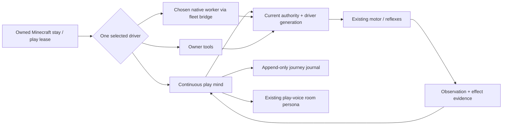

# ADR 0225: Minecraft keeps playing with one driver

Status: accepted (Brief 10, VUH-1584, 2026-10-05). Implementation is source-only until deployed; live acceptance is tracked with the brief.

## Decision

A joined Minecraft stay defaults to its own continuous play mind. It observes
nearby players, terrain, inventory and chat; decides freely; acts through the
existing motor; checks settlement and world evidence; journals usage and its
working notes; then repeats. In-game and active Discord room interjections enter
the same loop. The existing play-voice seam lets the Discord persona compose
speech from experience rather than a script.

The conversation retains the existing shared play lease and authority. Within
that stay, an explicit driver handoff chooses the built-in mind, owner tools, or
one admitted native worker. Generation fences invalidate held decisions before
handoff; motor settlement is required before a new driver acts. Workers use the
existing fleet bridge's service-owned Minecraft tools, never raw motor MCP, and
gain no join, configuration, administration or delegation authority.

`minecraft.play` selects a registered inexpensive model, token/spend ceiling,
pacing and idle timeout through API/CLI/TUI. Per-call usage is journaled, decision
preemption is bounded, repeated model failures back off then stop with
`mind_unavailable`, and notable conditions inform the owning conversation. The
loop re-observes before acting; immediate motor reflexes handle drowning,
falling and nearby hostile damage beneath the slower mind. Quiet worlds back off
and an idle/budget/failure stop leaves only Clankie's bot.

This reuses the play lifecycle, interjection queue, model/persona resolution,
voice path and journal envelope. Minecraft retains its native action and
observation schemas. Pokémon changes and a game-neutral kernel are separate
work. Verification exercises real service, lease, fleet transport, motor and
model boundaries per ADR 0221; no new scheduled or full-suite gate is added.
