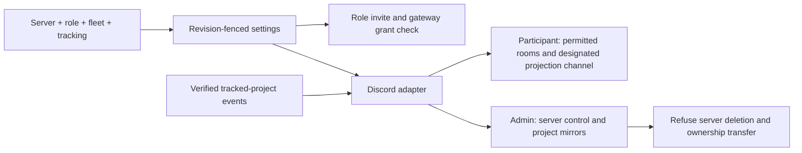

# ADR 0226: Discord connects a server with a role

Status: accepted (James, 2026-10-04), [VUH-1622](https://linear.app/vuhlp/issue/VUH-1622).
Supersedes the four-sentence setup and separate managed-server choice in
[ADR 0222](0222-discord-setup-has-one-shared-definition.md). Its shared protocol,
revision fences, directory reads and permission evidence remain foundations.

## Decision

Discord setup is one connected server, Clankie's role, fleet display on/off and
a tracking level. The shared definition belongs to protocol; the app, TUI and
hosted dashboard consume it. The normal setup has no channel or Discord-role
picker. IDs, machine grants and body diagnostics live under Advanced.

**Participant** means a normal server member. Discord permissions and channel
overwrites decide where Clankie can read, speak and join voice. Connecting the
server clears setup's channel filters rather than maintaining another permission
system. Fleet and tracking messages use the designated channel; he does not
create channels or webhooks to display a fleet there.

**Admin** means a server dedicated to Clankie. Its invitation requests
Administrator. Clankie controls channels, categories, roles, webhooks and
members without another approval step. The adapter refuses server deletion and
ownership transfer, including the underlying REST routes. Other server actions
follow his decisions and Discord's own platform constraints. A role grants no
access to the operator's shell; machine grants remain separate.

Invitations request the selected role's permissions. Setup checks the connected
body's own gateway evidence and flags missing grants. Unknown evidence remains
unchecked, never success. Setup reads and saves do not post to Discord.

Fleet display and tracking are independent. Disabling display suspends posting
and ingress through existing fleet projections without deleting their webhooks
or forgetting their server. Participant messages stay in the designated channel.
Admin may create and place fleet channels.

Tracking offers `off`, `project_updates`, `project_activity` and `all_issues`.
Project activity includes status changes, milestones and new/finished issues.
Only already tracked projects in the verified connected workspace are eligible.
Admin mirrors each as a channel or forum, with one thread/post per issue;
Clankie chooses the representation. Participant posts in the designated channel.
Private mappings survive disablement. An unconfirmed write remains uncertain
and is not automatically replayed.

## Consequences

VUH-1624, VUH-1627, VUH-1628 and VUH-1629 were canceled into VUH-1622.
VUH-1645's app connection flow needs rescoping to this model. VUH-1625's
directory and VUH-1626's reversible projection gate remain building blocks.
The public service and protocol implement the core; hosted control-plane UI
belongs in the private operations repository. Live Oathkeeper and Blinkercity
checks belong to James, separate from local integration evidence.

Discord remains the final authority over platform permissions and role
hierarchy. [Discord's permission documentation](https://docs.discord.com/developers/topics/permissions)
defines Administrator and channel overwrites; [its server API](https://docs.discord.com/developers/resources/guild)
defines guild deletion and the ownership-transfer field.
