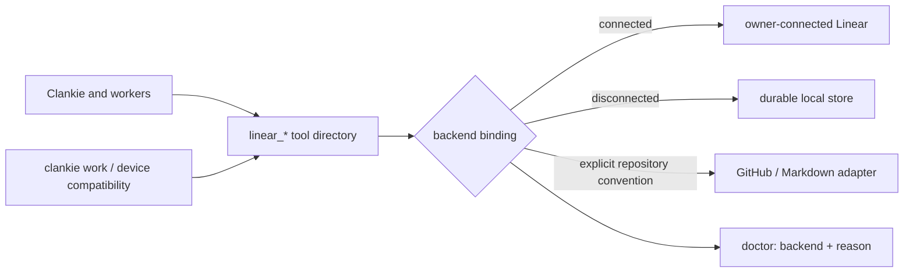

# ADR 0226: One tracker tool surface

Status: accepted (James, 2026-10-05). Tracks [VUH-1665](https://linear.app/vuhlp/issue/VUH-1665).
Amends the tool vocabulary, priority and disconnected behavior of
[ADR 0191](0191-work-is-tracked-where-the-repo-tracks-it.md).

## Context

Clankie and his workers already know the Linear tools and writing skills.
Separate `work_items` tools force them to learn another vocabulary, and losing
the Linear connection removes that familiar surface. James requested “a mirror
of linear tools locally, for fallback if we're not using Linear.”

## Decision

Expose the same `linear_*` names and input shapes through the existing service
tool directory to Clankie and workers. The supported subset covers issue
reads, lists and search; issue upserts and atomic description patches; state,
priority, labels, parents and relations; comments and replies; projects and
project status updates. Identity, team, state and label discovery support the
same writing and orientation skills. Unsupported provider features must fail
explicitly, rather than silently discard input.

Choose the owner-connected Linear backend when connected, retaining its
credential, account, lane and dispatch fences. Otherwise use durable local
service storage. A failed connected call never switches backend or replays a
mutation. `clankie doctor` identifies the active backend and why it was chosen.
Local identity is visibly local; it is not a fabricated verified Linear account.
Fleet admission and its kill switch continue to apply to both backends.

Repository conventions still select GitHub or Markdown storage. Their adapters
project that storage onto the same tools; repository selection is explicit.
The existing `clankie work`, device API and receipt-backed narrow writes remain
compatibility callers of the common contract. They retain repository admission,
fresh-read merges and uncertain-write handling. Ancillary local records belong
to the same repository scope, rather than a second task queue.

Priority is `0` (none), `1` (urgent), `2` (high), `3` (medium), `4` (low) on every
backend. Open-work lists sort urgent through low, then unprioritized, before
pagination or limits. Markdown stores priority as front matter; GitHub uses
reserved priority labels; Linear retains its native field.

Local records have immutable UUIDs and stable human identifiers. Writes lock
the durable store and replace it atomically. Patch anchors must match current
content; a failing operation aborts the entire mutation. Labels replace only
when explicitly supplied; relations append as in Linear. A local record remains
local when an account is connected; no automatic migration or synchronization
is implied.

## Export and import

A future explicit export is a versioned bundle containing source store UUID
(the local store's persisted team UUID),
record UUIDs and identifiers, full content, priorities, state and label metadata,
projects, comments and replies, relations, and timestamps. Import requires an
owner-selected connected account, team and project mapping. It creates projects
and issues first, records a durable `(store UUID, record UUID) → Linear UUID`
mapping, then resolves hierarchy, relations, status updates and comment threads.
Each mutation records intent and its provider receipt before continuing. A
rerun reconciles the mapping and uncertain receipts instead of duplicating
records; unmapped labels or states require a decision. Export/import execution
and automatic synchronization are outside this change.
