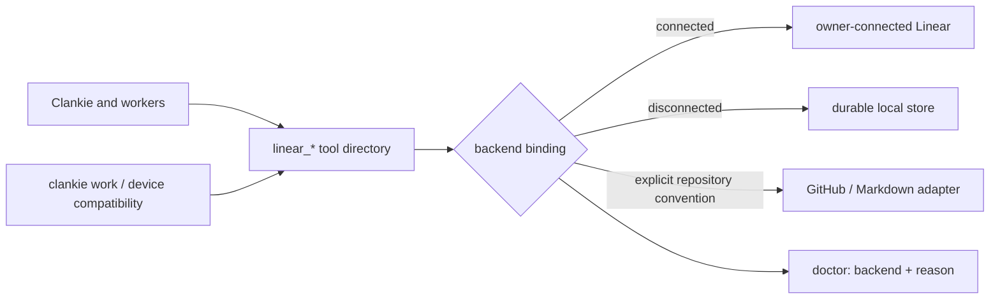

# ADR 0226: One tracker tool surface

Status: accepted (James, 2026-10-05). Tracks [VUH-1665](https://linear.app/vuhlp/issue/VUH-1665).
Amends the tool vocabulary, priority and disconnected behavior of
[ADR 0191](0191-work-is-tracked-where-the-repo-tracks-it.md).
Amended by [ADR 0243](0243-linear-graphql-is-the-tracker-escape-hatch.md):
`linear_graphql` reaches the rest of Linear's API beyond this subset.
A proposed
[ADR 0181 amendment](0181-clankie-is-independent-of-his-connections.md#amendment-the-built-in-tracker-is-the-default-2026-10-09-vuh-1904)
(VUH-1904) grows the built-in default tracker from the durable local backend and
makes Linear an optional connection; these tools stay the agent vocabulary.
A proposed [amendment](#amendment-actors-receipts-and-audit-2026-10-09-vuh-1916)
(VUH-1916) adds actors, exactly-once writes, preconditions and an audit log to
the built-in tracker. A second proposed
[amendment](#amendment-typed-events-delivery-stages-and-owner-wakes-2026-10-09-vuh-1917)
(VUH-1917) adds the item event stream, derived state, delivery stages and owner
wakes. A third proposed [amendment](#amendment-releases-2026-10-09-vuh-1930)
(VUH-1930) makes releases records whose items come from landed commits, and a
fourth [amendment](#amendment-cycles-2026-10-09-vuh-1931) (VUH-1931) adds
per-project cycles with automatic rollover.

## Context

Clankie and his workers already know the Linear tools and writing skills.
Separate `work_items` tools force them to learn another vocabulary, and losing
the Linear connection removes that familiar surface. James requested “a mirror
of linear tools locally, for fallback if we're not using Linear.”

## Decision

Expose the same `linear_*` names and input shapes through the existing service
tool directory to Clankie and workers. The supported subset covers issue
reads, lists and search; issue upserts and atomic description patches; state,
priority, labels, parents and relations; comments and replies; projects and
project status updates. Identity, team, state and label discovery support the
same writing and orientation skills. Unsupported provider features must fail
explicitly, rather than silently discard input.

Choose the owner-connected Linear backend when connected, retaining its
credential, account, lane and dispatch fences. Otherwise use durable local
service storage. A failed connected call never switches backend or replays a
mutation. `clankie doctor` identifies the active backend and why it was chosen.
Local identity is visibly local; it is not a fabricated verified Linear account.
Fleet admission and its kill switch continue to apply to both backends.

Repository conventions still select GitHub or Markdown storage. Their adapters
project that storage onto the same tools; repository selection is explicit.
The existing `clankie work`, device API and receipt-backed narrow writes remain
compatibility callers of the common contract. They retain repository admission,
fresh-read merges and uncertain-write handling. Ancillary local records belong
to the same repository scope, rather than a second task queue.

Priority is `0` (none), `1` (urgent), `2` (high), `3` (medium), `4` (low) on every
backend. Open-work lists sort urgent through low, then unprioritized, before
pagination or limits. Markdown stores priority as front matter; GitHub uses
reserved priority labels; Linear retains its native field.

Connected issue lists collect provider pages once into an account/configuration-
bound sorted snapshot. Identical concurrent reads and public cursor pages share
that scan for 60 seconds; failures have a 30-second retry floor. The host retains
at most 32 listings. Cursors name the snapshot and require a restarted listing
after expiry or invalidation, preventing mixed pages. Each caller still passes
its own lane, grant, account and revocation checks, including after a shared read.
Writes invalidate at dispatch and settlement (also after uncertain failures),
and verified webhooks invalidate before self-echo suppression. A connection
change or shutdown retires snapshots. No mutation is cached or retried. Host
call logs include the actual provider-page count, including zero for cache hits.

Local records have immutable UUIDs and stable human identifiers. Writes lock
the durable store and replace it atomically. Patch anchors must match current
content; a failing operation aborts the entire mutation. Labels replace only
when explicitly supplied; relations append as in Linear. A local record remains
local when an account is connected; no automatic migration or synchronization
is implied.

## Export and import

A future explicit export is a versioned bundle containing source store UUID
(the local store's persisted team UUID),
record UUIDs and identifiers, full content, priorities, state and label metadata,
projects, comments and replies, relations, and timestamps. Import requires an
owner-selected connected account, team and project mapping. It creates projects
and issues first, records a durable `(store UUID, record UUID) → Linear UUID`
mapping, then resolves hierarchy, relations, status updates and comment threads.
Each mutation records intent and its provider receipt before continuing. A
rerun reconciles the mapping and uncertain receipts instead of duplicating
records; unmapped labels or states require a decision. Export/import execution
and automatic synchronization are outside this change.

## Amendment: actors, receipts and audit (2026-10-09, VUH-1916)

Status: proposed. Tracks [VUH-1916](https://linear.app/vuhlp/issue/VUH-1916).
Applies to the built-in tracker (the durable local backend); connected Linear,
the Linear API tracker and the GitHub/Markdown adapters are unchanged.

**Actors.** Every write records who made it. The host stamps the actor from an
authenticated Clankie identity and passes it beside the call, never in tool
arguments. There are three types: `human` (the owner), `agent-worker` (Clankie
himself or a hired worker) and `app` (an enrolled device). Each actor carries
its on-behalf-of chain, outermost first, and the model when the host knows it.

| Caller                                   | Actor                                | Chain           |
| ---------------------------------------- | ------------------------------------ | --------------- |
| Fleet or granted worker (`clankie_call`) | `agent-worker`, its grant principal  | owner → Clankie |
| Clankie's operator tools                 | `agent-worker` `clankie`, turn model | owner           |
| Clankie in a social room                 | `agent-worker` `clankie`, turn model | none            |
| Owner write from the operator console    | `human` `owner`                      | none            |
| Owner write from an app device           | `app` `device:<id>`                  | owner           |
| Standalone use with no host              | the store's visibly local user       | none            |

A fleet worker is named by the seat its hire recorded. The records it creates
or changes carry `createdByActor` and `updatedByActor`; existing Linear-shaped
fields such as `author` and `createdBy` keep their meaning.

**Exactly-once writes.** Write tools accept an optional `idempotencyKey`. The
store keeps one receipt per (actor, key): the request fingerprint, `applied` or
`refused`, and the original result or reason. Receipts are committed in the same
atomic replacement as the effect, so a crash leaves both or neither. A retry
with the same key and arguments returns the original result without writing
again. The same key with different arguments is refused (`idempotency_conflict`).
`get_write_receipt` answers `applied`, `refused` or `unknown`. `unknown` means
nothing was applied or refused under that key by that actor, so sending again is
safe. This is the evidence store's receipt pattern
([ADR 0258](0258-evidence-lives-in-the-evidence-store.md)) applied to the tracker.
The worker channel's own call receipts stay a transport journal above it.

**Patch-safe updates.** Field and label deltas already exist (omitted fields are
unchanged; `addLabels`/`removeLabels`; description `patch`). Updates now accept
`ifUpdatedAt`. A record changed since then is refused with
`precondition_failed`, and nothing changes. Each write gets a strictly
increasing timestamp, so `updatedAt` works as a version even under a coarse or
fixed clock.

**Audit log.** Every applied or refused write appends an event with its tool,
actor, key, field names (not values), touched records or target, and refusal
reason. Events are hash-chained. The store refuses to open, and so to extend, a
log whose entries were edited, removed or reordered. `list_audit_events` reads
it newest first, optionally for one record.

**Where it lives.** Receipts and the audit log live inside the store file
(`tracker.json`), beside the records they describe, so one atomic replacement
covers effect, receipt and audit. Both grow without bound until a retention
decision. The hosted Postgres backend replaces this layout without changing the
tools.

**Other backends.** `idempotencyKey`, `ifUpdatedAt`, `get_write_receipt` and
`list_audit_events` fail explicitly on every other backend rather than being
dropped. `linear-writes.json` and `linear-attribution.json` already record only
connected-Linear activity; the built-in tracker never needed them, and they stay
unchanged for connected Linear.

## Amendment: typed events, delivery stages and owner wakes (2026-10-09, VUH-1917)

Status: proposed. Tracks [VUH-1917](https://linear.app/vuhlp/issue/VUH-1917).
Built-in tracker only, on top of the VUH-1916 actors, receipts and audit log.

**Event stream.** Each item has typed events in one store-wide stream.
Workers report `ack`, `plan`, `action`, `blocked`, `ask`, `result` and `error`
with `post_issue_event`. The tracker records `created`, `comment`, `state`,
`priority`, `stage`, `verified` and `reopened` from writes, including hand-set
ones. Every event carries its actor and a `selfEcho` flag. Owner activity (a
`human` actor, or an `app` acting for the owner) is not self-echo; everything
Clankie and his workers write is. Events are hash-linked like the audit log,
committed in the same atomic replacement as their write, and the store refuses
to open a broken chain. `list_issue_events` reads them oldest first and resumes
from the returned cursor (the event `seq`). In process, the store pushes newly
committed events to subscribers and replays from a cursor on subscribe.

**Derived state.** `ack` moves a reported item to accepted. `blocked`, `ask` and
`error` set flags that the next `ack`, `plan`, `action` or `result` clears.
A `stage` on the event advances delivery: reported → accepted → landed →
delivered → owner-verified. Each stage maps to a status: the one bound to it, or
otherwise the first status of its category. Status categories stay backlog,
unstarted, started, completed and canceled. `save_issue_status` creates or
renames statuses and binds them to stages, so custom names map onto Linear's
categories during the mirror. New stores add a Delivered status.

**Owner-only verification.** Only a `human` actor sets owner-verified, completes
an item by hand, or moves an item back. Agents report landed or delivered and
the owner checks it. Reaching landed raises a "check it works" owner ask: the
existing ADR 0245 ask with a new purpose, `verify`, so it appears in
`input_list` and the World mailbox. Answering "It works" records owner-verified
as the owner. Any other answer sends the item back to accepted with the
owner's text. These events are marked `via: owner_ask`. An ask's issue
reference may now use the built-in `clankie-work://` record URL.

**Owner wakes.** An in-process loop reads the stream from a durable cursor. It
needs no port, tunnel or webhook secret. Owner comments, verifications,
reopens, state and priority changes wake the item's project lead chat (the
VUH-1927 `projectChats` routes), otherwise `global-default`; nonproject items
wake the default chat. The same wake-target rules as Linear activity apply,
but not its follow switch: `linearWebhook.following` can only be turned on with
a configured Linear webhook, and the built-in tracker has none. Self-echo never
wakes. Answers to asks don't wake a second time, because ADR 0245 already
wakes the source chat. The owner's own writes reach the built-in tracker
through `POST /v1/tracker/owner/call`, authenticated as the operator (a `human`
owner) or a terminalControl device (`app`).

Optional outbound webhooks and feeding Linear's webhooks into this stream
during the mirror are not part of this change.

## Amendment: releases (2026-10-09, VUH-1930)

Status: proposed. Tracks [VUH-1930](https://linear.app/vuhlp/issue/VUH-1930).
Built-in tracker only, on top of the VUH-1917 event stream and stages. James,
2026-10-09: releases are in v1 because they are core to Clankie. Cycles and
initiatives stay out.

**Record.** A release is a shipped version of one repository lane: version,
tag, commit, lane, date with its date kind (annotated tag, lightweight tag's
commit, or publication), and its items. Its id is `repository:lane:version`, with
the repository named by its origin remote (`github.com/owner/name`). Clones
and worktrees therefore record one release. Releases live in `tracker.json`
beside the items they ship.

**Membership is derived, never typed.** A sync reads the repository's `v*`
versions through the same tag source as `clankie work project`. It then reads
the commits between each version and the previous one in version order. The
first version takes its whole history. The items are the keys those commit
messages name: built-in keys (`LOCAL-…`) and the connected tracker's team key
from the repository's convention (`VUH-…`). Other key-shaped text (`UTF-8`,
`SHA-256`) is not work. No tool writes a release or its items. The sync is a
host operation that the owner starts with `clankie work releases sync`
(`POST /v1/tracker/releases/sync`), and the release skill runs it after
pushing a tag.

**Delivered on ship.** A built-in item reaches `delivered` on the first release
that contains it, on any lane. That move is a `stage` event written as Clankie
(`agent-worker clankie` for the owner), `via: release`, with the version in its
body. It is self-echo, so it never wakes anyone. The owner still checks
everything that ships: a stage move that passes landed without stopping there
raises the same "check it works" `verify` ask that landing does, once per item.
Items already at `delivered` or
`owner-verified` stay put, and canceled or duplicate items are not delivered.
Keys from a connected tracker are listed by key only and have no stage effects
until the mirror (VUH-1907). The sync is deterministic: run again, it upserts
the same releases and moves nothing.

**Reads.** `list_releases` and `get_release` follow Linear's tool names and
input shapes. When Linear is connected, they reach Linear's own releases. On
the built-in tracker, the pipeline is the repository lane, the stage is
`Shipped`, `query` also matches an item key, and release notes fail explicitly.
`get_issue` with `includeReleases` lists the releases that shipped an item,
oldest first. GitHub and Markdown repository trackers refuse release tools.

Release notes, planned releases and lanes beyond one per repository convention
are outside this change. So is a release that does not ship as a `v*` tag.

## Amendment: cycles (2026-10-09, VUH-1931)

Status: proposed. Tracks [VUH-1931](https://linear.app/vuhlp/issue/VUH-1931).
Built-in tracker only. James's choice of cycle length and scope is still open,
so this uses the issue's default: one week, per project. The length is a stored
project setting (`save_project` `cycleDays`, `clankie work cycle length`), not a
constant, so changing it later is a setting change.

**Cycles.** A cycle is a numbered time box of one project, with a start and an
end. A project's first cycle starts at UTC midnight on the day its first item
joins a cycle. After that, each cycle starts where the previous one ended. A
length change applies from the next cycle, and the current cycle keeps its end.
Cycles are records in `tracker.json`.

**Membership.** An item joins or leaves a cycle through `save_issue` `cycle`
(an id, a number, `current` or `next`, or `null`), Linear's own field. Only the
owner, the owner's app or Clankie as lead may set it; a hired worker is refused
(`cycle_planning_reserved`). An item needs a project, and leaves its cycle if
it moves to another project. An ended cycle takes no new items. Every change is
a `cycle` event, with `from` and `to` set to cycle ids.

**Rollover.** Rollover needs no timer. The first tracker access after a cycle
ends performs it as Clankie's own write (`via: rollover`, self-echo). That write
creates each elapsed cycle and moves every unfinished item from an ended cycle
into the current one. Unfinished means a status that is not completed, canceled
or duplicate, so a delivered item that the owner has not yet verified rolls
over. Several elapsed cycles roll straight into the current one.

**The view comes from the event stream.** Each cycle's summary is read from its
`cycle` events and completions:

- planned: joined before the cycle started;
- added: joined after it started;
- rolled in;
- removed;
- finished: completed while in the cycle;
- rolled over;
- in flight: unfinished members of the current cycle.

There is no burn-down. `list_cycles` keeps Linear's
`type: current|previous|next` and adds `project`. `get_cycle` and
`list_issues` `cycle` read one cycle and its items. The current cycle is
what the ready queue (VUH-1918) will prefer.

Other backends refuse `cycle` and the cycle tools explicitly. Connected Linear
keeps its own team cycles, and the Linear import (VUH-1907) will map them.
