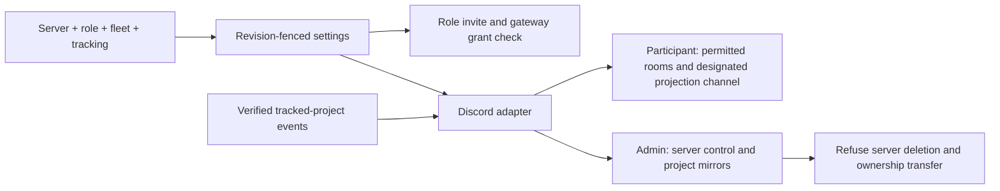

# ADR 0227: Discord connects a server with a role

Status: accepted (James, 2026-10-04), [VUH-1622](https://linear.app/vuhlp/issue/VUH-1622).
Supersedes the four-sentence setup and separate managed-server choice in
[ADR 0222](0222-discord-setup-has-one-shared-definition.md). Its shared protocol,
revision fences, directory reads and permission evidence remain foundations.

## Decision

Discord setup is one connected server, Clankie's role, fleet display on/off and
a tracking level. The shared definition belongs to protocol; the app, TUI and
hosted dashboard consume it. The normal setup has no channel or Discord-role
picker. IDs, machine grants and body diagnostics live under Advanced.

**Participant** means a normal server member. Discord permissions and channel
overwrites decide where Clankie can read, speak and join voice. Connecting the
server clears setup's channel filters rather than maintaining another permission
system. Fleet and tracking messages use the designated channel; he does not
create channels or webhooks to display a fleet there.

**Admin** means a server dedicated to Clankie. Its invitation requests
Administrator. Clankie controls channels, categories, roles, webhooks and
members without another approval step. The adapter refuses server deletion and
ownership transfer, including the underlying REST routes. Other server actions
follow his decisions and Discord's own platform constraints. A role grants no
access to the operator's shell; machine grants remain separate.

Invitations request the selected role's permissions. Setup checks the connected
body's own gateway evidence and flags missing grants. Unknown evidence remains
unchecked, never success. Setup reads and saves do not post to Discord.

Fleet display and tracking are independent. Disabling display suspends posting
and ingress through existing fleet projections without deleting their webhooks
or forgetting their server. Participant messages stay in the designated channel.
Admin may create and place fleet channels.

Tracking offers `off`, `project_updates`, `project_activity` and `all_issues`.
Project activity includes status changes, milestones and new/finished issues.
Only already tracked projects in the verified connected workspace are eligible.
Admin mirrors each as a channel or forum, with one thread/post per issue;
Clankie chooses the representation. Participant posts in the designated channel.
Private mappings survive disablement. An unconfirmed write remains uncertain
and is not automatically replayed.

New tracking channels and forums deny `View Channel` to `@everyone` and allow
Clankie's verified member. Private tracker content never inherits a public
server's default audience. Missing or mismatched member/grant evidence blocks
creation. Clankie can then admit the right people through normal Admin actions;
Discord's Administrator permission still bypasses channel overwrites.

## Managed directory and owner settings

VUH-1647 and VUH-1689 connect the same role model to a managed Discord provider.
Directory requests use the body's authenticated hosted connection rather than
a local Discord control port. The provider scopes every page to the current
installation and the customer's bound server. Native Discord permissions still
filter visible channels and private threads; incomplete caches remain partial,
and unknown permissions remain unchecked. A server or installation outside that
scope cannot become visible by changing the directory query.

The body projects its revision- and sequence-fenced policy to the provider. Participant has
no second channel allowlist; Discord permissions decide admission in its bound
server. Admin requires a dedicated bound server and verified Administrator.
The provider rechecks the current connection, installation, policy and channel
permissions before ingress and outbound effects. A conflicting projection
causes the body to reread the provider fence and retry its current policy.
The monotonic write sequence prevents a delayed write from succeeding after
a revision changes and then reverts. An empty ingress server list denies guild
ingress; it never selects every visible channel. Non-admitted messages do not
consume the tenant's admitted-message budget.
Disconnect/reinstall invalidates the old connection generation. Pending or
unavailable synchronization is reported separately from a successful save.

The hosted dashboard uses purpose-specific, request-bound, short-lived owner
permits. Settings and directory payloads are encrypted to the body; Discord
credentials stay with the managed provider. The body verifies the permit and
checks the live account connection grant before admitting the request. This
grant is the customer's Discord connection: disconnect or reinstall revokes
old permits. An already admitted request may finish; subsequent admissions
fail closed. This is separate from Cognito session/logout revocation. No device
record, terminal capability or broader operator bearer is created by the page.

These changes are code candidates. Local integration evidence does not imply
a deployed provider, a changed Discord application, or a real Discord post.

## Consequences

VUH-1624, VUH-1627, VUH-1628 and VUH-1629 were canceled into VUH-1622.
VUH-1645's app connection flow needs rescoping to this model. VUH-1625's
directory and VUH-1626's reversible projection gate remain building blocks.
The public service and protocol implement the core; hosted control-plane UI
belongs in the private operations repository. Live Oathkeeper and Blinkercity
checks belong to James, separate from local integration evidence.

Discord remains the final authority over platform permissions and role
hierarchy. [Discord's permission documentation](https://docs.discord.com/developers/topics/permissions)
defines Administrator and channel overwrites; [its server API](https://docs.discord.com/developers/resources/guild)
defines guild deletion and the ownership-transfer field.
