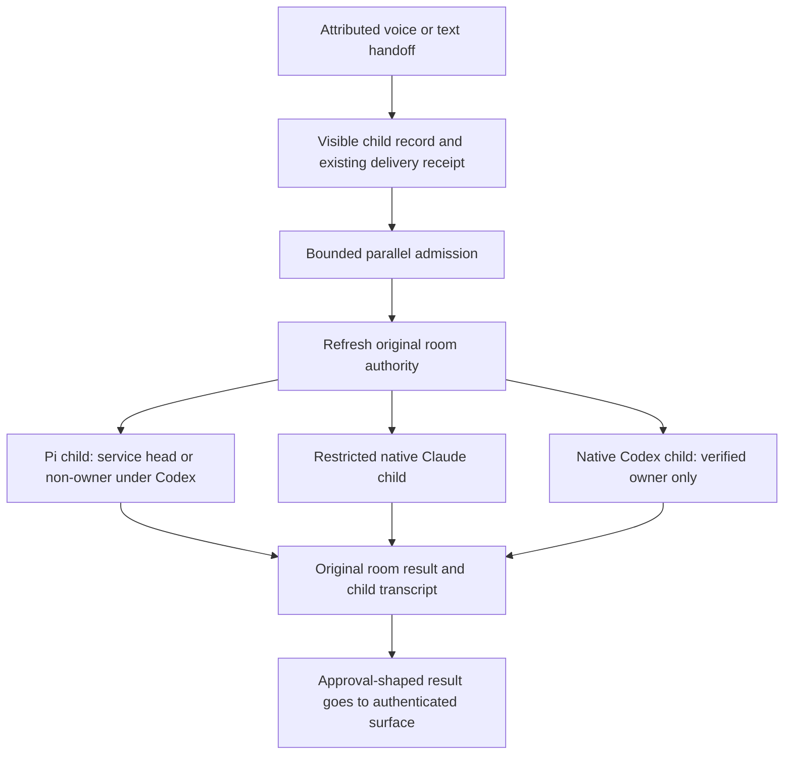

# ADR 0229: Room handoffs are visible parallel threads

Status: accepted for engineering (James, 2026-10-05), including the Codex
fallback decision. Extends [ADR 0218](0218-native-seats-drive-their-attached-conversation.md).
Work: [VUH-1672](https://linear.app/vuhlp/issue/VUH-1672).

## Context

Voice `ask_clankie` work used one continuing room run. Different speakers waited
for that run, and a new message could steer another person's work. Discord text
shared the same execution problem. A native operator seat attached to Clankie's
main conversation did not receive handoffs from other rooms.

## Decision

Every admitted voice or Discord text handoff gets a durable conversation record
under Clankie. The record retains the original room, delivery ID, authenticated
actor ID, source, request, current work, state and result. Actor names are display
text. The TUI dock and app expose these records and select the corresponding
transcript. The existing room conversation remains the authority and reply
destination; the child is an execution record, not a new grant or an ephemeral
`/btw` fork.

A shared admission queue bounds concurrent work to four handoffs globally and
two per room, with at most 32 waiting jobs. Excess requests get a clear busy
result instead of an unbounded pending record. Live admitted jobs retain their
records; inactive and abandoned records follow bounded conversation retention.
Completed delivery retries return the saved result, including after restart.
Separate
handoffs use separate execution sessions and captures; another speaker cannot
steer an active request. Exact delivery IDs keep existing receipt semantics.
Different requests with identical wording remain different handoffs. An explicit
voice join refers only to the same authenticated speaker's existing call in the
same realtime conversation. Mouth playback retains its existing serialization
and stale-result checks: parallel work does not mean overlapping speech.
Durably admitted work may continue after its realtime voice conversation closes;
the existing conversation, quiet and stay guards suppress late speech. Its child
record remains available for inspection.

Execution follows the live head:

| Head        | Room authority    | Executor                                                  |
| ----------- | ----------------- | --------------------------------------------------------- |
| Service Pi  | Social or machine | Separate Pi room thread                                   |
| Claude Code | Social or machine | Native Claude child with only the scoped room proxy tools |
| Codex       | Verified owner    | Native Codex child                                        |
| Codex       | Any non-owner     | Separate Pi thread under the original room lane and grant |

Native requests use the existing parent seat channel. Clankie starts a real native
subagent; the service verifies its parent, exact task marker and, for Claude,
restricted agent type before admitting scoped proxy calls or displaying a native
child reference. A queued request is not evidence that a native child exists.
The parent receives only an opaque task payload and releases its turn after
spawning. The verified child reads the original request from the scoped catalog;
ambient room text does not enter the operator parent's dispatch instructions.
The proxy captures its tool bank and original room authority on the host; model
arguments cannot choose another actor or destination. Grants and recipient
identity are checked again after waiting and before effects or completion.

The operator's builtin tools and MCP catalog are excluded from Claude's
restricted room agent. An approval-shaped result keeps the existing
authenticated-surface handoff. Ambient voice or text cannot approve privileged
work, including by selecting a child transcript. Once a native handoff is taken
or uncertain, it is never replayed as a Pi run.

## Codex limitation and upstream request

Installed Codex 0.160.0 copies only a bounded set of role feature overrides.
Its tests explicitly retain the parent's MCP servers and permissions even when
the child role specifies alternatives. Disabling the shell still leaves
`apply_patch` available. Its internal `ToolPolicy.allowed_tools` could impose the
needed tool ceiling, but has no public app-server or configuration API.
Sources: [role application](https://github.com/openai/codex/blob/rust-v0.160.0/codex-rs/core/src/agent/role.rs),
[inheritance tests](https://github.com/openai/codex/blob/rust-v0.160.0/codex-rs/core/src/agent/role_tests.rs),
[tool registration](https://github.com/openai/codex/blob/rust-v0.160.0/codex-rs/core/src/tools/spec_plan.rs),
[internal tool policy](https://github.com/openai/codex/blob/rust-v0.160.0/codex-rs/ext/extension-api/src/tool_policy.rs).

James selected Pi execution for every non-owner Codex handoff instead of
granting operator authority or refusing the work. Individual, guild and channel
machine grants authorize the room tool set; none conveys the operator seat's
full MCP, shell and file-edit authority. Only the verified owner can use native
Codex children. Metadata shows the actual executor.
The upstream ask is a public, enforced per-child tool and MCP ceiling, applied
at both catalog construction and dispatch, without changing the parent seat's
permissions. Full native non-owner Codex execution depends on that capability;
hooks that can fail open do not establish this boundary.

## Verification

Focused integration covers actual service receipts, persisted child records,
bounded concurrency, exact native ancestry and scoped MCP calls. It separates
completed computation from confirmed room delivery. The real multi-person voice
call and native operator session checks belong to James; exact steps and tested
limits live in the [VUH-1672 evidence record](../testing/2026-10-05-room-handoffs/README.md).
