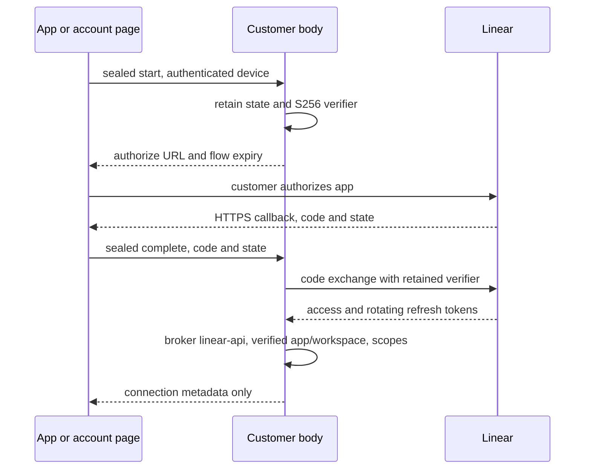

# ADR 0232: Hosted Connections use the body broker

Status: proposed (2026-10-05). Implements the code portion of
[VUH-1383](https://linear.app/vuhlp/issue/VUH-1383), updating
[ADR 0196](0196-account-connections-keep-tokens-on-the-body.md)'s initial
account API proposal. Provider registrations and production authorization remain
James's developer-account actions.

## Decision

GitHub and Linear are connections to Clankie, following
[ADR 0181](0181-clankie-is-independent-of-his-connections.md). The app's
Connections settings and the signed-in account page use the same body-owned
`/v1/accounts` API. They show verified identity and actual granted scopes, start
authorization, and disconnect. The body stores provider credentials exclusively
in its credential broker. This follows the VUH-1369 model-key boundary: fleet
storage, gateway logs and body telemetry contain no customer provider tokens.

The hosted portal obtains an ephemeral paired Take Control device through the
signed, sealed pairing flow in [ADR 0173](0173-the-gateway-cannot-read-device-traffic.md).
It verifies body identity and carries device authorization inside the existing
authenticated encryption envelope. Browser keys and the device bearer remain in
memory. Explicit sign-out revokes that device; closing the tab forgets its local
state. No server-side connection table mirrors the body's accounts.

### GitHub

The body starts the device flow. The customer opens GitHub's verification page
and enters the user code; the device code stays on the body. The body respects
polling intervals and stores the returned access token under `github`, alongside
the returned scopes and verified login. OAuth scope `repo` supports private-repo
issue read/write. A future GitHub App can reduce permission breadth; that change
is outside this delivery.

Hosted bodies never receive Clankie's shared GitHub developer secret: a
customer with Take Control can read that body's broker. Hosted disconnect
deletes only its local credential, reports `revoked: false`, and returns the
GitHub permission-management page. The UI explains the remaining action.
Removing the whole GitHub app authorization there is a customer action that
can affect their other connected bodies; Clankie never does it automatically.

An owner-run self-hosted body may hold its own OAuth app secret under
`github-oauth-app`. It revokes only its stored token with
`DELETE /applications/{client_id}/token` and the token body, preserving other
tokens for the same GitHub user and app. Only HTTP 204 is reported as revoked.
The whole-app `/grant` endpoint is never used. If the owner's secret is absent
or token revocation fails, the body deletes its local credential and returns
the provider permission-management page. The shared developer secret is never
provisioned to hosted bodies, bootstrap, fleet storage or customer portals.

Provider references: [GitHub device authorization](https://docs.github.com/en/apps/oauth-apps/building-oauth-apps/authorizing-oauth-apps),
[token revocation](https://docs.github.com/en/rest/apps/oauth-applications#delete-an-app-token).

### Linear

Use a registered OAuth app with S256 PKCE and `actor=app`, requesting `read,write`
for tracker operations. App installation requires the customer's workspace
administrator consent. No admin, mention or assignment scope is requested.
The body creates the state and verifier, validates the callback's single-use
state and exchanges the code itself. Granted scopes come from the token response.
Refresh and revocation remain broker operations.

The registered return is the gateway origin's `/account/connections/callback`.
The callback page clears its URL before loading more UI, has no analytics, and
uses no-store and no-referrer. Access logs omit callback query parameters.
For the account page, a same-origin BroadcastChannel keyed by the unpredictable
flow state returns the code to the initiating tab, including when provider COOP
severs the popup's opener. For the native app, an explicit Open Clankie link
returns `clankie://accounts/linear/callback`. Both consumers verify pending state,
expiry and the current body connection, consume once, and seal completion to
that body. A callback authorization code is not an access token; the body alone
holds the verifier needed to exchange it. No OAuth verifier or token reaches
the browser, app, gateway or fleet database.

Registered API OAuth uses broker entry `linear-api` and the GraphQL API. Existing
`linear` credentials belong to the separately configured MCP/app connection;
an API token must never be sent to the MCP audience. The body's in-process API
tracker implements the canonical surface from
[ADR 0226](0226-one-tracker-tool-surface.md), retaining repository, account,
write and fleet grant fences. API outage refuses rather than selecting another
backend. Disconnect clears both Linear credential lanes and pending flows so a
hidden legacy connection cannot reappear after the customer disconnects.
Provider-wide compare-and-set of issue descriptions is unavailable; unsafe
description edits must refuse rather than risk overwriting uploaded evidence.

Provider references: [Linear OAuth and PKCE](https://linear.app/developers/oauth-2-0-authentication),
[app actors](https://linear.app/developers/oauth-actor-authorization),
[GraphQL API](https://linear.app/developers/graphql).

## Configuration and verification

Public client IDs and the exact HTTPS callback can be provisioned to hosted
bodies through strict bootstrap `accounts` configuration, mapped to body
`oauthApps`. Without configured apps, connections show unavailable. Broker
secrets and customer tokens cannot be accepted in bootstrap or fleet settings.
Locally, `clankie accounts apps` configures public values; a developer GitHub
revocation secret enters only an owner-run self-hosted body's broker through
explicit stdin setup for its own OAuth app; hosted bodies refuse that setup.
`/connections` and `clankie accounts` expose the same lifecycle.

Tests use local provider fixtures, real encrypted transport and isolated broker
and fleet persistence. They exercise connection, tracker writes, disconnect,
grant changes and refusal paths, and inspect logs/telemetry/persistence for
credential markers. Native UI execution and real provider authorization require
registered apps and remain separate from these code checks. No OAuth app,
customer sign-in, token, live deployment or service restart is created here.
