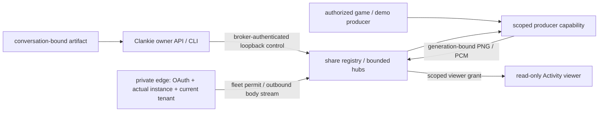

# ADR 0233: Activity shares own their media scope

Status: core accepted 2026-10-04; hosted implementation submitted for review 2026-10-05. Official application registration/verification and live Discord proof remain James's operational gate. Extends [ADR 0047](0047-discord-activity-presence-plane.md).

## Context

[VUH-1481](https://linear.app/vuhlp/issue/VUH-1481) asks official-bot Clankies
to share general media, including hosted customers. The existing Activity has
one public game stream. Its envelopes require an emulator counter, replacement
preserves stale state, and some writes lack a backpressure bound. That stream
cannot become a shared hosted tenant router.

Hosted customers ask Clankie to share; they never register an application,
manage a bot token or configure a tunnel. Hosted-only routing and accounts
belong in the private ops repository under
[ADR 0183](0183-the-harness-is-public-the-hosted-service-is-private.md).

## Decision

Core owns finite sessions independent of Activity app IDs. Each has an
unpredictable ID, trusted controller scope (tenant, installation, guild,
channel), source descriptor and increasing generation. PNG and stereo PCM use
a separate v2 envelope; game capture counters are optional. Images, animations
and demos do not impersonate an emulator.

The private producer listener stays separate from the tunnelled viewer.
Management uses the existing broker bearer. Producers get a capability for
one share/generation; it never enters a browser. Admission uses a separate,
short-lived opaque grant issued by authenticated management. Browser claims
about scope confer no authority. Scoped media rejects anonymous viewers and
controller bearers and carries no machine control or input API.

Core grants prove delegated read access, **not Discord identity or membership**.
The private hosted adapter must verify the official application's active
instance, participant, current installation and intended room before issuing
them. The hosted edge performs those checks before each admission and at most every fifteen seconds while reading. It uses Discord's current instance API, not SDK query fields, and requires View Channel, Connect and Use Embedded Activities for the verified participant and installation owner. The bot needs View Channel and Create Instant Invite. Only voice channels are admitted; this explicit destination does not modify text ingress settings.

Keep one tenant per guild. Bindings remain reserved for the process lifetime,
with a finite cap. A replacement installation invalidates all old shares in
that guild. Hosted control must authenticate the current installation before
invoking this private seam.

Switch advances generation, rotates the producer capability, clears retained
media and old admission grants, and announces the session to existing viewers.
Already admitted viewers follow the switch; reconnect requires a fresh grant.
Stop, expiry and producer loss are terminal: clear state, revoke admission and
close viewers. A second producer in a generation is refused. Transport retries
cannot resurrect a terminal share. Viewer decode, sound and sequences are
fenced by generation and local connection epoch.

All socket writes, media/text sizes, shares, viewers, pending admissions,
grants, client capabilities and TTLs are bounded. Retain only the latest frame,
overlay and status, never audio. A lifecycle message that cannot fit closes
the socket instead of queuing behind stale media. Scoped ingress checks
canonical base64, byte count, PNG header dimensions and digest, and a 200 ms PCM
limit. Model text remains untrusted display data rendered with textContent.

Management effects never retry automatically. Lost/invalid responses yield
typed uncertainty, with share/generation when known. Read the ephemeral
registry to reconcile; an unknown start also has finite expiry. The private edge records a durable scoped request receipt before a single invite create/delete attempt. A lost receipt is uncertain and its ID is reconciled without resending, including after restart. Source switch updates the same invite with a monotonic generation; an uncertain launch remains uncertain.

## Compatibility and consequences

Preserve the self-host launcher, named tunnel, ports, avatars, public legacy
`/frames`, private `/producer` and `/snapshot`. Legacy game media stays v1;
replacement adds a reset event understood by the current viewer. The public
legacy stream is never a fallback for scoped or managed shares, and no private
artifact is projected onto it.

The first owner-facing non-game source resolves a delivered PNG by exact
conversation/artifact ID and validates its stored digest. The share API accepts
no URL, file path or new screen-capture permission. The existing Pokémon and Minecraft producers attach as sourceId=play. Exact delivered GIF/MP4/WAV/MP3 artifacts run through forced, file-descriptor-only FFmpeg decoding (32 MiB, 120 seconds, 640 px, 5 fps); cancellation removes only owned subprocesses and temporary files.

Evidence crosses real Clankie HTTP, its artifact store, production publisher,
private ingress and public viewer sockets. The served viewer runs with real
sockets and controlled rendering devices, including held image decode across
switch/stop, following [ADR 0221](0221-tests-prove-the-product-and-its-boundaries.md).
Hosted routing, two-customer isolation, audience checks and revocation are covered with production boundaries and loopback Discord fixtures; actual Discord launch and inspected recordings remain James's gate. Commands and limits live in
the [Activity README](../../apps/discord-activity/README.md) and [CLI](../cli.md).

## Hosted admission and operation

The paired owner device sends the existing encrypted operator request. A captain tool captures host-owned conversation authority and pins delivered artifacts to that conversation. Browser participants get neither bearer. The body starts a private, random-credential loopback registry automatically; customers never provision it. The body signs requests with its current installation pairing key. The fleet validates account, tenant, installation and entitlement before asking the private edge, which owns Discord credentials. The gateway relays media only over the body's existing authenticated outbound connection.

The official viewer runs Discord's bundled Embedded App SDK: ready, authorize identify, server exchange and instance admission, authenticate, then a single-use media grant. Browser OAuth access is ephemeral for the required SDK authenticate call; it never reaches the body, model, durable receipt or logs. The gateway validates a fleet-signed, digest-bound media permit, and the body independently revalidates the live edge authorization. A media permit is domain-separated from Discord ingress and cannot start a captain turn.

Admissions die on expiry, room or participant permission loss, disconnect, installation replacement, stop and edge restart. Cached instance evidence has a fixed fifteen-second deadline; reads never extend it. Quiet streams revalidate and close, too. Source switches retain admitted viewers, clear old content and audio, and require new admissions for reconnects. A share holds activity-share in the existing hosted busy heartbeat until producer loss, stop, expiry or shutdown. Stream bytes, viewers, grants, requests and queues have finite caps.

The private bearer-authenticated controller stream is bounded by the original share expiry, separate from public delegated grants (at most five minutes) and the single-use browser connection proof. It follows a confirmed source switch but cannot prolong the share. Hosted body reads independently check live edge authorization; the controller seam does not grant Discord admission by itself. Activity polling and stop have separate finite account request budgets, preserving the existing busy-heartbeat budget and a stop lane.

The self-hosted official-bot OAuth/instance adapter is explicitly outside this batch (lead decision 2026-10-05); local delegated shares remain available. James must select/enable the official Activity application, configure its public URL mapping and verification using existing operator-owned credentials, deploy the reviewed code, and inspect a real Discord launch with two customers, sound, switching, stop and permission revocation. No such account, tunnel, deployment or provider effect was performed for this change. Self-hosted scoped local viewer admission remains an explicitly delegated read grant; managed SDK audience checks are not silently bypassed for it.
