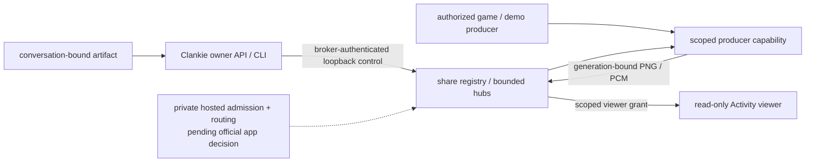

# ADR 0233: Activity shares own their media scope

Status: accepted for the core by Clankie, 2026-10-04. Official application
selection, registration/verification and private hosted integration remain
pending James's decision. Extends [ADR 0047](0047-discord-activity-presence-plane.md).

## Context

[VUH-1481](https://linear.app/vuhlp/issue/VUH-1481) asks official-bot Clankies
to share general media, including hosted customers. The existing Activity has
one public game stream. Its envelopes require an emulator counter, replacement
preserves stale state, and some writes lack a backpressure bound. That stream
cannot become a shared hosted tenant router.

Hosted customers ask Clankie to share; they never register an application,
manage a bot token or configure a tunnel. Hosted-only routing and accounts
belong in the private ops repository under
[ADR 0183](0183-the-harness-is-public-the-hosted-service-is-private.md).

## Decision

Core owns finite sessions independent of Activity app IDs. Each has an
unpredictable ID, trusted controller scope (tenant, installation, guild,
channel), source descriptor and increasing generation. PNG and stereo PCM use
a separate v2 envelope; game capture counters are optional. Images, animations
and demos do not impersonate an emulator.

The private producer listener stays separate from the tunnelled viewer.
Management uses the existing broker bearer. Producers get a capability for
one share/generation; it never enters a browser. Admission uses a separate,
short-lived opaque grant issued by authenticated management. Browser claims
about scope confer no authority. Scoped media rejects anonymous viewers and
controller bearers and carries no machine control or input API.

Core grants prove delegated read access, **not Discord identity or membership**.
The private hosted adapter must verify the official application's active
instance, participant, current installation and intended room before issuing
them. Registration/token-dependent admission, public routing, launch/stop
receipts and active-share compute leases remain held for that integration.

Keep one tenant per guild. Bindings remain reserved for the process lifetime,
with a finite cap. A replacement installation invalidates all old shares in
that guild. Hosted control must authenticate the current installation before
invoking this private seam.

Switch advances generation, rotates the producer capability, clears retained
media and old admission grants, and announces the session to existing viewers.
Already admitted viewers follow the switch; reconnect requires a fresh grant.
Stop, expiry and producer loss are terminal: clear state, revoke admission and
close viewers. A second producer in a generation is refused. Transport retries
cannot resurrect a terminal share. Viewer decode, sound and sequences are
fenced by generation and local connection epoch.

All socket writes, media/text sizes, shares, viewers, pending admissions,
grants, client capabilities and TTLs are bounded. Retain only the latest frame,
overlay and status, never audio. A lifecycle message that cannot fit closes
the socket instead of queuing behind stale media. Scoped ingress checks
canonical base64, byte count, PNG header dimensions and digest, and a 200 ms PCM
limit. Model text remains untrusted display data rendered with textContent.

Management effects never retry automatically. Lost/invalid responses yield
typed uncertainty, with share/generation when known. Read the ephemeral
registry to reconcile; an unknown start also has finite expiry. This adds no
Discord write or alternate durable delivery journal.

## Compatibility and consequences

Preserve the self-host launcher, named tunnel, ports, avatars, public legacy
`/frames`, private `/producer` and `/snapshot`. Legacy game media stays v1;
replacement adds a reset event understood by the current viewer. The public
legacy stream is never a fallback for scoped or managed shares, and no private
artifact is projected onto it.

The first owner-facing non-game source resolves a delivered PNG by exact
conversation/artifact ID and validates its stored digest. The share API accepts
no URL, file path or new screen-capture permission. Other authorized producers
can publish game/animation/demo frames through the general contract.

Evidence crosses real Clankie HTTP, its artifact store, production publisher,
private ingress and public viewer sockets. The served viewer runs with real
sockets and controlled rendering devices, including held image decode across
switch/stop, following [ADR 0221](0221-tests-prove-the-product-and-its-boundaries.md).
Local proof does not replace pending managed Discord launch, audience checks,
two-customer isolation and inspected recordings. Commands and limits live in
the [Activity README](../../apps/discord-activity/README.md) and [CLI](../cli.md).
