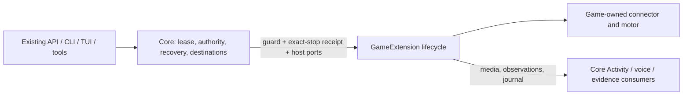

# ADR 0234: Games share one extension contract

Status: proposed implementation, 2026-10-06; lifecycle registration and Minecraft
adoption implemented under [VUH-1616](https://linear.app/vuhlp/issue/VUH-1616),
2026-10-08. Rivals exact-stop and lease adoption remains
[VUH-1849](https://linear.app/vuhlp/issue/VUH-1849). Extends
[ADR 0145](0145-the-world-is-the-only-body.md),
[ADR 0175](0175-rivals-agent-is-a-gameplay-skill.md), and
[ADR 0219](0219-minecraft-is-an-mcp-connected-body.md).

## Context

Pokémon's native PokeAgents client and Minecraft's service-owned MCP connection
both have a guarded session, a mind above their motor, settings, a gameplay
skill, and a watch surface. Both share the `play` lease and require exact
termination evidence. Their inputs, observations, session generations, and
motor timing differ. Rivals already has a skill and its own session server.

## Decision

Use the in-process `GameExtension<Request, Result, Settings, Host>` contract in
`@clankie/game-extension`. Each trusted extension declares a version, identity,
connector (native package, MCP connection, or skill/session server), skill path,
existing settings key and parser, and an optional Activity surface. Its factory
receives typed host ports and returns `start`, `stop`, `status`, and `health`.
Request and result types remain game-specific. A Minecraft action is not a GBA
button press, and neither motor moves into this contract.

Core retains durable play leases and recovery, owner/admin authority,
destination policy, persona/model selection, Discord/Activity connections,
and audit/evidence projections. Extensions provide their connector, driver,
rendered media and journal production. Game-specific journals remain evidence,
never authority. An extension cannot acquire a lease or choose a publishing
room by declaring metadata. Its host ports supply only the approved destination.

`start` runs until execution and cleanup settle. The host authenticates the
request before calling it; its guard is checked before connector entry, at
running admission, and at each game effect. `stop(sessionId)` requests a stop
for exactly that local run and returns no termination proof. `onRunning` occurs
once after joining and before the first turn.

The shared lifecycle wrapper keeps `starting`, `running`, and `stopping` local
state. Without a connector's confirmed-stop callback it retains `uncertain`
and refuses reuse, even when execution returned or threw. The wrapper's status and health are
read-only local projections: `ready` means no local termination uncertainty,
not proof of credentials, a reachable server, or live video. Durable recovery
stays with the core's existing session record and exact connector receipts;
this wrapper does not invent a second lease or persistent recovery store.
The contract also permits asynchronous read-only status/health for MCP and
session-server connectors; neither operation may join a world or call a model.

## Registration and discovery

A trusted service composition registers an installed factory with
`GameExtensionRegistry.register(extension, host, projection)`. The descriptor is
validated and copied before constructing the runtime. Duplicate IDs are refused
before factory invocation. A factory is inert: creating or discovering it may
read its persisted local state, but cannot join a game, start capture or call a
model. Minecraft explicitly activates its idle polling/capture after host boot.
The registry is an in-process installation boundary for reviewed, bundled code;
metadata never imports a path, installs an npm package or grants permissions.

The optional projection owns a game's domain tools and exact HTTP route paths.
Core supplies the authenticated turn and operator authorizer, settings source,
and approved private connector port. Tool catalogs and HTTP dispatch consult the
current registrations. Unregistering an idle extension quiesces capture/polling
and removes its tools, routes and discovery entry without changing core. Held,
starting, stopping and uncertain lifecycles refuse removal. Registration fences
also protect older native API references after removal; pending Minecraft join
admission is visible before its first awaited authority/profile read.

`GET /v1/games/extensions`, `clankie games extensions` and TUI `/games extensions`
share a bounded owner-authenticated catalog. It exposes descriptor metadata,
local lifecycle status and health, never credentials, endpoints, action/chat
history or model output. `ready` remains local lifecycle health, not live-body,
credential, reachability or media proof. Provider errors become a fixed degraded
result; discovery never initiates gameplay.

Core retains the durable ledger and exact native restart recovery. After that
incarnation-fenced operation proves the connector ended, it reconciles a settled
uncertain runtime with `reconcileStopped`. A deadline, replacement session,
requested stop or failed proof cannot clear it. Reconciliation does not create
another ledger or release a claim itself.

## Adoption

| Game      | Extension-owned implementation                                                                                                                                                                      | Host boundary / remaining work                                                                                                                                                                                                                                                                                                                     |
| --------- | --------------------------------------------------------------------------------------------------------------------------------------------------------------------------------------------------- | -------------------------------------------------------------------------------------------------------------------------------------------------------------------------------------------------------------------------------------------------------------------------------------------------------------------------------------------------- |
| Pokémon   | `integrations/pokemon`: existing typed native factory, connector, executor and journal production; registered runtime persists across sittings                                                      | Core keeps authenticated entry, play lease, world-session receipt and exact restart recovery. Existing settings key is `gameplay`, skill is `pokeagents`, Activity surface is `gba_emulator`.                                                                                                                                                      |
| Minecraft | `integrations/minecraft`: native port schemas, MCP adapter, persisted connector state machine, driver handoffs, play host, capture, domain tools and routes; factory owns activation and quiescence | Core supplies the durable play ledger, current conversation authority, owner/admin checks, fresh DNS/profile policy, broker-private MCP capability, persona/model selection and approved sinks. Existing key/skill/surface remain `minecraft`.                                                                                                     |
| Rivals    | Mapped to a skill/session-server connector, `gameplay.rivalsUrl`, high-level objective requests, native sitting IDs, bounded status/frame replies and read-only watch surface (ADR 0175)            | `start` must retain the sitting until exact original-controller stop; `stop` is only a request. Current client lacks shared play ownership and durable exact-controller recovery, so it is not advertised as a ready registered lifecycle. Those implementation proofs are VUH-1849. The native fast policy remains outside the turn-based kernel. |

Minecraft's compatibility files re-export the integration implementation. Its
persisted session/connection generation, guard at final dispatch, worker-driver
handoff and exact disconnect rules remain the existing ones. Ending a mind
burst or handing control to an owner does not end the connector stay. Original
operator API, CLI and TUI settings/commands remain compatible. Host account
setup, administrator identity, invitations, publishing destinations and their
audit remain core authority projections, not extension-authored grants.

## Verification

[Registration evidence](../testing/2026-10-08-game-extension-registration/README.md)
records the isolated native IPC, real Mineflayer packet/MCP/worker boundary,
owner-authenticated HTTP/CLI and settings projection checks. Earlier
[Pokémon adoption evidence](../testing/2026-10-06-game-extension/README.md)
remains valid for unchanged execution behavior. These fixtures do not prove a
live game body, paid model, Discord stream or deployment.
