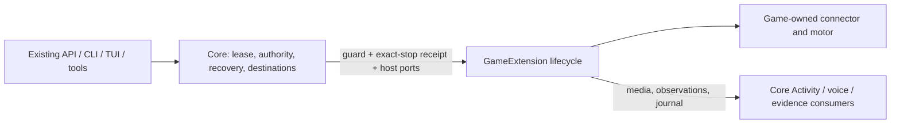

# ADR 0234: Games share one extension contract

Status: proposed implementation, 2026-10-06. Contract and Pokémon adoption are
submitted together; Minecraft and Rivals adoption remain follow-ups on
[VUH-1616](https://linear.app/vuhlp/issue/VUH-1616). Extends
[ADR 0145](0145-the-world-is-the-only-body.md),
[ADR 0175](0175-rivals-agent-is-a-gameplay-skill.md), and
[ADR 0219](0219-minecraft-is-an-mcp-connected-body.md).

## Context

Pokémon's native PokeAgents client and Minecraft's service-owned MCP connection
both have a guarded session, a mind above their motor, settings, a gameplay
skill, and a watch surface. Both share the `play` lease and require exact
termination evidence. Their inputs, observations, session generations, and
motor timing differ. Rivals already has a skill and its own session server.

## Decision

Use the in-process `GameExtension<Request, Result, Settings, Host>` contract in
`@clankie/game-extension`. Each trusted extension declares a version, identity,
connector (native package, MCP connection, or skill/session server), skill path,
existing settings key and parser, and an optional Activity surface. Its factory
receives typed host ports and returns `start`, `stop`, `status`, and `health`.
Request and result types remain game-specific. A Minecraft action is not a GBA
button press, and neither motor moves into this contract.

Core retains durable play leases and recovery, owner/admin authority,
destination policy, persona/model selection, Discord/Activity connections,
and audit/evidence projections. Extensions provide their connector, driver,
rendered media and journal production. Game-specific journals remain evidence,
never authority. An extension cannot acquire a lease or choose a publishing
room by declaring metadata. Its host ports supply only the approved destination.

`start` runs until execution and cleanup settle. The host authenticates the
request before calling it; its guard is checked before connector entry, at
running admission, and at each game effect. `stop(sessionId)` requests a stop
for exactly that local run and returns no termination proof. `onRunning` occurs
once after joining and before the first turn.

The shared lifecycle wrapper keeps `starting`, `running`, and `stopping` local
state. Without a connector's confirmed-stop callback it retains `uncertain`
and refuses reuse, even when execution returned or threw. The wrapper's status and health are
read-only local projections: `ready` means no local termination uncertainty,
not proof of credentials, a reachable server, or live video. Durable recovery
stays with the core's existing session record and exact connector receipts;
this wrapper does not invent a second lease or persistent recovery store.
The contract also permits asynchronous read-only status/health for MCP and
session-server connectors; neither operation may join a world or call a model.

## Adoption

| Extension | Connector and execution                                                                                                                            | Settings / skill / surface                                                | State                                                                                 |
| --------- | -------------------------------------------------------------------------------------------------------------------------------------------------- | ------------------------------------------------------------------------- | ------------------------------------------------------------------------------------- |
| Pokémon   | `integrations/pokemon`: native `WorldPlayerClient`, world operation partition, live session and executor; `packages/play` retains its mind/journal | `gameplay` / `pokeagents` / `gba_emulator`                                | Implements the contract; legacy core paths are compatibility exports/composition only |
| Minecraft | `MinecraftMcpPort`, `MinecraftService`, `MinecraftPlayHost`, capture and existing integration motor                                                | `minecraft` / `minecraft` / its existing rendered capture                 | Follow-up coordinated with the Minecraft lead; no Minecraft files changed here        |
| Rivals    | Existing skill/session-server client and guarded controller lifecycle                                                                              | `gameplay.rivalsUrl` / Rivals gameplay skill / existing read-only capture | Follow-up; preserve its high-level objectives and existing range guards               |

Pokémon keeps the existing API, CLI, TUI and settings schema. Its budgets,
backoff, voice fairness, stale-decision re-deciding and notable events build on
`8f4b19d1` without changing the play loop. The service composes the installed
package through `pokemonExtension.create`; the compatibility executor delegates
to its lifecycle. Core still owns Pokémon's authenticated entry tools and
restart recovery rather than moving authority into the extension.

This slice ships package composition, not runtime discovery or arbitrary plugin
loading. Adding/removing an extension without core edits still needs the
coordinated registration and settings/tool projection work below. No new
extension configuration endpoint or parallel settings store is introduced.

## Follow-ups

- Minecraft lead: move service-specific connector, lifecycle, capture and tool
  composition behind an extension factory while preserving the shared lease,
  persisted session/connection generation, driver handoff and host authority.
  Its schema stays compatible with existing API/CLI/TUI consumers. Add/remove
  registration must remove its tools, routes and capture without core edits.
- Lead: decide the trusted installed-extension registration seam with Minecraft
  adoption. Keep credentials broker-owned; do not load arbitrary paths or
  infer permissions from a manifest. This is an open acceptance gap, not an
  implementation delivered by this slice.
- Rivals owner: adapt status/start/stop and bounded session-server replies to
  this contract, then prove shared play lease and exact termination recovery.
  Keep existing perception/controller decisions in Rivals; no per-input model
  loop. These gaps remain tracked on VUH-1616 for the lead to split/close.

## Verification

[Fixture evidence](../testing/2026-10-06-game-extension/README.md) covers the
real native client over local IPC, guarded start, budget accounting, scoped
stop, concurrency refusal, and denied departure retaining uncertainty. Existing
Pokémon robustness, world body and voice regressions remain in place. No paid
model calls, live worlds, simulators or evals are needed for this migration.
