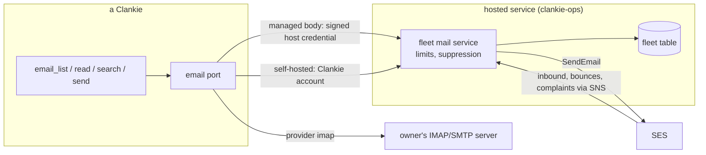

# ADR 0242: Every Clankie has a mailbox we run

Status: accepted (James approved building it, 2026-10-06, VUH-1764). Supersedes the mailbox part of
[ADR 0127](0127-his-accounts-are-his.md): his address is no longer a forward
into a hand-made Gmail account read with an app password. The rest of ADR 0127
stands: signups by hand, mail as untrusted sender text, mail at the console only.

## Context

ADR 0127 gave one Clankie one address: `clankie@clankie.bot`, forwarded by
Cloudflare Email Routing into a Google account James made by hand and read
over IMAP with an app password. It does not extend past him. Google forbids
automated account creation and an app password is a manual step, so a hosted
customer could never get a mailbox, which breaks "hosted Clankie just works".
It also failed quietly for James: on 2026-10-06 his mailbox began refusing with
only `provider_error: "Command failed"`, because the refusal dropped the IMAP
server's reason, and the mailbox was missing from `clankie accounts list`.

## Decision

**Clankie's hosted service runs a mailbox for every Clankie.** The fleet hands
each one an address on the mail domain (`clankie-<8 hex>@clankie.bot`) on its
first mail call: a managed body per tenant, a self-hosted install per Clankie
account. SES receives mail for the domain and publishes it to the fleet over
SNS; the fleet keeps it in its table. Mail leaves through SES, after the
mailbox's own limits allow it. No customer and no owner creates an account,
a password or a server. The service lives in `clankie-ops`; the contract is
`@clankie/protocol/hosted-mail`.

**One email port, two backends.** The mail tools do not change. A managed body
reaches the service with its signed host credential (`/fleet/v1/body/mail`); a
self-hosted install signed in to a Clankie account reaches it with that
account's bearer (`/fleet/v1/account/mail`). `settings.email.provider` picks
`clankie` or `imap`; unset, an IMAP server the owner configured wins and the
Clankie mailbox is used otherwise. Bring-your-own IMAP stays as the advanced
path, unchanged. The first answer from the service writes the address into
`settings.email.fromAddress`, so the captain still states his address from
settings (ADR 0127).

**Limits are the service's, and a refusal names the one hit.** Per mailbox,
from a durable send log: sends an hour, sends a day, and different recipients a
day, with a lower ceiling for an unpaid signed-in account than for a paying
hosted body. The refusal carries the limit's name, its ceiling and when the
next send can go. A recipient that bounced permanently or complained is refused
for every mailbox. Inbound mail is scanned; spam and virus verdicts are
dropped, and mail over SES's 150 KB SNS limit bounces.

**The mailbox shows its real state.** It is a row in the account catalog
(`email`), so `clankie accounts list`, `/connections` and the hosted
Connections view show the address and the result of the last real exchange.
A refused sign-in, IMAP or SMTP or the Clankie account, is `sign_in_rejected`
with the server's own words, not `Command failed`.

## Alternatives considered

- **A Google account per Clankie.** Rejected: automated creation is
  prohibited, and the app password is the manual step this removes.
- **A third-party mailbox host per customer** (Fastmail, Migadu, Google
  Workspace seats). Rejected: per-seat cost and an account per customer to
  provision and recover, for what SES does on a domain we already verify.
- **Store inbound mail in S3.** Rejected for now: the SNS action carries the
  message, the body reads text only, and the fleet table already holds the
  rest. Larger mail (attachments) is a later decision, not a default.
- **IMAP from the service.** Rejected: a protocol server to run and secure so
  that the existing port could keep speaking IMAP; the port already has a seam.

## Consequences

- Hosted bodies have a working address with no setup, and James's own install
  can switch to the Clankie mailbox with `clankie accounts connect email` or
  `/connect email` → Clankie mailbox.
- Clankie runs an outbound sending service: cost and abuse exposure are ours.
  The limits and suppression bound it; SES reputation is shared with sign-in
  mail on the same domain identity, through a separate configuration set.
- Turning it on is the owner's: SES production access, the mail stack, the
  fleet's mail environment, and the MX move. Moving the MX ends ADR 0127's
  Cloudflare forward of `clankie@`, which is reserved and never handed out.
- Search reads the newest 500 messages of a folder, headers and text.
