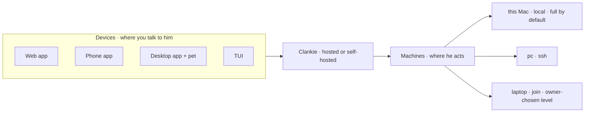

# ADR 0244: Machines join Clankie at an access level

Status: accepted (James, 2026-10-07). Tracked by
[VUH-1792](https://linear.app/vuhlp/issue/VUH-1792). Ships the `join`
transport that [ADR 0212](0212-machines-and-devices.md) reserved for later.
Amends [ADR 0199](0199-hard-computer-work-goes-to-a-computer-use-harness.md)'s
"a hosted body has no desktop at all". Leaves who may ask for machine tools to
[ADR 0133](0133-a-machine-grant-belongs-to-a-discord-lane.md). The app side is
app ADR 0066 (the web app is the main app; the desktop is the web app plus
the pet).

## Context

Hosted and self-hosted Clankie are the same being: the same service, app,
Discord, memory and workers. What differs is where his body runs. A
self-hosted Mac lets him act on that Mac. A hosted owner has no way to let him
act on their own laptop. Machines today are the local Mac and ssh hosts
(ADR 0212). A laptop with no ssh route can only be a device you talk through.

Access is also all-or-nothing. On the local Mac the service runs as the owner
with an unsandboxed shell (ADR 0086). Approved workspace directories
(ADR 0193) narrow where workers start, but they are not an OS boundary. Some
owners will not want Clankie to have full control of a machine.

## Decision

**Any machine can join.** `clankie join` on a laptop or PC shows a code. The
owner approves it from an existing device, and the machine dials out through
the gateway to Clankie, hosted or self-hosted. It needs no inbound port. The
desktop app offers the same thing as "Let Clankie use this computer", and the
TUI offers it when connected to a hosted Clankie. A phone is never a machine.
On mobile the app is the whole surface.

**Each machine has an access level the owner chooses.**

| Level   | Clankie may                                                    |
| ------- | -------------------------------------------------------------- |
| portal  | talk to the owner there; no action on the machine              |
| workers | hire agents into Herdr sessions in owner-approved directories  |
| shell   | use his own shell on the machine (ADR 0086)                    |
| screen  | see and drive the desktop (desktop control) as a computer host |

Each level includes the ones above it. The level says what Clankie may do on
a machine. ADR 0133's grants still decide who may ask him to. A joined machine
enforces its own level and refuses anything above it.

### Access contract (VUH-1801)

The four names are the complete ordered vocabulary. Owners choose one level,
not a list of tools or arbitrary commands. `portal` is the default for an
unknown or newly registered remote machine. The local self-hosted machine
retains `screen` when no level was stored, preserving existing installations.
An invalid level or unavailable policy never grants an operation.

Machine permission is a ceiling independent of speaker authority. Discord
ownership and room skill grants follow [ADR 0251](0251-discord-owners-and-room-skills.md): becoming an owner does not
raise a machine's level, and a room skill never grants shell or screen access.
Worker directory grants and native pane proof remain additional requirements.
A bounded service adapter using fixed, service-owned I/O is a product
capability, not the caller's general shell. Its skill, actor and audience
checks stay separate from this machine ceiling.

The owner API, paired-device command, CLI and TUI use the same level contract.
The inventory reports the selected level and whether enforcement is a service
preference or a host boundary. Changes require owner authority; workers and
joined clients cannot raise their own level. The local default is a specific
migration rule, never a default for unknown remote hosts.

Enforcement checks current policy at execution, including after queued work
waits. Catalog visibility is not authority. Lowering a level stops new effects
above it, but does not terminate existing workers or recall completed effects.
Recovery/stop paths remain available so revocation cannot strand an active
screen lease. Refusals name the machine, selected level and required level.

Join transport and its authenticated host registration are VUH-1800. A joined
receiver must check its own owner-approved ceiling before dispatching a typed
worker, shell or screen operation; an incoming level or service assertion
cannot raise that ceiling. Until that receiver ships and is exercised, a
service-side policy check is not joined-host enforcement evidence. Similarly,
lowering the self-hosted Mac remains a service preference until VUH-1804 adds
an OS boundary. A shell with the owner's credentials can otherwise bypass
Clankie's own tool restrictions.

**A self-hosted Mac keeps full access by default.** Existing installs keep
working. An owner can lower it. A lowered local level is called a sandbox only
when the OS enforces it (a separate user, a sandbox profile or a VM). The
service runs as the owner, so a limit kept only by Clankie's own tools is a
preference, not a boundary, and docs say which one applies.

**A hosted owner can lend a screen.** A joined machine at the screen level is a
`ComputerAdapter` host for a hosted Clankie. Consent is per session. The
desktop pet shows that Clankie is driving and offers a stop. Input stays off
until the owner allows it. ADR 0127's stops hold. This differs from giving a
hosted Clankie a computer of his own
([VUH-1619](https://linear.app/vuhlp/issue/VUH-1619)).

## Consequences

- Hosted and self-hosted owners get the same machine model. Only the default
  for the local Mac differs.
- `join` needs gateway relaying for machine traffic and an approval flow on
  an existing device ([VUH-1800](https://linear.app/vuhlp/issue/VUH-1800)).
- Levels need one vocabulary across CLI, TUI, Settings → Machines and docs
  ([VUH-1801](https://linear.app/vuhlp/issue/VUH-1801)).
- Lending a screen needs capture and input bundled per OS. Today's adapters
  borrow Peekaboo and Codex's Windows tools
  ([VUH-1803](https://linear.app/vuhlp/issue/VUH-1803)).
- A real self-hosted sandbox is OS work, not a settings flag
  ([VUH-1804](https://linear.app/vuhlp/issue/VUH-1804)). Until it ships, docs
  must not call a lowered local level a sandbox.
