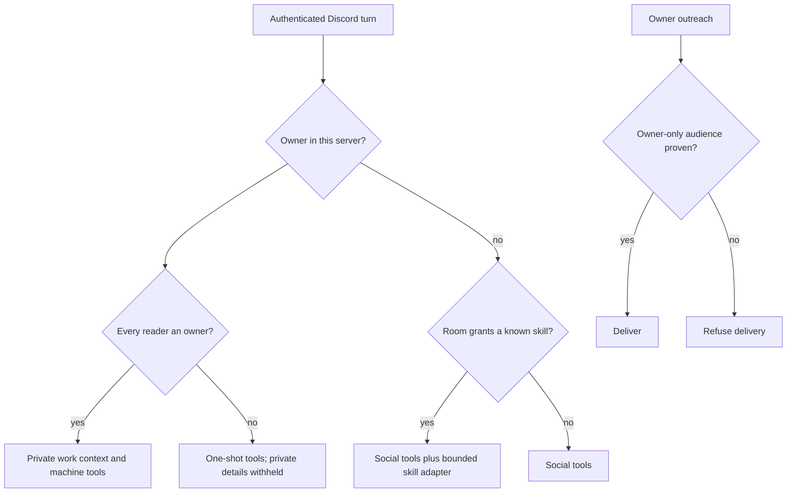

# ADR 0251: Discord servers have owners; rooms can grant skills

Status: Accepted (2026-10-07). Implements VUH-1831, extends VUH-1622,
and supersedes ADR 0133's trusted guild/channel machine grant.

## Decision

Each connected server has two choices: Clankie's role (Participant or Admin)
and owners (Just me, Everyone, or a Discord role). Just me is the default and
uses the configured owner identity. Admin describes what Clankie can manage;
it never makes the server's members owners. The existing fleet and tracking
choices stay on the selected projection server. Raw IDs stay in Advanced.

Owners have machine authority. Everyone else has social tools. A room may add
a named skill through one choice, “This room can use: house hunting”. Skills
are instructions, not executable authority (ADR 0236): a grant resolves to a
service-owned capability adapter with a fixed tool schema. Unknown skills
fail closed. There is no tool-name list or arbitrary command in owner settings.

The first adapter wraps the existing house-hunting ledger and listing API.
It accepts structured operations, binds household storage on the host, and
never exposes bash, general filesystem access, credentials, fleet tools or
other skills. Non-machine sessions use an explicit tool allowlist that removes
builtins from the callable registry, including after loadout changes. The SDK
`noTools: "builtin"` setting alone only changes the initial active tools.
The service loads only the granted skill's instructions, with
guidance to use this adapter instead of the skill's shell examples.

Role membership is read through the authenticated Discord body, never taken
from a message or a caller's claimed roles. Failure to prove it is social.
Shared rooms are conservatively treated as containing non-owners unless the
entire server is explicitly owned by everyone or the body proves a private
channel's permissions admit only owners. Their context explicitly keeps work,
fleet and machine detail private, including when an owner asks there. Native
owner seats and global memory must not supply private context in such rooms.

Durable system authority keys include the ownership policy. Skill handoffs are
fresh Pi runs, so their exact grants never survive into another turn.
An owner's machine turn in a mixed room stays one-shot. Skill turns use Pi,
never an owner-native harness. Grants are checked again at execution; removing
a room grant cannot leave a warm session or queued turn with the old tools.

Owner outreach, relays, fleet projections and tracking require an owner-only
audience. Unknown audiences fail closed. Admin is not evidence that an existing
room is private. New managed rooms start private; Discord permission changes
must be checked at delivery. Owner DMs retain the official-bot private boundary;
lab group DMs do not.

## Migration and rollout

1. Normalize old stored configs on load and persist on the next normal settings
   write. Legacy guild/channel IDs stop granting machine authority immediately,
   including environment overrides. Individual machine-user compatibility
   remains for existing private DMs and explicit actor grants.
2. Preserve other existing server roles; create Just me policies for known servers.
   The owner-confirmed personal setup below overrides those two legacy roles.
   The explicitly recorded house-hunting legacy grant in guild
   `1052402897645752351`, channel `1551975693582336060`, becomes `house-hunting`.
   Other legacy rooms do not silently become skill or Everyone grants.
3. Existing Oathkeeper (`866430493889134672`) becomes Admin, Just me; blinker
   city becomes Participant, Just me. These IDs are migration history, never
   runtime authorization constants. A new installation gets no personal grants.
4. API and CLI expose the same revision-fenced settings; TUI adds the choices.
   App controls ([VUH-1835](https://linear.app/vuhlp/issue/VUH-1835), clankie-app)
   and hosted dashboard controls
   ([VUH-1836](https://linear.app/vuhlp/issue/VUH-1836), clankie-ops) are explicit
   follow-ups using this shared contract. No hosted-only code lives here.
5. Clankie deploys and verifies live household continuity, role ownership,
   privacy and outreach. Workers do not edit live settings or run model evals.

Feedback records the authenticated speaker ID. Legacy name-attributed decisions
remain readable and keep excluding homes; an explicit owner-confirmed binding
is the follow-up [VUH-1834](https://linear.app/vuhlp/issue/VUH-1834). Display names
never establish authorship (owner decision, 2026-10-08).

## Consequences

Setup stays small. A server's role cannot escalate a non-owner, and a useful
room need not gain the owner's whole computer. Adding another executable skill
requires an audited adapter rather than trusting prose or shell examples.
Unknown or unavailable membership and audience evidence reduces authority.
The live acceptance checks and app/dashboard parity remain explicit until done.
