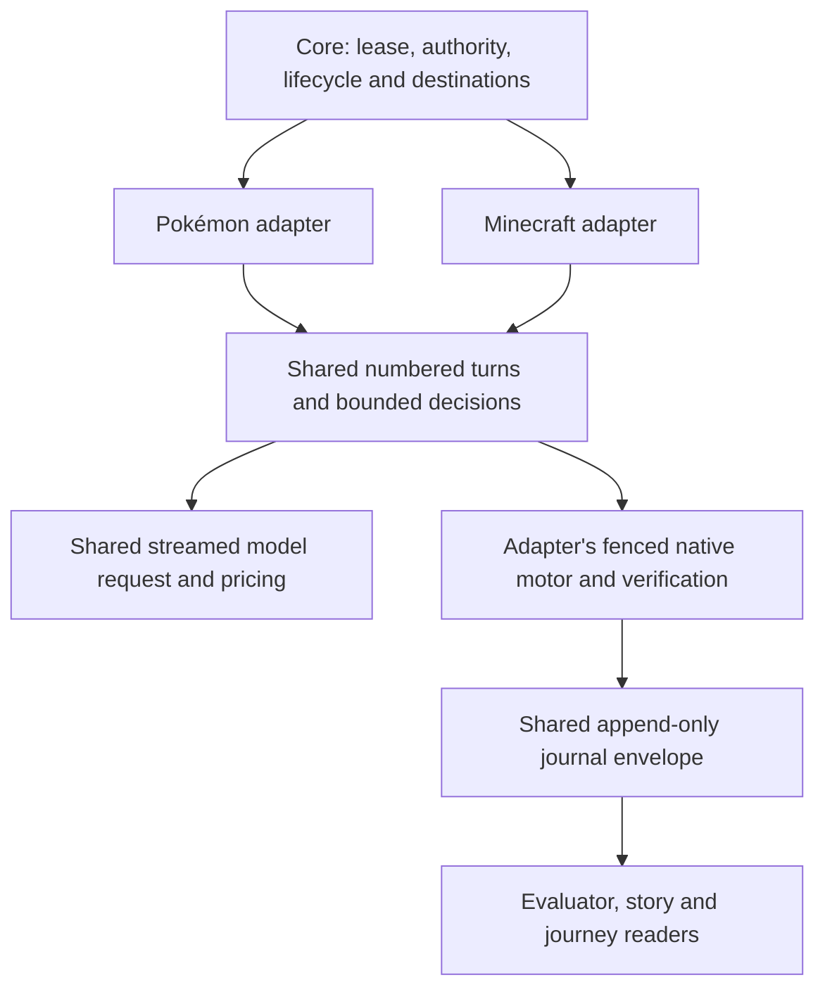

# ADR 0253: Turn-based games share a play kernel

Status: accepted (VUH-1747, 2026-10-08).

## Decision

Pokémon and Minecraft use one observe/decide/act/verify/remember scheduler in
`packages/play`, extending [ADR 0225](0225-minecraft-keeps-playing-with-one-driver.md)
and [ADR 0234](0234-games-share-one-extension-contract.md). Game adapters supply
observations, their native decision/action schemas, state fences, memory and
progress policy. The kernel owns numbered turns and bounded proposal replacement;
its model transport owns streaming, deadlines, cancellation and provider pricing.
Neither adapter carries a second turn scheduler or pricing formula.

Minecraft's adapter and prompt live in `integrations/minecraft`. Pokémon retains
its existing `GbaDriverIo` adapter in `packages/play/free-play.ts`, composed by
`integrations/pokemon`. Moving files does not admit a second controller: core
still owns leases, grants, join/leave, driver generations, model/persona resolution,
recovery and room destinations. Minecraft's existing MCP motor and lifecycle
remain separate. Full Minecraft lifecycle adoption and dynamic installed-extension
registration under VUH-1616 remain follow-ups.

Policy stays explicit where the bodies differ. Both adapters allow at most two
room-message replacements in a numbered turn. Pokémon aborts a proposal and
reserves unreported usage; Minecraft lets its billed request settle first and
stops when usage is unknown. Pokémon can re-decide a changed state twice within
a turn; Minecraft records a stale turn and re-observes on the next turn. Their
existing failure limits, action settlement, idle pacing and speech cooldowns
remain adapter policy, using shared backoff/cooldown primitives.

Every new journal line carries the same run, journey, environment, session,
venue, timestamp and version envelope (header V3; turn/summary/diagnostics V2).
Native game payloads remain evidence, never authority. The existing reader accepts
legacy Pokémon journals and projects Minecraft turns for evaluation, stories and
journey memory, retaining native observations and exact action evidence. Pokémon
scene/tile heuristics are unknown for Minecraft; absence of a Pokémon framebuffer,
map or timing record is never filled with invented evidence. Bounded audience
cards may truncate text; the canonical trail retains the native bounded payload.
A separate read-only play environment identifier admits Minecraft metadata without
expanding Pokémon's embodiment motor catalog.

Rivals is intentionally excluded. Its real-time tactical pad loop is owned by the
Rivals controller (ADR 0175), not a slow turn-based model scheduler. This kernel
does not prescribe routes, speech or actions, introduce a universal action schema,
or change owner configuration. Verification uses existing game regressions and
HTTP/model/voice/filesystem integration boundaries; it drives no live game body.
