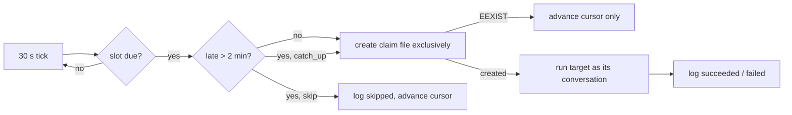

# ADR 0265: Routines are recurring jobs with a run fence

Status: accepted by the lead for VUH-2018, 2026-10-10.
Tracked by [VUH-2018](https://linear.app/vuhlp/issue/VUH-2018).
Builds on [ADR 0130](0130-goals-and-self-wakes-share-the-operator-thread.md) and
[ADR 0187](0187-clankie-hires-his-own-seats.md).

## Context

Clankie could wake himself once (`schedule_wake`, one pending wake per
conversation, replaced by the next) and ran fixed internal loops: the fleet
round, the daily issue-status check. The owner had no way to say "every
weekday at 9:00, triage new KH2 issues" or "every Friday, hire someone to run
the cleanup audit" and have it keep happening across restarts, deploys and a
Mac that sleeps.

## Decision

A **routine** is a name, a schedule, a target, an enabled flag and a missed-run
policy, owned by the service in `<state>/routines/`.

- **Schedule.** Five cron fields in an IANA time zone (the machine's unless
  given). Plain language resolves to cron at creation: "every weekday at 9:00",
  "every friday at 17:30", "every morning", "every 2 hours", "every 30 minutes".
  An unrecognised phrase is refused, never guessed. Evaluation uses `croner`,
  so daylight-saving changes follow the zone.
- **Targets.** Each runs with the authority of its target conversation and
  nothing more:
  - `turn`: one host-authored turn in that conversation (the self-wake path,
    so a native harness seat gets it over its own channel).
  - `hire`: `hire_agent`'s own path (`HireSeat`) with that conversation as the
    hiring authority, so admission, owner gates, account choice and the
    first-breath watch are unchanged. The lead hears which seat was hired, or
    why none was.
  - `check`: a command run through `clankie heavy` in a directory, with a
    timeout; the conversation hears failures (or every result).
- **Run fence.** Before a run starts the service creates
  `claims/<routine>/<slot>` exclusively. A slot is claimed once, ever, by one
  process. The schedule cursor advances with the claim. So a restart, a deploy
  that overlaps two services on one state directory, or a timer that fires
  twice cannot run a slot again. Runs are at most once: a run left `running` by
  a process that is gone is logged `interrupted` and not replayed. A slot that
  comes due while the previous run is still going is logged `skipped`; a
  routine never overlaps itself.
- **Missed runs.** The scheduler checks every 30 seconds rather than arming one
  long timer, so it notices a sleep as soon as the Mac wakes. A slot found more
  than two minutes late was missed. `catch_up` (the default) runs once for all
  missed slots and says how many it stands in for; `skip` logs one skipped run
  with the count and waits for the next slot. Editing a schedule or resuming a
  paused routine never owes runs from before.
- **Run log.** Every run is a line in `runs.jsonl`: trigger (`schedule`,
  `catch_up`, `manual`), slot, status, start, finish, duration, a one-sentence
  detail, links. History reads newest first.
- **Surfaces.** One API, `POST /v1/captain/routines` with a `RoutineCommand`
  (operator auth, or a Take Control device through the relay, as the fleet
  roster): `list`, `add`, `edit`, `pause`, `resume`, `run_now`,
  `remove`, `history`. `clankie routines` is a thin client of it, as are the
  TUI's `/routines`, the app's Settings > Routines and the desktop pet's menu
  ([VUH-2052](https://linear.app/vuhlp/issue/VUH-2052)). The lead lane
  gets one `routine` tool over the same store, scoped to routines that target
  its own conversation; it cannot create one that acts elsewhere. Remote
  project leads get the same tool. An owner's target that names no
  conversation goes to Clankie's main chat.

## Consequences

- Routines survive restarts and deploys with no double runs, at the cost of
  never retrying a run a restart cut short. That is the safer failure for jobs
  that hire people and spend model turns; the next slot runs as usual.
- A routine adds no authority. A lead's routine can only do what that lead can
  already do in its own conversation; the owner's API can target any ordinary
  chat. Hires still pass every gate `hire_agent` applies at run time.
- Claim files are kept 45 days so a long-asleep routine cannot reclaim an old
  slot, then pruned.
- Not yet built: a per-run tracker ticket (the issue's optional "recurring
  ticket"). The run log carries links where a target reports them.
