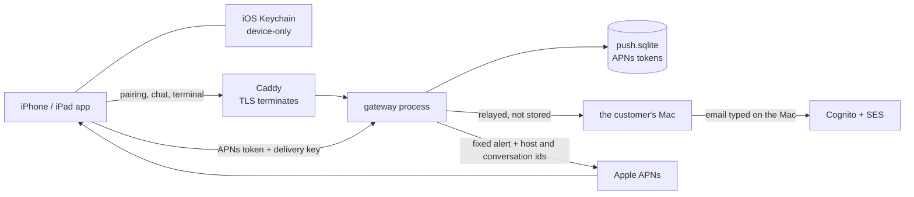

# App privacy disclosures

Three surfaces describe the same behavior and must agree: the public policy at
[clankie.bot/privacy](https://clankie.bot/privacy/) (source in the landing
repository, per [ADR 0155](adr/0155-public-docs-are-a-product-surface.md)), the
`PrivacyInfo.xcprivacy` manifest shipped in the iPhone and iPad build, and the
App Privacy answers in App Store Connect. This document is the inventory all
three derive from, so a change to one is checked against the code rather than
against the other two.

Anything transmitted off the phone and kept longer than the request it serves is
collection. That single line decides every answer below.

## Where data goes

## Verified inventory

| Element                                                                                                        | Where it lives                                                              | Leaves the phone                                                     | Evidence                                                                                                                                       |
| -------------------------------------------------------------------------------------------------------------- | --------------------------------------------------------------------------- | -------------------------------------------------------------------- | ---------------------------------------------------------------------------------------------------------------------------------------------- |
| Device session token, device id, session expiry, Mac route, Mac's self-reported name                           | iOS Keychain, `WhenUnlockedThisDeviceOnly`, no access group, no iCloud sync | The token only, as a bearer to the Mac                               | `packages/device-session/src/pairingSession.ts` in the app repository                                                                          |
| APNs device token, delivery key, registration id, sequence                                                     | Same Keychain, second record                                                | Token and key go to the gateway; neither reaches the Mac             | `apps/mobile/pushDelivery.ts` in the app repository                                                                                            |
| Pairing payload                                                                                                | —                                                                           | Offer capability, the fixed label `Clankie mobile`, and the platform | [`PairingRedeemRequestSchema`](../packages/protocol/src/index.ts)                                                                              |
| Messages, terminal bytes, authorization headers                                                                | The Mac                                                                     | Relayed through the gateway in memory, never stored or logged        | [`apps/gateway/README.md`](../apps/gateway/README.md), [ADR 0151](adr/0151-the-public-doorway-routes-home.md)                                  |
| Push registration row: token, token hash, key hash, sequence, environment, host id, device id, account subject | `push.sqlite` on the gateway host, `0600`                                   | —                                                                    | [`packages/protocol/src/device-push.ts`](../packages/protocol/src/device-push.ts), [ADR 0159](adr/0159-the-device-authorizes-push-delivery.md) |
| Notification payload                                                                                           | —                                                                           | Fixed title and body plus host and conversation ids; no message text | [`apps/gateway/README.md`](../apps/gateway/README.md)                                                                                          |
| Gateway log line                                                                                               | Gateway host, size-rotated                                                  | —                                                                    | Host id, request id, status, response bytes, duration, connect and disconnect                                                                  |
| Proxy access log                                                                                               | Same host, same rotation                                                    | —                                                                    | Client IP, user agent, request line, TLS parameters, status, size, duration                                                                    |
| Sign-in email                                                                                                  | Cognito user pool `clankie-accounts`                                        | Typed on the Mac; the app never touches it                           | [`infra/aws/accounts/README.md`](../infra/aws/accounts/README.md)                                                                              |
| Camera frames                                                                                                  | Never leave the scanner                                                     | No                                                                   | QR decode only, no capture API in the app                                                                                                      |
| Picked photos                                                                                                  | App sandbox                                                                 | No — the live lane refuses attachments                               | `liveCaptainSession.ts` in the app repository                                                                                                  |

## App Store Connect answers

Answer the App Privacy questionnaire exactly as follows. Each answer is the
consequence of one verified behavior.

**Tracking — "Do you or your third-party partners use data for tracking?"**
No. The app carries no advertising, attribution, or analytics SDK, contacts no
host but `api.clankie.bot` and the customer's own Mac, and never presents an ATT
prompt. `NSPrivacyTracking` is `false` and no tracking domains are declared.

**Data collection — "Do you or your third-party partners collect data from this app?"**
Yes, because of notifications. Everything else the app transmits is relayed to
the customer's own Mac and retained by nobody; the push registration is stored
durably on the gateway and is the only reason this is not a clean "No".

Declare exactly two types, both under **App Functionality**, both **Linked to
the user**, both **not used for tracking**:

| Type      | Category    | Why                                                                                                                                                                                                      |
| --------- | ----------- | -------------------------------------------------------------------------------------------------------------------------------------------------------------------------------------------------------- |
| Device ID | Identifiers | The APNs device token is stored in the gateway's registration table so a notification can be addressed to that device. It is retained until the registration is cleared or Apple reports the token gone. |
| User ID   | Identifiers | The same row carries the device id and the account subject that owns it, which identify the account a registration belongs to.                                                                           |

Leave every other type unchecked, for these reasons:

- **Contact Info / Email Address** — the sign-in email is typed into Clankie on
  the Mac, against Cognito. The app has no email field and no sign-in UI.
- **User Content (messages, photos, audio)** — conversation and terminal traffic
  is relayed in real time and neither stored nor logged by the gateway. Photo
  attachments cannot be sent on the shipping lane at all.
- **Usage Data, Diagnostics, Crash Data** — no telemetry leaves the device. The
  landing page's analytics beacon is a website, not the app, and is out of scope
  for App Privacy.
- **Location, Contacts, Health, Financial, Purchases, Browsing or Search
  History, Sensitive Info** — no API, permission, or code path exists.

Set the privacy policy URL to `https://clankie.bot/privacy/` in both the App
Store listing and the TestFlight test information, and the support URL to
`https://clankie.bot/support/`.

## Keeping the three in agreement

The manifest's `NSPrivacyCollectedDataTypes` must list the same two types as the
questionnaire. An empty array while the build registers for APNs and the gateway
stores the token is a disagreement, not a simplification.

Revisit this document when image attachments start sending, when push delivery
changes shape, or when the gateway gains any durable table beyond routing
registrations.
