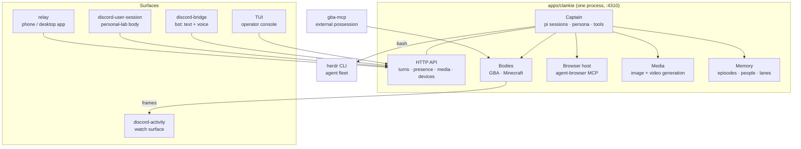

# Architecture

Clankie is one service plus the surfaces that reach it. The service owns the
captain (a [pi](https://pi.dev)-based agent with durable sessions), his tools,
his game bodies, and the HTTP API every surface speaks.

## How a message becomes a turn

A Discord message reaches the bridge, which posts it to
`POST /v1/captain/channel-turns`. The service normalizes it — untrusted body
fenced and labelled, images resolved to bytes at the last hop, channel context
attached — and prompts a pi session. Voice channels and operator conversations
get durable sessions (pi JSONL trees that survive restarts); text turns are
one-shot, because the channel history rides in with each request. The reply
carries the turn's last screenshot or generated image with it, and replying
with the silence sentinel sends nothing: silence is a real answer.

The TUI and relay speak the same operator-conversation contract
(`/operator/v1/dispatch`): revision-fenced sends, cursored replay, long-polled
tails. Conversations are files under `~/.clankie/captain/`.

## Where things run

- **Captain tools.** Coding tools (read/bash/edit/write) are pi built-ins.
  Authored tools: browser (catalog resolved live from the agent-browser MCP
  host), `generate_image` / `generate_video`, `start_play` / `stop_play`,
  `observe_room`, `observe_current_activity`, `get_self_state`,
  `remember_episode`.
- **Leading agents.** Clankie leads coding agents through the herdr CLI over
  bash, guided by skills — there is no worker protocol. Agents coordinate
  through herdr and plain files.
- **Game bodies.** `integrations/gba-emulator` and
  `integrations/minecraft-mineflayer`, booted and leased inside the service;
  `body-lock` keeps one writer on the emulator across processes (the free-play
  CLI, gba-mcp, and the live session cannot fight over it). Frames flow to the
  Discord activity surface.
- **Auth.** Provider keys and OAuth tokens live in the credential broker
  (Keychain), written by the TUI `/auth` flow and read by pi through a
  credential-store bridge. Persona is owner-authored in
  `~/.config/clankie/settings.json` and can never be set by a caller.

## Decisions that shaped this tree

**2026-08: the pi rewrite.** The previous architecture was an agent-fleet OS:
missions, task DAGs, doctrine, policy engine, evidence chains, worker
protocol, evaluation gates, three services with a versioned protocol between
each layer. It proved out governed delegation, and it buried the fun under
ceremony. This tree keeps the fun — Discord presence and voice, the game
bodies, media generation, browsing, the TUI — and deletes the governance
machinery. The eve framework was replaced by pi (`createAgentSession`:
sessions, tools, skills, compaction for free), and captain + control plane +
runner collapsed into one service. Herdr replaced the worker fleet: visible
panes beat a lease protocol. What survives of the old rigor is the part worth
keeping: untrusted input stays fenced, secrets stay in the broker, and Clankie
reports what actually happened rather than what he intended.
