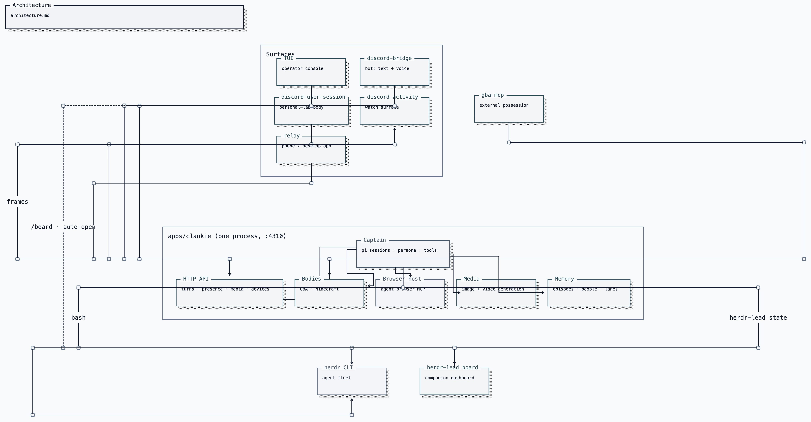

# Architecture

Clankie is one service plus the surfaces that reach it. The service owns the
captain (a [pi](https://pi.dev)-based agent with durable sessions), his tools,
his game bodies, and the HTTP API every surface speaks.

## How a message becomes a turn

A Discord message reaches the bridge, which posts it to
`POST /v1/captain/channel-turns`. The service normalizes it — untrusted body
fenced and labelled, images resolved to bytes at the last hop, channel context
attached — and prompts a pi session. Voice channels and operator conversations
get durable sessions (pi JSONL trees that survive restarts); text turns are
one-shot, because the channel history rides in with each request. The reply
carries the turn's last screenshot or generated image with it, and replying
with the silence sentinel sends nothing: silence is a real answer. A one-shot
text run has a 60-second deadline; expiry aborts its pi session and settles the
turn as `captain_turn_timeout` so the bridge stops refreshing Discord typing.

The TUI and relay speak the same operator-conversation contract
(`/operator/v1/dispatch`): revision-fenced sends, cursored replay, long-polled
tails. Conversations are files under `~/.clankie/captain/`. The full HTTP
surface is listed in [`apps/clankie/openapi.yaml`](../apps/clankie/openapi.yaml);
`apps/clankie/scripts/setup-yaak.py` builds a local Yaak workspace against it.

Operator input can invoke an exact loaded skill as `/name task` or
`/skill:name task`. The service rewrites that verified invocation to Pi's native
skill command and enables expansion for that prompt only. Discord input and
ordinary operator prompts keep expansion disabled.

Before each Pi run, a hidden host extension reads the newest bounded episode
card into the system prompt. The host supplies the destination lane, filters
operator-private notes out of ambient lanes, and refreshes recall without
persisting duplicate cards in the conversation. Discord turns also receive the
newest visible person facts for their authenticated guild/user identity. The
global 128-episode ring and per-person fact files live under
`~/.clankie/memory/`; the TUI's `/memory` command browses, edits, and forgets
that same store through operator-only routes.

## Where things run

- **Captain tools.** Coding tools (read/bash/edit/write) are pi built-ins.
  They attach to the operator console and to Discord text turns whose actor
  is on `discord.systemActorUserIds` ([ADR 0095](adr/0095-discord-system-actors.md)).
  Voice never gets them. Authored tools: browser (catalog resolved live from
  the agent-browser MCP host), `generate_image` / `generate_video`,
  `voice_join` / `voice_leave`, `youtube_search` and the `music_*` controls,
  `start_play` / `stop_play`, `observe_room`, `observe_current_activity`,
  `recall_play`,
  `observe_share`, `get_self_state`, `remember_episode`. Linear search/create/comment after
  `/connect linear`. Mail list/read/send after `/connect email` — operator
  console only.
- **Leading agents.** Clankie leads coding agents through the herdr CLI over
  bash, guided by skills — there is no worker protocol. The service is his
  durable body; joining a herdr session (the operator console in a pane)
  is how he acquires the fleet. A seated turn attaches a live agent census
  so he can lead, route, and harvest without rediscovering the room. The
  herdr-lead board is the companion dashboard
  ([ADR 0097](adr/0097-herdr-lead-is-the-companion-dashboard.md)). Agents
  coordinate through herdr and plain files.
- **Game bodies.** `integrations/gba-emulator` and
  `integrations/minecraft-mineflayer`, booted and leased inside the service;
  `body-lock` keeps one writer on the emulator across processes (the free-play
  CLI, gba-mcp, and the live session cannot fight over it). Frames flow to the
  Discord activity surface.
- **Auth.** Provider keys and OAuth tokens live in the credential broker
  (Keychain), written by the TUI `/auth` flow and read by pi through a
  credential-store bridge. Persona is owner-authored in
  `~/.config/clankie/settings.json` and can never be set by a caller.
  `/connect` stores Linear and mailbox credentials the same way; Discord
  remains a body configured by `/discord` ([ADR 0093](adr/0093-owner-authored-service-connections.md)).
  An optional lab user-session body watches Discord screen shares through an
  external ClankVox binary ([ADR 0098](adr/0098-user-session-watches-discord-shares.md)).
  `/discord` Active body picks which process is the mouth; the launcher
  starts only that one ([ADR 0048](adr/0048-discord-user-session-transport.md)).
  Who may ask him to drive this machine from Discord is
  `discord.systemActorUserIds` ([ADR 0095](adr/0095-discord-system-actors.md)).

## Current architecture constraints

Clankie uses pi's `createAgentSession` for sessions, tools, skills, and
compaction. The captain, HTTP control surface, and play runner share one service.
Herdr exposes the coding-agent fleet as visible panes coordinated through its CLI
and plain files. Untrusted input stays fenced, secrets stay in the credential
broker, and every report describes observed outcomes rather than intentions.

[`adr/`](adr/) records the active decisions for play mechanics, voice, presence,
media, browsing, and operator control.
