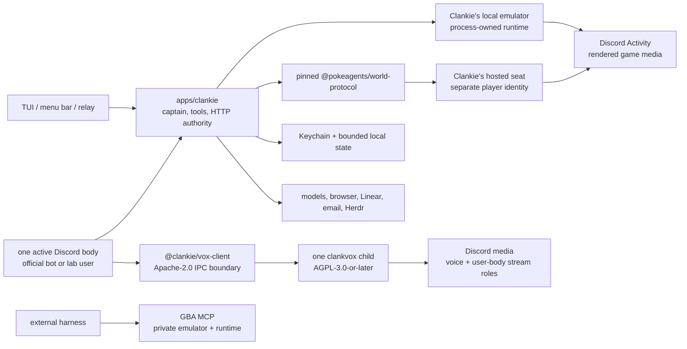

# Architecture

Clankie is one service plus the surfaces that reach it. The service owns the
captain (a [pi](https://pi.dev)-based agent with durable sessions), his tools,
his game bodies, and the HTTP API every surface speaks.

This Mermaid diagram, [ADR 0128](adr/0128-vox-is-the-sole-discord-media-owner.md),
and [ADR 0129](adr/0129-each-player-owns-a-body.md) are the canonical current
architecture diagrams. The JPG/tldraw exports under `docs/diagrams/` are
historical snapshots.

## How a message becomes a turn

The older [message-to-captain JPG](diagrams/clankie-message-turn-sequence.jpg)
is a historical snapshot; the present flow is described below.

A Discord message reaches the active bridge. A text-only message in the live
voice channel's attached chat enters that room's existing `VoiceFloor`; the
realtime room thread may answer aloud, ask the captain to act, or stay silent,
and no separate text turn races it ([ADR 0124](adr/0124-one-self-has-many-local-threads.md)).
Every other message posts to `POST /v1/captain/channel-turns`. The service normalizes it — untrusted body
fenced and labelled, images resolved to bytes at the last hop, channel context
attached — and prompts a pi session. Every room gets a continuing session (a pi
JSONL tree that survives restarts): operator conversations, voice channels under
`~/.clankie/captain/voice/`, and text channels under `~/.clankie/captain/rooms/`
([ADR 0118](adr/0118-a-text-room-is-a-durable-lane.md)). A message that arrives
while that room's run is streaming is steered into it and reported `absorbed`,
so a burst of messages gets one merged reply rather than one reply each
([ADR 0091](adr/0091-a-mid-turn-message-steers-the-turn.md)). The channel
backlog still rides in with the request, and is used only when the lane does not
already hold that conversation. A privileged turn drops to a one-shot, which
writes its own tree under `~/.clankie/captain/turns/` so the tools it ran are
readable afterwards ([ADR 0107](adr/0107-a-one-shot-turn-still-leaves-a-trail.md)).
The reply carries the turn's last screenshot or generated image with it — and
when that artifact cannot be resolved, the words still post and say the picture
did not — while replying with the silence sentinel sends nothing: silence is a
real answer. Nothing caps how long a turn may take — looking something
up properly is work, not a fault — but a turn that emits no event at all for 5
minutes is a dead stream, so the stall watchdog aborts its pi session and
settles it as `captain_turn_stalled`. While someone waits on a slow requested
turn, he can post one short `send_text_update` message to the channel ("hang on,
pulling the bracket up") without ending it; work he elects to do on his own
stays quiet. Discord shows him typing for the whole turn rather than for a
capped minute.

The TUI and relay speak the same operator-conversation contract
(`/operator/v1/dispatch`): revision-fenced sends, cursored replay, long-polled
tails. A TUI process creates a fresh conversation unless `--chat` explicitly
resumes one. Conversation and Pi session are one lifetime: bounded retention
removes their shared directory, while public event logs rotate with typed cursor
recovery ([ADR 0111](adr/0111-a-console-process-starts-one-conversation.md)).
Conversations are files under `~/.clankie/captain/`. Each settled operator or
Discord captain turn also appends one metrics line to
`~/.clankie/captain/turn-settled.jsonl`: tool-name counts, first mutating tool,
and context-token occupancy. The file sits beside `autonomy.json`, outside the
conversation directory the retention pass deletes. It is not `~/.clankie/events.jsonl` —
that log already uses `captain.turn.settled` for presence idle/waiting_user, and
the captain does not write domain events. An absorbed steer
([ADR 0091](adr/0091-a-mid-turn-message-steers-the-turn.md)) shares the owning
run's line. The full HTTP
surface is listed in [`apps/clankie/openapi.yaml`](../apps/clankie/openapi.yaml);
[`apps/clankie/scripts/setup-yaak.py`](../apps/clankie/scripts/setup-yaak.py)
imports that canonical catalog into Yaak and adds a Keychain-backed `Local`
environment for authenticated requests.

The service also keeps `autonomy.json`: one owner-approved goal and one
replaceable self-wake per operator conversation, plus a global enable switch.
An unreadable file fails closed and surfaces `state_unreadable` to operator
clients instead of silently re-enabling autonomous work.
An active goal queues host-authored continuation turns through the same
conversation chain as operator messages, so every tool call and reply stays in
the existing Pi session and public event log. A human message that arrives
while that run is streaming is steered into it rather than waiting behind the
whole turn; in-flight tool calls still finish
([ADR 0091](adr/0091-a-mid-turn-message-steers-the-turn.md)). A
token budget moves a goal to `budget_limited`; `/goal` owns activation,
pause/resume, and clearing, while `/autonomy off` stops new continuations and
wakes. A due wake queues one turn with Clankie's recorded reason and may be
replaced by another. Neither path changes the conversation's tool set or
authority ([ADR 0130](adr/0130-goals-and-self-wakes-share-the-operator-thread.md)).

The native macOS menu-bar app uses that same contract to list continuing Pi
sessions and tail expanded transcripts. Its microphone opens a private local
realtime room over an authenticated loopback WebSocket; social speech stays in
the room, while `ask_clankie` sends actionable work through the operator
conversation service. Raw PCM remains in memory. Exact Discord speech is a
separate, bounded captain read that returns content only while owner-controlled
transcript retention is enabled
([ADR 0125](adr/0125-the-menu-bar-is-a-private-local-voice-room.md)).

Operator input can invoke an exact loaded skill as `/name task` or
`/skill:name task`. The service rewrites that verified invocation to Pi's native
skill command and enables expansion for that prompt only. Discord input and
ordinary operator prompts keep expansion disabled.

Before each Pi run, a hidden host extension reads the newest bounded episode
card into the system prompt. The host supplies the destination lane, filters
operator-private notes out of ambient lanes, and refreshes recall without
persisting duplicate cards in the conversation. Discord turns also receive the
newest visible person facts for their authenticated guild/user identity. The
global 128-episode ring and per-person fact files live under
`~/.clankie/memory/`; the TUI's `/memory` command browses, edits, and forgets
that same store through operator-only routes. [`docs/memory.md`](memory.md) is
the full picture — what each store holds, who may read it, and what bounds it.

## Where things run

- **Captain tools.** Coding tools (read/bash/edit/write) are pi built-ins. They
  attach to the operator console and to Discord turns — text or voice — whose
  trigger actor is on `discord.systemActorUserIds`
  ([ADR 0095](adr/0095-discord-system-actors.md),
  [ADR 0105](adr/0105-voice-is-as-capable-as-the-room-it-is-in.md)). A
  privileged turn always runs on a one-shot session, so the grant never
  outlives the actor who earned it on the room's shared lane. They
  land in the conversation's workspace — the directory a workspace-scoped
  operator conversation names, this repository for every other lane
  ([ADR 0104](adr/0104-clankie-works-where-you-launched-him.md)). Voice join/leave
  are the same argument-free tools on Discord and the operator console: a
  Discord turn follows the authenticated speaker, an operator turn follows the
  configured owner ([ADR 0062](adr/0062-voice-join-by-asking.md)). The
  canonical authored-tool registry is
  [`apps/clankie/src/captain/tools.ts`](../apps/clankie/src/captain/tools.ts),
  connected-service additions live in
  [`captain/connect-tools.ts`](../apps/clankie/src/captain/connect-tools.ts), and
  the HTTP surface is
  [`apps/clankie/openapi.yaml`](../apps/clankie/openapi.yaml). This document does
  not duplicate their changing census.
- **Browser catalog.** The service registers the complete paginated
  `agent-browser` catalog with pi, but only everyday navigation tools and
  `browser_tool_search` start active. Browser calls are sequential across rooms;
  the subprocess receives no Clankie credentials, but true filesystem/network
  isolation requires a VM or remote broker ([ADR 0082](adr/0082-clankie-holds-the-browser.md)).
  The persistent profile holds his own accounts, signed up for by hand: the
  catalog's `headed` argument relaunches the browser visible on the operator's
  screen, so he can hand over the window for a signup, a CAPTCHA, or a phone
  check rather than grinding at it. A headed session is exempt from the
  browser's idle timeout ([ADR 0127](adr/0127-his-accounts-are-his.md)).
- **Leading agents.** Clankie leads coding agents through the herdr CLI over
  bash, guided by skills — there is no worker protocol. The service is his
  durable body; joining a herdr session (the operator console in a pane)
  is how he acquires the fleet. A seated turn attaches a live agent census
  so he can lead, route, and harvest without rediscovering the room. The
  herdr-lead board is the companion dashboard
  ([ADR 0097](adr/0097-herdr-lead-is-the-companion-dashboard.md)). Agents
  coordinate through herdr and plain files.
- **Game bodies.** `runFreePlay` drives one seam, `GbaDriverIo`; its mind,
  voice, progress, learned transitions, and behavior loop do not branch on
  where the body is. The shared journal format does preserve body-aware
  provenance at each causal stage, so evaluation can distinguish local state
  from a hosted body generation without creating a second play loop.
  Every sitting also carries a stable journey identity separate from its run
  and checkpoint ids. The bounded story spans that journey, and the next local
  or hosted sitting receives the last self-authored notes and objective while
  exact world state remains owned by the checkpoint or hosted cartridge save
  ([ADR 0126](adr/0126-game-state-history-and-memory-have-separate-owners.md)).
  Two Clankie-owned bodies implement that seam. The local one is
  [`integrations/gba-emulator`](../integrations/gba-emulator/README.md), booted
  by the local play host in the service process. The hosted one is Clankie's
  separately credentialed seat in a PokeAgents world, reached through
  `WorldPlayerClient` on `@pokeagents/world-protocol/ipc` (`WORLD_ADDRESS` unix,
  tcp, or tls) and entered with the `pokeagent_join_mmo` tool
  ([ADR 0103](adr/0103-a-hosted-world-is-another-body.md)). A hosted world
  cannot be paused, changes without him acting, and can replace his body under
  him. Owner settings independently enable the local emulator and hosted MMO;
  both may be available while the shared play host allows one live session
  across them. Frames from either flow to the Discord activity surface.
  [`apps/gba-mcp`](../apps/gba-mcp/README.md) is outside this path: each MCP
  process owns a private emulator/runtime and grants its caller no control over
  Clankie, Activity publication, play voice, or room input.
  `EnvironmentRuntime` leases remain internal action/session fences within the
  owning runtime; they are not cross-process possession.
- **PokeAgents boundary.** The sibling PokeAgents repository owns the
  `WORLD_OPERATIONS` catalog, capability schemas, native client transport, and
  the MCP projection derived from that catalog. MCP carries calls; the world
  contract and host enforce player identity, authority, and gameplay semantics.
  Clankie currently imports only the pinned `@pokeagents/world-protocol`
  package (including `/ipc`) and keeps host, emulator, persistence, and
  world-MCP packages out of product source. Hosted play composes
  `WorldPlayerClient`. Every catalog operation is classified body or mind;
  unclassified names stay off `pokeagent_world` until classified. The play loop
  owns BODY (`world.join`, `world.leave`, `play.observe`, `play.act`,
  `play.frame`, `play.watch`); the mind owns session, who, regions, travel, and
  challenges.
- **Auth.** Provider keys and OAuth tokens live in the credential broker
  (Keychain), written by the TUI `/auth` flow and read by pi through a
  credential-store bridge. Compatibility model/media provider keys may fall
  back to existing shell values or the gitignored root `.env.local` when the
  broker has no entry; Discord account and body credentials remain broker-only
  except documented operator/captain test overrides. Persona is owner-authored in
  `~/.config/clankie/settings.json` and can never be set by a caller.
  `/connect` stores Linear and mailbox credentials the same way; Discord
  remains a body configured by `/discord` ([credential guide](credentials.md),
  [ADR 0093](adr/0093-owner-authored-service-connections.md)). The mailbox is
  his own address, not the owner's inbox: `email.fromAddress` carries the
  identity when the provider login differs, the captain states that address
  from settings, and mail stays console-only because sign-in codes arrive there
  ([ADR 0127](adr/0127-his-accounts-are-his.md)). That address is public, so every
  message the mail tools return is labelled untrusted sender text the way a
  Discord body is ([ADR 0081](adr/0081-an-image-is-part-of-what-is-said.md)). A seat in a
  hosted world is a broker credential too — `pokeagent_mmo_world`, with the
  environment variant refused outright. Each media-enabled active Discord body
  owns one `clankvox` child through the Apache `@clankie/vox-client` boundary.
  A text-only official-bot process does not spawn Vox. Both media-enabled bodies
  use its primary role for voice, TTS, and music; the lab user body can
  concurrently watch screen shares and publish Go Live through separate roles
  ([Discord media guide](discord-media.md),
  [ADR 0128](adr/0128-vox-is-the-sole-discord-media-owner.md)).
  `/discord` Active body picks which process is the mouth; the launcher
  starts only that one ([ADR 0048](adr/0048-discord-user-session-transport.md)).
  Who may ask him to drive this machine from Discord is
  `discord.systemActorUserIds` ([ADR 0095](adr/0095-discord-system-actors.md)).

## Native media plane

Each media-enabled active bot or user-session body owns exactly one `clankvox`
child. A text-only official-bot process owns none. Apache product code speaks
through `@clankie/vox-client`; the AGPL executable owns DAVE, RTP/RTCP, codecs,
capture, TTS/music pacing, screen-watch, and Go Live publishing. The TypeScript
`DiscordVoiceSession` retains consent, attribution, floor, realtime-provider,
and captain-handoff policy.

Readiness is role-specific: versioned `process_ready` must exactly match the
client IPC protocol and proves only that the child can serve IPC;
`transport_state=ready` proves a role's Discord media transport; and positive
`dave_state=ready` proves that role's negotiated DAVE session. Primary voice
ready, connection, transport, DAVE, and error events are correlated by the
caller's `connectionId`. The detailed current diagram and evidence rules live in
[ADR 0128](adr/0128-vox-is-the-sole-discord-media-owner.md).

## Current architecture constraints

Clankie uses pi's `ModelRuntime` and `createAgentSession` for the captain's
models, sessions, tools, skills, and compaction. The captain, HTTP surface, and
play host share one service
([ADR 0101](adr/0101-pi-owns-the-captain-model-runtime.md)).
Herdr exposes the coding-agent fleet as visible panes coordinated through its CLI
and plain files. Untrusted input stays fenced, secrets stay in the credential
broker, and every report describes observed outcomes rather than intentions.

[`adr/`](adr/) records the active decisions for play mechanics, voice, presence,
media, browsing, and operator control.

## Canonical Homes

| Concern                           | Canonical reference                                                                       |
| --------------------------------- | ----------------------------------------------------------------------------------------- |
| HTTP API                          | [`apps/clankie/openapi.yaml`](../apps/clankie/openapi.yaml)                               |
| Operator console and launcher     | [`apps/tui/README.md`](../apps/tui/README.md)                                             |
| macOS menu-bar app                | [`apps/menu-bar/README.md`](../apps/menu-bar/README.md)                                   |
| Official Discord bot operation    | [`apps/discord-bridge/README.md`](../apps/discord-bridge/README.md)                       |
| Shared Discord behavior           | [`packages/discord-presence-core/README.md`](../packages/discord-presence-core/README.md) |
| Personal-lab Discord body         | [`apps/discord-user-session/README.md`](../apps/discord-user-session/README.md)           |
| Clankie's play commentary/hearing | [`packages/play-voice/README.md`](../packages/play-voice/README.md)                       |
| Game-body ownership               | [ADR 0129](adr/0129-each-player-owns-a-body.md)                                           |
| Native media                      | [`apps/vox/README.md`](../apps/vox/README.md)                                             |
| Discord media surfaces            | [`docs/discord-media.md`](discord-media.md)                                               |
| Durable memory                    | [`docs/memory.md`](memory.md)                                                             |
| Credential identities/setup       | [`docs/credentials.md`](credentials.md)                                                   |
| Credential implementation         | [`packages/credential-broker/README.md`](../packages/credential-broker/README.md)         |
| Models                            | [`packages/model-provider/README.md`](../packages/model-provider/README.md)               |
